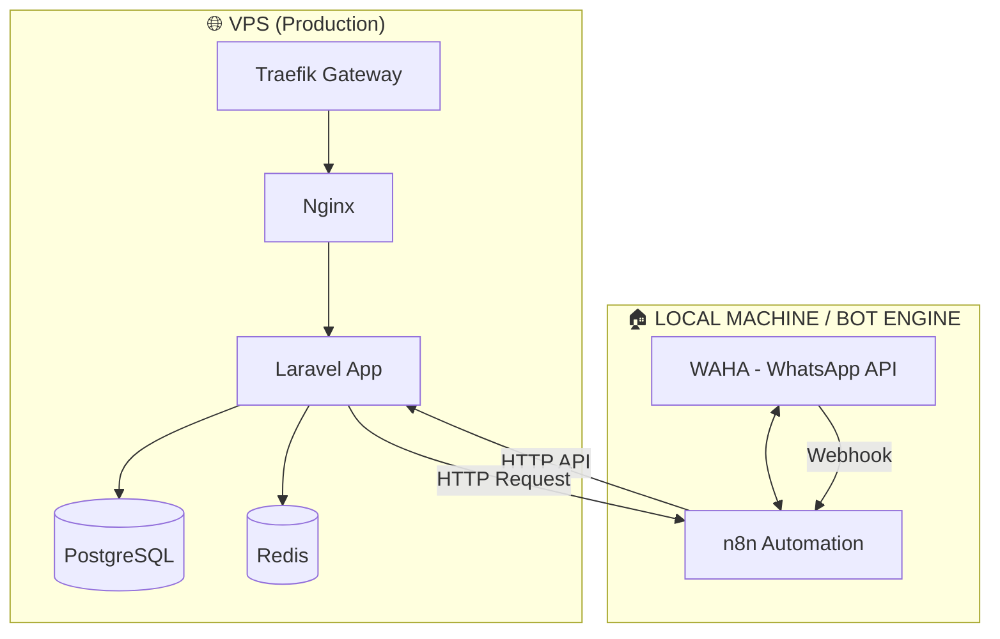

# 🚀 Deployment Architecture: Kecamatan SAE (Decoupled)

Struktur ini memisahkan **Landing Page (VPS)** dari **Bot Engine (Lokal/Secondary VPS)** untuk efisiensi resource dan stabilitas.

## 🏗️ Arsitektur


---

## 🛠️ Cara Menjalankan

### A. Di VPS (Production Server)
Pastikan port 80 & 443 terbuka.

1. Gunakan file `docker-compose.vps.yml`.
2. Sesuaikan `.env` (isi `DOMAIN`, `ACME_EMAIL`, dll).
3. Jalankan:
   ```bash
   docker compose -f docker-compose.vps.yml up -d
   ```

### B. Di LOCAL MACHINE (Bot Engine)
Pastikan Docker terinstal.

1. Gunakan file `docker-compose.bot.yml`.
2. Gunakan `.env.bot` sebagai referensi (copy ke `.env`).
3. Jalankan:
   ```bash
   docker compose -f docker-compose.bot.yml --env-file .env.bot up -d
   ```

---

## 🔌 Konfigurasi Konektivitas

| Arah Komunikasi | Metode | Endpoint |
| :--- | :--- | :--- |
| **Pesan Masuk** | WA -> WAHA -> n8n | `http://kecamatan-n8n:5678/webhook/whatsapp-primary` |
| **n8n ke Laravel** | n8n -> Laravel API | `https://domain-anda.com/api/whatsapp/handle` |
| **Laravel ke n8n** | App -> n8n | `http://IP_LOKAL_BOT:5678/webhook/whatsapp-reply` |

### Catatan Keamanan:
*   Gunakan token `BOT_TOKEN` / `API_TOKEN` yang sama di kedua sisi.
*   Jika n8n di lokal tidak memiliki IP publik, Anda bisa menggunakan **Cloudflare Tunnel** atau **ngrok** untuk mengekspos webhook n8n agar bisa dipanggil oleh Laravel VPS.
