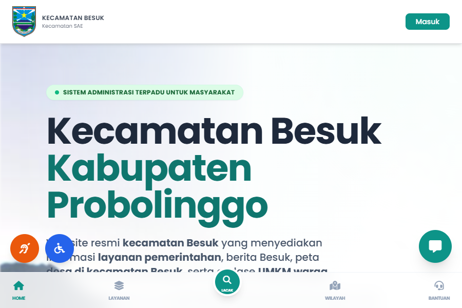
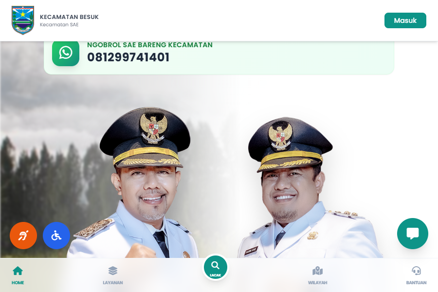

# 🏛️ Dashboard Kecamatan SAE
### Sistem Administrasi Terpadu untuk Masyarakat

[](https://laravel.com)
[](https://php.net)
[](https://docker.com)
[](https://github.com/benchoaz/KECAMATANSAE)

---

## 🌐 Landing Page & Web Portal Publik

Landing Page dibangun sebagai **Single Source of Truth** (Etalase Utama) bagi kemajuan digital warga. Didukung dengan desain (UI/UX) *premium* bernuansa modern, portal ini bukan sekadar halaman statis:

1. **Eksplorasi Navigasi Publik:** Mengedepankan kemudahan akses super cepat ke Pusat Pelayanan, Hub Ekonomi (UMKM), Info Pekerjaan (Jasa), serta fitur Lacak Berkas.
2. **Konsistensi Visual Web (Unified UI):** Semua subsistem warga—dari melihat Etalase Toko sebuah UMKM (`/umkm-rakyat/toko/...`) hingga profil Pemasar Jasa—berjalan pada _layout_ portal mandiri tanpa tercampur baur dengan kompleksitas struktur portal Admin Internal Kecamatan.





---

## 📋 Tentang Aplikasi

**Dashboard Kecamatan SAE** adalah platform digital terintegrasi untuk Kecamatan Besuk, Kabupaten Probolinggo. Sistem ini menghubungkan masyarakat dengan layanan pemerintahan kecamatan secara digital melalui web dan WhatsApp Bot.

### ✨ Fitur Utama

| Modul | Deskripsi |
|---|---|
| 🏠 **Landing Page** | Portal publik dengan info layanan, berita, dan kontak WhatsApp bot |
| 📋 **Pelayanan Publik** | Pengajuan & tracking layanan administrasi online |
| 🤖 **WhatsApp Bot** | Bot otomatis via WAHA + n8n untuk layanan 24 jam |
| 🏘️ **Pemerintahan Desa** | Monitoring aparatur, dokumen, dan perencanaan desa |
| 🏗️ **Pembangunan** | Monitoring proyek pembangunan desa |
| 🛡️ **Trantibum** | Laporan kejadian keamanan dan ketertiban |
| 🛒 **UMKM** | Direktori UMKM lokal dan etalase produk |
| 💼 **Loker** | Informasi lowongan kerja warga |
| 📰 **Berita** | Publikasi berita dan pengumuman kecamatan |
| 🗺️ **Geospasial** | Peta wilayah desa berbasis GeoJSON |

---

## 🏗️ Arsitektur Sistem

```
┌─────────────────────────────────────────────────────┐
│                   Docker Stack                       │
│                                                     │
│  ┌──────────┐  ┌──────────┐  ┌──────────────────┐  │
│  │  Nginx   │  │  Laravel │  │     MySQL 8.0    │  │
│  │ :8000    │→ │  PHP-FPM │→ │    :3307         │  │
│  └──────────┘  └──────────┘  └──────────────────┘  │
│                                                     │
│  ┌──────────────────┐  ┌──────────────────────────┐ │
│  │  WAHA (WhatsApp) │  │  n8n (Workflow)          │ │
│  │  :3000           │  │  :5679                   │ │
│  └──────────────────┘  └──────────────────────────┘ │
└─────────────────────────────────────────────────────┘
```

---

## 🚀 Instalasi dengan Docker

### Prasyarat
- Docker & Docker Compose
- Git

### Langkah Instalasi

```bash
# 1. Clone repository
git clone https://github.com/benchoaz/KecamatanSAEversiKabupaten.git
cd KecamatanSAEversiKabupaten

# 2. Jalankan Auto-Deploy (Satu Perintah untuk Semua)
# Script ini akan otomatis mendeteksi VPS, menginstall Docker, dependensi, & migrasi DB.
bash deploy.sh
```

Akses aplikasi di: **http://localhost:8000**

---

## ⚙️ Konfigurasi Environment

Edit file `.env` sesuai kebutuhan:

```env
# Database
DB_HOST=db
DB_DATABASE=dashboard_kecamatan
DB_USERNAME=user
DB_PASSWORD=root

# WAHA WhatsApp API
WAHA_API_URL=http://waha-kecamatan:3000
WAHA_API_KEY=your_waha_api_key
WAHA_SESSION=default

# n8n Workflow
N8N_REPLY_WEBHOOK_URL=http://n8n-kecamatan:5678/webhook/whatsapp-besuk

# WhatsApp API Token (untuk n8n)
WHATSAPP_API_TOKEN=your_token_here
```

---

## 🔒 Sistem Autentikasi (Web Portal Ekonomi)

Guna memaksimalkan keamanan dan kemudahan bagi warga pelaku usaha, sistem portal menggunakan otentikasi aman tanpa pendaftaran akun rumit:

*   **Super Dasbor Warga (Tanpa Sandi):** Mengedepankan kemudahan bagi warga. Seluruh akses manajemen UMKM dan profil Jasa/Pekerjaan dipusatkan pada **Portal Warga Passwordless**. Warga cukup memasukkan Nomor WhatsApp, dan sistem akan menembakkan **Magic Link** (Tautan Akses Aman) langsung ke chat warga. Ini menghilangkan kebutuhan untuk menghafal PIN atau Password yang rumit.

---
## 🤖 WhatsApp Bot

Bot WhatsApp terintegrasi dengan **WAHA** (WhatsApp HTTP API) dan **n8n** untuk workflow automation.

**Alur:**
```
Pesan WA → WAHA → n8n Webhook → Dashboard API → Response → WAHA → Pesan WA
```

**Konfigurasi nomor bot** dapat diubah langsung dari dashboard admin:
> Menu: **Pengaturan → Monitoring WhatsApp Bot**

### 🔐 Akses WAHA Dashboard

WAHA Dashboard dapat diakses di: **http://localhost:3000**

**Cara Login:**
| Field | Nilai |
|-------|-------|
| Username | `admin` |
| Password | (nilai `WAHA_API_KEY` dari file `.env`) |

Contoh: Jika `WAHA_API_KEY=62a72516dd1b418499d9dd22075ccfa0`, maka password adalah `62a72516dd1b418499d9dd22075ccfa0`

> ⚠️ **Penting**: WAHA menggunakan API Key sebagai password untuk autentikasi dashboard.

---

## 👥 Akun Default

### Laravel Dashboard (localhost:8000)
| Role | Username | Password |
|---|---|---|
| Super Admin | `admin` | `admin123` |
| Operator Kecamatan | `admin_kec` | `password` |
| Operator Desa | `admin_desa` | `password` |

### WAHA Dashboard (localhost:3000)
| Field | Nilai |
|-------|-------|
| Username | `admin` |
| Password | (nilai `WAHA_API_KEY` dari `.env`) |

### n8n Workflow (localhost:5679)
Tidak memerlukan autentikasi (sesuai konfigurasi).

---

## 🛠️ Tech Stack

- **Backend**: Laravel 11, PHP 8.2
- **Frontend**: Bootstrap 5, Tailwind CSS, Alpine.js
- **Database**: MySQL 8.0
- **Cache**: File/Database
- **WhatsApp**: WAHA (devlikeapro/waha)
- **Automation**: n8n
- **Server**: Nginx + PHP-FPM
- **Container**: Docker Compose

---

## 📁 Struktur Direktori

```
dashboard-kecamatan/
├── app/
│   ├── Http/Controllers/
│   │   ├── Kecamatan/          # Controller modul kecamatan
│   │   └── Api/                # API endpoints untuk WhatsApp bot
│   ├── Models/                 # Eloquent models
│   └── Services/
│       └── WhatsApp/           # Handler WhatsApp bot
├── database/
│   ├── migrations/             # Database migrations
│   └── seeders/                # Data seeder
├── docker/
│   └── php/                    # PHP Docker config
├── resources/views/
│   ├── kecamatan/              # Views dashboard kecamatan
│   ├── public/                 # Views halaman publik
│   └── landing.blade.php       # Landing page
└── routes/
    ├── web.php                 # Web routes
    ├── kecamatan.php           # Routes dashboard kecamatan
    └── api.php                 # API routes
```

---

## 📄 Lisensi

Project ini dikembangkan untuk **Kecamatan Besuk, Kabupaten Probolinggo**.

---

<p align="center">
  Dibuat dengan ❤️ untuk pelayanan masyarakat Kecamatan Besuk
</p>
