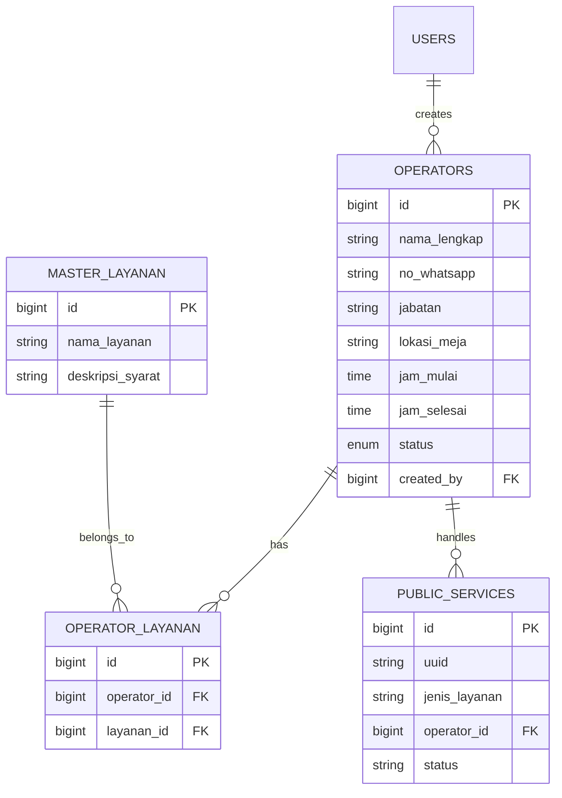

# UI Mockup: Operator Management System

## Overview

This document provides a comprehensive UI mockup for the **Operator Management** feature in the Dashboard Kecamatan system. This feature allows administrators to manage service operators who handle public service requests, including their contact information, assigned services, and work schedules.

---

## 1. Menu Location in Sidebar

The "Kelola Operator" menu item will be placed under the **Pengaturan** section, accessible only to Super Admin and Operator Kecamatan roles.

```
┌─────────────────────────────────────┐
│ 📊 Dashboard Kecamatan              │
├─────────────────────────────────────┤
│                                     │
│ MENU UTAMA                          │
│ ├─ 🏠 Dashboard                     │
│ └─ ✅ Verifikasi                    │
│                                     │
│ EKONOMI & KREATIF                   │
│ ├─ 🏪 Portal UMKM                   │
│ └─ 📋 Kelola UMKM                   │
│                                     │
│ MONITORING                          │
│ └─ 📜 Riwayat & Status              │
│                                     │
│ PENGATURAN                          │
│ ├─ ⚙️ Pengaturan Sistem             │
│ ├─ 👥 Manajemen User                │
│ ├─ 🗺️ Master Data Desa              │
│ └─ 👤 Kelola Operator  ◄── NEW      │
│                                     │
└─────────────────────────────────────┘
```

### Sidebar Code Addition

Add the following to [`sidebar.blade.php`](dashboard-kecamatan/resources/views/layouts/partials/sidebar.blade.php:238):

```blade
<li class="nav-item">
    <a href="{{ route('kecamatan.operators.index') }}"
        class="nav-link {{ request()->routeIs('kecamatan.operators.*') ? 'active' : '' }}">
        <span class="nav-icon"><i class="fas fa-user-tie"></i></span>
        <span class="nav-text">Kelola Operator</span>
    </a>
</li>
```

---

## 2. Operator List Page

The main list page displays all operators in a card-based layout with filtering and search capabilities.

```
┌─────────────────────────────────────────────────────────────────────────────────┐
│ KELOLA OPERATOR PELAYANAN                                      [+ Tambah Operator]│
├─────────────────────────────────────────────────────────────────────────────────┤
│ Filter: [Semua Layanan ▼] [Semua Status ▼]          🔍 Cari operator...        │
├─────────────────────────────────────────────────────────────────────────────────┤
│                                                                                 │
│ ┌─────────────────────────────────────────────────────────────────────────────┐ │
│ │ 👤 Budi Santoso                                        Status: ✅ Aktif      │ │
│ │ 📱 0812-3456-7890                      Layanan: KTP, KK, Domisili          │ │
│ │ 📍 Meja 3 - Loket Pelayanan                     Jam: 08:00 - 15:00        │ │
│ │                                                      [Edit] [Nonaktifkan]    │ │
│ └─────────────────────────────────────────────────────────────────────────────┘ │
│                                                                                 │
│ ┌─────────────────────────────────────────────────────────────────────────────┐ │
│ │ 👤 Siti Aminah                                         Status: ✅ Aktif      │ │
│ │ 📱 0813-4567-8901                      Layanan: SKTM, Surat Pindah         │ │
│ │ 📍 Meja 2 - Loket Pelayanan                     Jam: 08:00 - 15:00        │ │
│ │                                                      [Edit] [Nonaktifkan]    │ │
│ └─────────────────────────────────────────────────────────────────────────────┘ │
│                                                                                 │
│ ┌─────────────────────────────────────────────────────────────────────────────┐ │
│ │ 👤 Ahmad Wijaya                                       Status: ⚪ Nonaktif    │ │
│ │ 📱 0814-5678-9012                          Layanan: Izin Usaha             │ │
│ │ 📍 Meja 1 - Loket Pelayanan                     Jam: -                     │ │
│ │                                                        [Edit] [Aktifkan]     │ │
│ └─────────────────────────────────────────────────────────────────────────────┘ │
│                                                                                 │
│ Menampilkan 3 dari 3 operator                                                  │
└─────────────────────────────────────────────────────────────────────────────────┘
```

### Page Elements

| Element | Description |
|---------|-------------|
| **Title** | "KELOLA OPERATOR PELAYANAN" |
| **Add Button** | Primary button to add new operator |
| **Filter Dropdowns** | Filter by service type and status |
| **Search Box** | Real-time search by name or phone |
| **Operator Cards** | Card-based layout showing operator details |
| **Status Badge** | Visual indicator (Aktif/Nonaktif) |
| **Action Buttons** | Edit and Toggle Status buttons |

---

## 3. Add/Edit Operator Form

Modal or dedicated page for creating and editing operator information.

```
┌─────────────────────────────────────────────────────────────────────────────────┐
│ TAMBAH OPERATOR BARU                                                     [✕ Tutup]│
├─────────────────────────────────────────────────────────────────────────────────┤
│                                                                                 │
│  Data Operator                                                                  │
│  ─────────────────────────────────────────────────────────────────────────────  │
│                                                                                 │
│  Nama Lengkap *                                                                 │
│  ┌─────────────────────────────────────────────────────────────────────────┐   │
│  │ Masukkan nama lengkap operator                                           │   │
│  └─────────────────────────────────────────────────────────────────────────┘   │
│                                                                                 │
│  Nomor WhatsApp *                                                               │
│  ┌─────────────────────────────────────────────────────────────────────────┐   │
│  │ 08xx-xxxx-xxxx                                                           │   │
│  └─────────────────────────────────────────────────────────────────────────┘   │
│  ℹ️ Nomor ini akan ditampilkan ke pemohon untuk pengambilan dokumen            │
│                                                                                 │
│  Jabatan                                                                        │
│  ┌─────────────────────────────────────────────────────────────────────────┐   │
│  │ Operator Pelayanan                                                       │   │
│  └─────────────────────────────────────────────────────────────────────────┘   │
│                                                                                 │
│  Lokasi/Meja                                                                    │
│  ┌─────────────────────────────────────────────────────────────────────────┐   │
│  │ Meja 3 - Loket Pelayanan                                                 │   │
│  └─────────────────────────────────────────────────────────────────────────┘   │
│                                                                                 │
│  Jam Pelayanan                                                                  │
│  ┌──────────────┐        s/d        ┌──────────────┐                          │
│  │    08:00     │                    │    15:00     │                          │
│  └──────────────┘                    └──────────────┘                          │
│                                                                                 │
│  Layanan yang Ditangani *                                                       │
│  ─────────────────────────────────────────────────────────────────────────────  │
│  ☑ KTP                          ☑ Surat Keterangan Domisili                    │
│  ☑ Kartu Keluarga               ☐ Surat Keterangan Tidak Mampu                 │
│  ☐ Surat Pindah                 ☐ Izin Usaha                                   │
│  ☐ SKCK                         ☐ Surat Keterangan Lainnya                     │
│                                                                                 │
│  Status                                                                         │
│  ◉ Aktif                                                                        │
│  ○ Nonaktif                                                                     │
│                                                                                 │
│  ─────────────────────────────────────────────────────────────────────────────  │
│                                                                                 │
│                                      [Batal]            [Simpan Operator]       │
└─────────────────────────────────────────────────────────────────────────────────┘
```

### Form Fields

| Field | Type | Required | Description |
|-------|------|----------|-------------|
| `nama_lengkap` | Text | Yes | Operator's full name |
| `no_whatsapp` | Text | Yes | WhatsApp number for public display |
| `jabatan` | Text | No | Job title/position |
| `lokasi_meja` | Text | No | Physical location/desk number |
| `jam_mulai` | Time | No | Service start time |
| `jam_selesai` | Time | No | Service end time |
| `layanan` | Multi-select | Yes | Services handled by this operator |
| `status` | Radio | Yes | Active/Inactive status |

---

## 4. Operator Assignment in PublicService Detail

When viewing a service request detail, the assigned operator is displayed with option to change.

```
┌─────────────────────────────────────────────────────────────────────────────────┐
│ DETAIL PENGAJUAN: PS-2026-02-13-001                                    [← Kembali]│
├─────────────────────────────────────────────────────────────────────────────────┤
│                                                                                 │
│  Data Pemohon                           Status: ✅ Selesai                      │
│  ───────────────────────────────        ────────────────────────────────────   │
│  Nama    : Ahmad Sudirman               Dibuat   : 13 Feb 2026, 09:15          │
│  NIK     : 3507121502850001             Diproses : 13 Feb 2026, 10:30          │
│  WhatsApp: 0812-9876-5432               Selesai  : 13 Feb 2026, 14:00          │
│  Desa    : Besuk                                                              │
│                                                                                 │
│  Jenis Layanan: Surat Keterangan Domisili                                      │
│  Keperluan    : Persyaratan pendaftaran sekolah                                │
│                                                                                 │
│  ─────────────────────────────────────────────────────────────────────────────  │
│                                                                                 │
│  PENUGASAN OPERATOR                                                             │
│  ─────────────────────────────────────────────────────────────────────────────  │
│                                                                                 │
│  Operator:                                                                      │
│  ┌─────────────────────────────────────────────────────────────────────────┐   │
│  │ 👤 Budi Santoso                                              [Ganti]     │   │
│  │ 📱 0812-3456-7890                                                       │   │
│  │ 📍 Meja 3 - Loket Pelayanan                                             │   │
│  └─────────────────────────────────────────────────────────────────────────┘   │
│                                                                                 │
│  Catatan Pengambilan:                                                           │
│  ┌─────────────────────────────────────────────────────────────────────────┐   │
│  │ Silakan ambil di kantor kecamatan jam 08:00-15:00, bawa KTP asli        │   │
│  │ dan fotokopi KK.                                                        │   │
│  └─────────────────────────────────────────────────────────────────────────┘   │
│                                                                                 │
│  [📤 Kirim Notifikasi WhatsApp ke Pemohon]                                     │
│                                                                                 │
└─────────────────────────────────────────────────────────────────────────────────┘
```

### Operator Selection Modal

When clicking "Ganti" button:

```
┌─────────────────────────────────────────────────────────────────┐
│ PILIH OPERATOR                                           [✕]   │
├─────────────────────────────────────────────────────────────────┤
│                                                                 │
│ Layanan: Surat Keterangan Domisili                              │
│                                                                 │
│ ┌─────────────────────────────────────────────────────────────┐ │
│ │ ◉ Budi Santoso - Meja 3                                     │ │
│ │   📱 0812-3456-7890 | Jam: 08:00-15:00                      │ │
│ └─────────────────────────────────────────────────────────────┘ │
│                                                                 │
│ ┌─────────────────────────────────────────────────────────────┐ │
│ │ ○ Siti Aminah - Meja 2                                      │ │
│ │   📱 0813-4567-8901 | Jam: 08:00-15:00                      │ │
│ └─────────────────────────────────────────────────────────────┘ │
│                                                                 │
│ ℹ️ Hanya menampilkan operator yang menangani layanan ini       │
│                                                                 │
│                              [Batal]        [Pilih Operator]    │
└─────────────────────────────────────────────────────────────────┘
```

---

## 5. WhatsApp Notification Sent to User

When a service is completed and the operator is assigned, a WhatsApp notification is sent to the applicant.

```
┌─────────────────────────────────────────────┐
│ 📱 WhatsApp Notification                    │
├─────────────────────────────────────────────┤
│                                             │
│ ✅ DOKUMEN ANDA SUDAH SELESAI               │
│                                             │
│ No. Tiket: PS-2026-02-13-001               │
│ Jenis: Surat Keterangan Domisili           │
│                                             │
│ ─────────────────────────────────────────── │
│                                             │
│ 👤 Operator: Budi Santoso                   │
│ 📱 0812-3456-7890                          │
│ 📍 Meja 3 - Loket Pelayanan                │
│                                             │
│ 💬 Catatan:                                 │
│ Silakan ambil di kantor kecamatan          │
│ jam 08:00-15:00, bawa KTP asli             │
│ dan fotokopi KK.                            │
│                                             │
│ ─────────────────────────────────────────── │
│                                             │
│ Ketik "status PS-2026-02-13-001"           │
│ untuk cek status kapan saja.                │
│                                             │
│ - Bot Kecamatan Besuk                      │
└─────────────────────────────────────────────┘
```

---

## 6. Database Table Structure

### Table: `operators`

```sql
CREATE TABLE operators (
    id BIGINT UNSIGNED PRIMARY KEY AUTO_INCREMENT,
    nama_lengkap VARCHAR(255) NOT NULL,
    no_whatsapp VARCHAR(20) NOT NULL,
    jabatan VARCHAR(100) NULL,
    lokasi_meja VARCHAR(100) NULL,
    jam_mulai TIME NULL,
    jam_selesai TIME NULL,
    status ENUM('aktif', 'nonaktif') DEFAULT 'aktif',
    created_by BIGINT UNSIGNED NULL,
    updated_by BIGINT UNSIGNED NULL,
    created_at TIMESTAMP DEFAULT CURRENT_TIMESTAMP,
    updated_at TIMESTAMP DEFAULT CURRENT_TIMESTAMP ON UPDATE CURRENT_TIMESTAMP,
    
    INDEX idx_status (status),
    INDEX idx_whatsapp (no_whatsapp),
    FOREIGN KEY (created_by) REFERENCES users(id) ON DELETE SET NULL,
    FOREIGN KEY (updated_by) REFERENCES users(id) ON DELETE SET NULL
);
```

### Pivot Table: `operator_layanan`

Many-to-many relationship between operators and services.

```sql
CREATE TABLE operator_layanan (
    id BIGINT UNSIGNED PRIMARY KEY AUTO_INCREMENT,
    operator_id BIGINT UNSIGNED NOT NULL,
    layanan_id BIGINT UNSIGNED NOT NULL,
    created_at TIMESTAMP DEFAULT CURRENT_TIMESTAMP,
    
    UNIQUE KEY unique_operator_layanan (operator_id, layanan_id),
    FOREIGN KEY (operator_id) REFERENCES operators(id) ON DELETE CASCADE,
    FOREIGN KEY (layanan_id) REFERENCES master_layanan(id) ON DELETE CASCADE
);
```

### Update Table: `public_services`

Add operator assignment field to existing table.

```sql
ALTER TABLE public_services 
ADD COLUMN operator_id BIGINT UNSIGNED NULL AFTER handled_by,
ADD FOREIGN KEY (operator_id) REFERENCES operators(id) ON DELETE SET NULL;
```

---

## 7. API Endpoints

### RESTful Endpoints

| Method | Endpoint | Description | Permission |
|--------|----------|-------------|------------|
| GET | `/api/v1/operators` | List all operators | `operator.view` |
| GET | `/api/v1/operators/{id}` | Get operator detail | `operator.view` |
| POST | `/api/v1/operators` | Create new operator | `operator.create` |
| PUT | `/api/v1/operators/{id}` | Update operator | `operator.edit` |
| DELETE | `/api/v1/operators/{id}` | Delete operator | `operator.delete` |
| PATCH | `/api/v1/operators/{id}/toggle-status` | Toggle active/inactive | `operator.edit` |
| GET | `/api/v1/operators/by-layanan/{layanan_id}` | Get operators by service | `operator.view` |

### API Response Examples

#### List Operators

```json
GET /api/v1/operators

{
    "success": true,
    "data": [
        {
            "id": 1,
            "nama_lengkap": "Budi Santoso",
            "no_whatsapp": "081234567890",
            "jabatan": "Operator Pelayanan",
            "lokasi_meja": "Meja 3 - Loket Pelayanan",
            "jam_mulai": "08:00",
            "jam_selesai": "15:00",
            "status": "aktif",
            "layanan": [
                {
                    "id": 1,
                    "nama_layanan": "KTP"
                },
                {
                    "id": 2,
                    "nama_layanan": "Kartu Keluarga"
                }
            ]
        }
    ],
    "meta": {
        "total": 3,
        "page": 1,
        "per_page": 15
    }
}
```

#### Create Operator

```json
POST /api/v1/operators
Content-Type: application/json

{
    "nama_lengkap": "Budi Santoso",
    "no_whatsapp": "081234567890",
    "jabatan": "Operator Pelayanan",
    "lokasi_meja": "Meja 3 - Loket Pelayanan",
    "jam_mulai": "08:00",
    "jam_selesai": "15:00",
    "layanan_ids": [1, 2, 3],
    "status": "aktif"
}
```

---

## 8. Permission Requirements

### New Permissions to Add

Add these permissions to the roles system:

| Permission | Description |
|------------|-------------|
| `operator.view` | View operator list and details |
| `operator.create` | Create new operators |
| `operator.edit` | Edit existing operators |
| `operator.delete` | Delete operators |

### Role Assignment

| Role | Permissions |
|------|-------------|
| Super Admin | All operator permissions |
| Operator Kecamatan | `operator.view`, `operator.edit` |
| Operator Desa | None |

### Update to [`RolesAndPermissionsSeeder.php`](dashboard-kecamatan/database/seeders/RolesAndPermissionsSeeder.php)

```php
// Operator Management Permissions
'operator.view',
'operator.create',
'operator.edit',
'operator.delete',
```

---

## 9. Implementation Steps

### Phase 1: Database Setup

1. Create migration for `operators` table
2. Create migration for `operator_layanan` pivot table
3. Add `operator_id` column to `public_services` table
4. Run migrations

### Phase 2: Backend Development

1. Create `Operator` model with relationships
2. Create `OperatorController` with CRUD operations
3. Add routes to `routes/web.php`
4. Add API routes to `routes/api.php`
5. Create `OperatorPolicy` for authorization
6. Update `PelayananController` to include operator assignment

### Phase 3: Frontend Development

1. Create operator index view (`kecamatan.operators.index`)
2. Create operator form view (`kecamatan.operators.form`)
3. Add sidebar menu item
4. Update service detail view to show operator assignment
5. Create operator selection modal component

### Phase 4: Integration

1. Update WhatsApp notification template to include operator info
2. Update `buildStatusMessage()` in `PelayananController`
3. Test notification flow end-to-end

### Phase 5: Testing & Documentation

1. Write feature tests for operator CRUD
2. Write API tests
3. Update user documentation

---

## 10. File Structure

```
dashboard-kecamatan/
├── app/
│   ├── Http/
│   │   ├── Controllers/
│   │   │   └── Kecamatan/
│   │   │       └── OperatorController.php      # NEW
│   │   └── Requests/
│   │       └── OperatorRequest.php             # NEW
│   ├── Models/
│   │   └── Operator.php                        # NEW
│   └── Policies/
│       └── OperatorPolicy.php                  # NEW
├── database/
│   ├── migrations/
│   │   ├── 2026_02_13_create_operators_table.php           # NEW
│   │   ├── 2026_02_13_create_operator_layanan_table.php    # NEW
│   │   └── 2026_02_13_add_operator_id_to_public_services.php # NEW
│   └── seeders/
│       └── OperatorSeeder.php                  # NEW
├── resources/
│   └── views/
│       └── kecamatan/
│           └── operators/
│               ├── index.blade.php             # NEW
│               └── form.blade.php              # NEW
└── routes/
    ├── web.php                                 # UPDATE
    └── api.php                                 # UPDATE
```

---

## 11. Model Relationships



---

## 12. WhatsApp Notification Template

### Updated Template with Operator Info

```php
private function buildStatusMessage($complaint, $newStatus)
{
    // ... existing code ...
    
    if ($newStatus === PublicService::STATUS_SELESAI) {
        // Add operator information
        if ($complaint->operator) {
            $message .= "👤 *Operator:* {$complaint->operator->nama_lengkap}\n";
            $message .= "📱 {$complaint->operator->no_whatsapp}\n";
            if ($complaint->operator->lokasi_meja) {
                $message .= "📍 {$complaint->operator->lokasi_meja}\n";
            }
            $message .= "\n";
        }
        
        // ... rest of completion logic ...
    }
    
    return $message;
}
```

---

## 13. Summary

This UI mockup document provides a complete design for the Operator Management feature in the Dashboard Kecamatan system. The implementation includes:

- **Menu Integration**: New menu item in sidebar under Pengaturan
- **Operator List**: Card-based layout with filtering and search
- **CRUD Forms**: Add/Edit operator with service assignment
- **Service Integration**: Operator assignment in service detail view
- **WhatsApp Integration**: Operator info in completion notifications
- **Database Schema**: Complete table structure with relationships
- **API Design**: RESTful endpoints for all operations
- **Permissions**: Role-based access control

The feature enables better tracking of service handlers and provides citizens with direct contact information for document pickup, improving the overall service experience.
