# User Permission System Design Document

## Overview

This document outlines the comprehensive design for the user management system in Dashboard Kecamatan with granular menu permission controls, complete workflow analysis, and UI specifications. The system enables administrators to configure which menus each role can access, with optional user-level overrides for special cases.

---

## Table of Contents

1. [Application Workflows Analysis](#1-application-workflows-analysis)
2. [Database Schema](#2-database-schema)
3. [Role Hierarchy](#3-role-hierarchy)
4. [UI Design Specifications](#4-ui-design-specifications)
5. [Permission Matrix](#5-permission-matrix)
6. [Workflow Diagrams](#6-workflow-diagrams)
7. [Model Relationships](#7-model-relationships)
8. [Middleware Implementation](#8-middleware-implementation)
9. [Controller Implementation](#9-controller-implementation)
10. [Sidebar Refactoring](#10-sidebar-refactoring)
11. [Implementation Checklist](#11-implementation-checklist)
12. [Security Considerations](#12-security-considerations)
13. [Performance Considerations](#13-performance-considerations)

---

## 1. Application Workflows Analysis

### 1.1 Kecamatan Level Workflows

#### A. Dashboard Monitoring Workflow

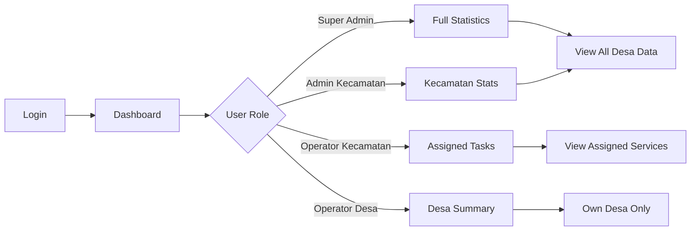

**User Actions:**
| Action | Super Admin | Admin Kec | Op. Kec | Op. Desa |
|--------|-------------|-----------|---------|----------|
| View dashboard | ✓ | ✓ | ✓ | ✓ |
| Export reports | ✓ | ✓ | ✓ | - |
| View all desa | ✓ | ✓ | ✓ | - |
| Filter by desa | ✓ | ✓ | ✓ | Own only |

#### B. Pemerintahan Management Workflow

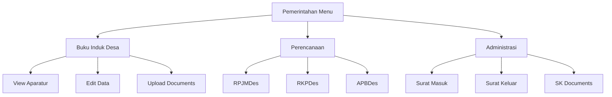

**User Actions:**
| Action | Super Admin | Admin Kec | Op. Kec | Op. Desa |
|--------|-------------|-----------|---------|----------|
| View pemerintahan | ✓ | ✓ | ✓ | ✓ |
| Create entries | ✓ | ✓ | ✓ | ✓ |
| Edit any desa | ✓ | ✓ | ✓ | - |
| Edit own desa | ✓ | ✓ | ✓ | ✓ |
| Delete entries | ✓ | ✓ | - | - |

#### C. Pelayanan Publik Processing Workflow

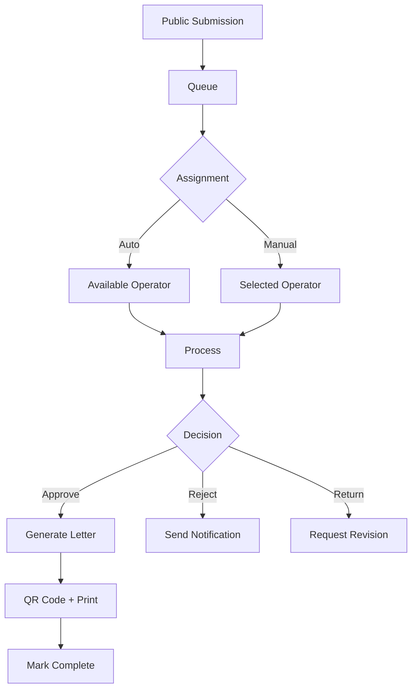

**User Actions:**
| Action | Super Admin | Admin Kec | Op. Kec | Public |
|--------|-------------|-----------|---------|--------|
| Submit request | - | - | - | ✓ |
| View queue | ✓ | ✓ | ✓ | - |
| Process request | ✓ | ✓ | ✓ | - |
| Approve/Reject | ✓ | ✓ | - | - |
| Track status | - | - | - | ✓ |

#### D. UMKM Verification Workflow

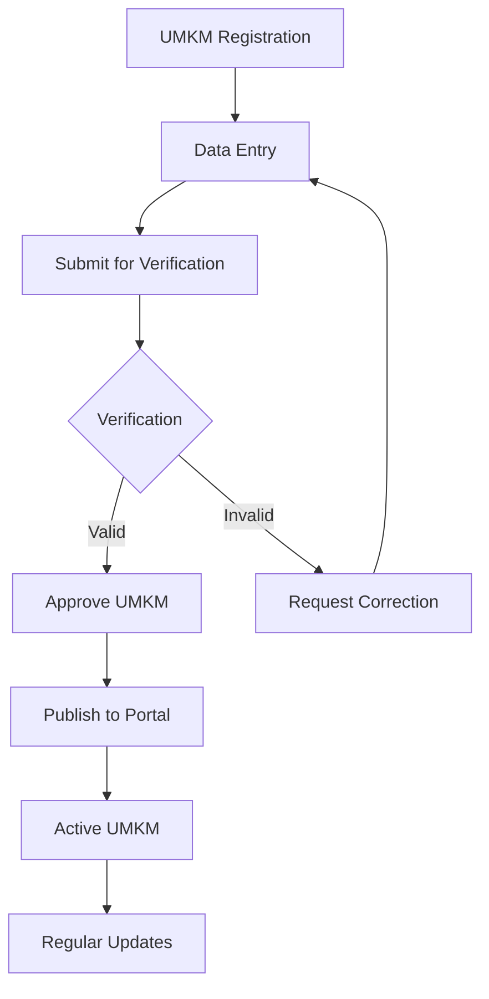

**User Actions:**
| Action | Super Admin | Admin Kec | Op. Kec | Op. Desa | Public |
|--------|-------------|-----------|---------|----------|--------|
| Register UMKM | - | - | - | - | ✓ |
| View pending | ✓ | ✓ | ✓ | - | - |
| Verify UMKM | ✓ | ✓ | ✓ | - | - |
| Edit UMKM | ✓ | ✓ | ✓ | ✓ | Own |
| Delete UMKM | ✓ | - | - | - | - |

#### E. Trantibum Monitoring Workflow

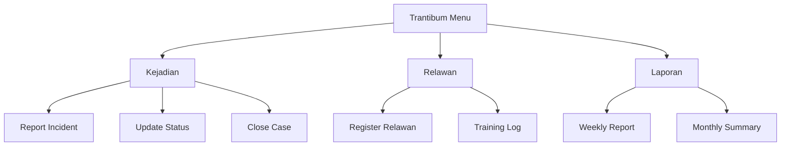

**User Actions:**
| Action | Super Admin | Admin Kec | Op. Kec | Op. Desa |
|--------|-------------|-----------|---------|----------|
| View incidents | ✓ | ✓ | ✓ | ✓ |
| Create incident | ✓ | ✓ | ✓ | ✓ |
| Update status | ✓ | ✓ | ✓ | Own area |
| Manage relawan | ✓ | ✓ | ✓ | - |
| Generate reports | ✓ | ✓ | ✓ | - |

#### F. User Management Workflow

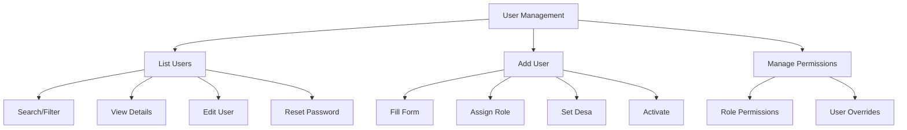

**User Actions:**
| Action | Super Admin | Admin Kec | Op. Kec |
|--------|-------------|-----------|---------|
| View all users | ✓ | ✓ | - |
| Create user | ✓ | ✓ | - |
| Edit any user | ✓ | ✓ | - |
| Delete user | ✓ | - | - |
| Manage permissions | ✓ | ✓ | - |
| Reset passwords | ✓ | ✓ | - |

#### G. System Settings Workflow

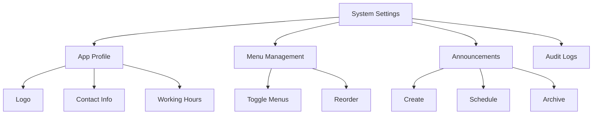

**User Actions:**
| Action | Super Admin | Admin Kec |
|--------|-------------|-----------|
| Edit app profile | ✓ | - |
| Manage menus | ✓ | - |
| Create announcements | ✓ | ✓ |
| View audit logs | ✓ | ✓ |

---

### 1.2 Desa Level Workflows

#### A. Data Desa Entry Workflow

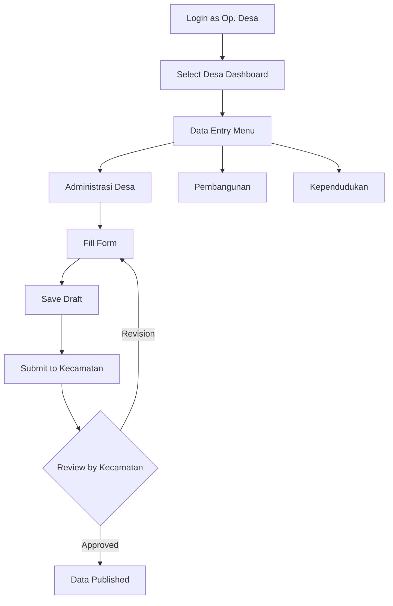

**User Actions:**
| Action | Op. Desa |
|--------|----------|
| View own desa data | ✓ |
| Create new entries | ✓ |
| Edit draft entries | ✓ |
| Submit for approval | ✓ |
| View submission status | ✓ |

#### B. Pembangunan Reporting Workflow

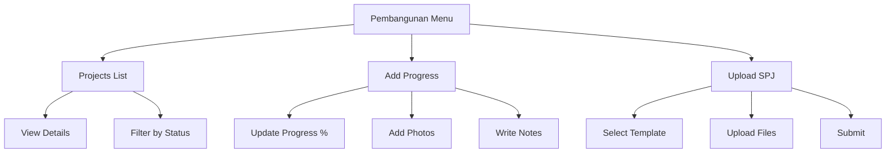

**User Actions:**
| Action | Op. Desa | Op. Kec | Admin Kec |
|--------|----------|---------|-----------|
| View projects | Own desa | All | All |
| Create project | ✓ | - | - |
| Update progress | ✓ | - | - |
| Upload SPJ | ✓ | - | - |
| Verify SPJ | - | ✓ | ✓ |
| Approve project | - | - | ✓ |

#### C. Administrasi Desa Workflow

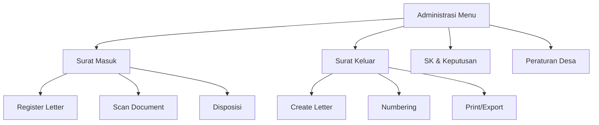

**User Actions:**
| Action | Op. Desa |
|--------|----------|
| Register surat masuk | ✓ |
| Create surat keluar | ✓ |
| Upload documents | ✓ |
| Search archives | ✓ |
| Export reports | ✓ |

#### D. Submission to Kecamatan Workflow

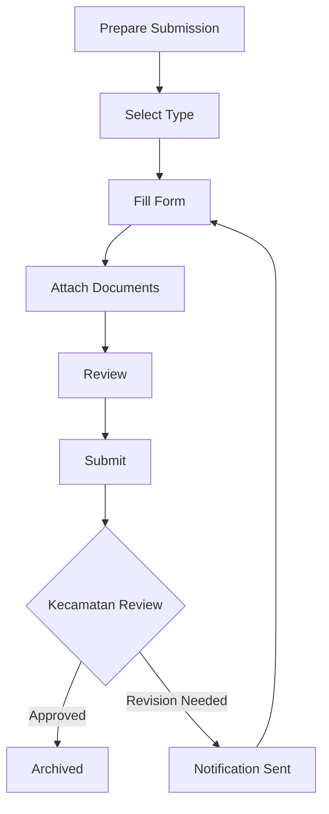

**Submission Types:**
- Laporan Pembangunan
- Laporan Keuangan
- Permohonan Anggaran
- Laporan Kegiatan
- Dokumen Perencanaan

---

### 1.3 Public Workflows

#### A. Landing Page Access

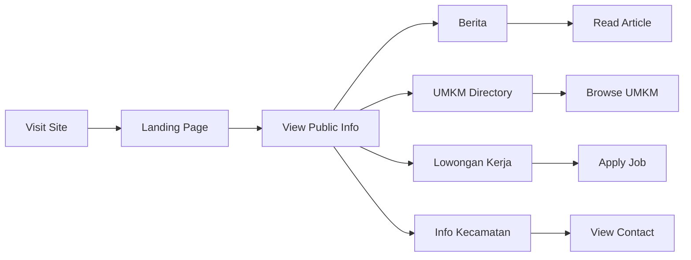

**Public Actions:**
| Action | Guest | Registered |
|--------|-------|------------|
| View berita | ✓ | ✓ |
| Browse UMKM | ✓ | ✓ |
| View loker | ✓ | ✓ |
| Submit complaint | - | ✓ |
| Register UMKM | - | ✓ |
| Track submissions | - | ✓ |

#### B. Public Service Submission Workflow

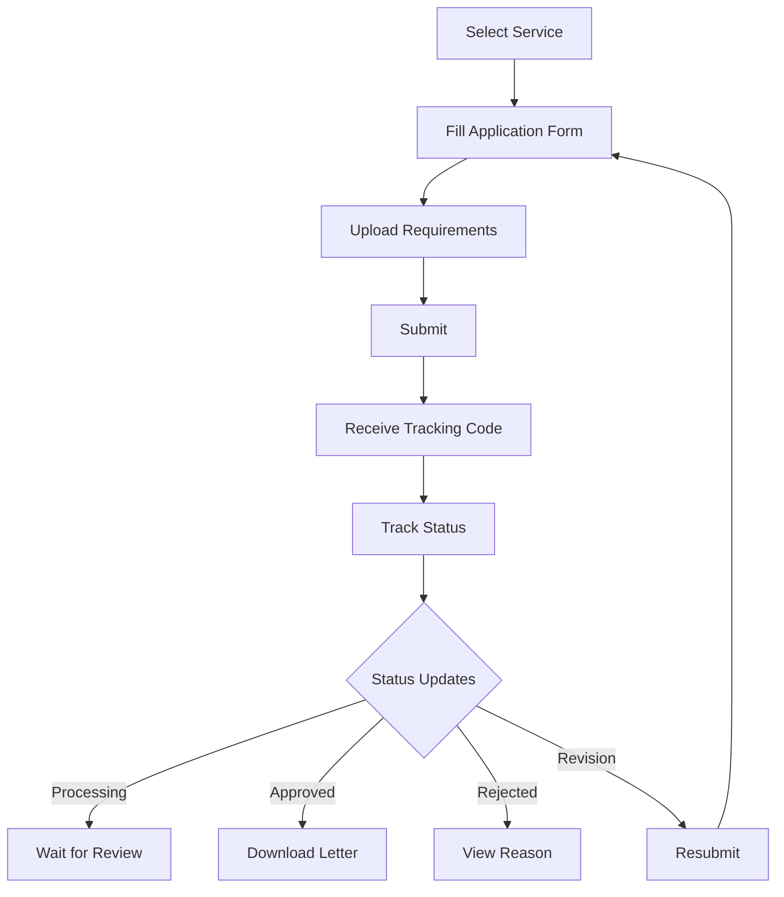

**Available Services:**
- Surat Keterangan Domisili
- Surat Keterangan Usaha
- Surat Keterangan Tidak Mampu
- Surat Pengantar SKCK
- Surat Keterangan Pindah
- Rekomendasi UMKM

#### C. UMKM Registration Workflow

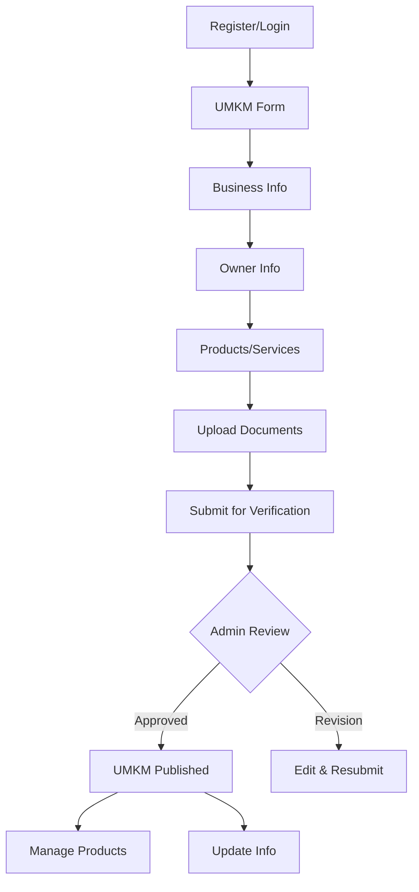

**Required Documents:**
- KTP Pemilik
- NPWP Usaha
- NIB / Izin Usaha
- Foto Produk
- Foto Lokasi Usaha

#### D. Complaint Submission Workflow

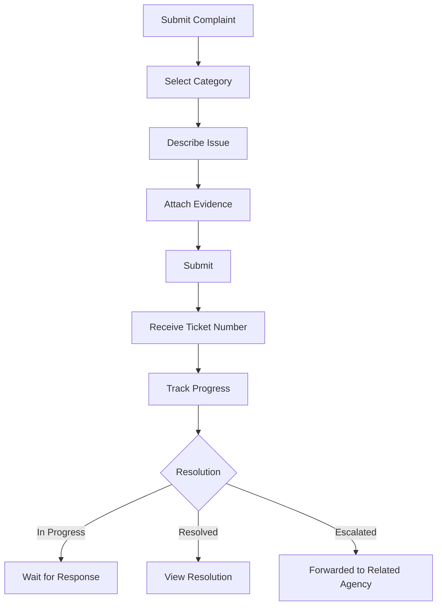

**Complaint Categories:**
- Infrastruktur
- Pelayanan Publik
- Keamanan & Ketertiban
- Kesejahteraan Sosial
- Administrasi

---

## 2. Database Schema

### 2.1 Enhanced Users Table

```sql
CREATE TABLE users (
    id BIGINT PRIMARY KEY AUTO_INCREMENT,
    
    -- Identity
    nama_lengkap VARCHAR(255) NOT NULL,
    username VARCHAR(100) UNIQUE NOT NULL,
    email VARCHAR(255) UNIQUE,
    password VARCHAR(255) NOT NULL,
    
    -- Role & Location
    role_id BIGINT NOT NULL,
    desa_id BIGINT NULL,
    
    -- Contact
    no_hp VARCHAR(20),
    whatsapp_verified BOOLEAN DEFAULT FALSE,
    
    -- Professional Info
    nip VARCHAR(20) NULL,
    jabatan VARCHAR(100) NULL,
    
    -- Profile
    foto VARCHAR(255),
    
    -- Status
    status ENUM('aktif', 'nonaktif', 'pending') DEFAULT 'pending',
    
    -- Authentication
    email_verified_at TIMESTAMP NULL,
    remember_token VARCHAR(100),
    last_login TIMESTAMP NULL,
    
    -- Audit
    created_at TIMESTAMP DEFAULT CURRENT_TIMESTAMP,
    updated_at TIMESTAMP DEFAULT CURRENT_TIMESTAMP ON UPDATE CURRENT_TIMESTAMP,
    
    -- Foreign Keys
    FOREIGN KEY (role_id) REFERENCES roles(id) ON DELETE RESTRICT,
    FOREIGN KEY (desa_id) REFERENCES desa(id) ON DELETE SET NULL,
    
    -- Indexes
    INDEX idx_users_role (role_id),
    INDEX idx_users_desa (desa_id),
    INDEX idx_users_status (status)
);
```

### 2.2 Enhanced Roles Table

```sql
CREATE TABLE roles (
    id BIGINT PRIMARY KEY AUTO_INCREMENT,
    
    -- Identity
    nama_role VARCHAR(50) UNIQUE NOT NULL,
    kode_role VARCHAR(20) UNIQUE NOT NULL,
    deskripsi TEXT,
    
    -- Hierarchy
    level INT DEFAULT 0 COMMENT '1=Super Admin, 2=Kecamatan, 3=Desa, 4=Public',
    
    -- System Flag
    is_system BOOLEAN DEFAULT FALSE COMMENT 'System roles cannot be deleted',
    
    -- Audit
    created_at TIMESTAMP DEFAULT CURRENT_TIMESTAMP,
    updated_at TIMESTAMP DEFAULT CURRENT_TIMESTAMP ON UPDATE CURRENT_TIMESTAMP
);

-- Default Roles
INSERT INTO roles (nama_role, kode_role, deskripsi, level, is_system) VALUES
('Super Admin', 'SUPER_ADMIN', 'Full system administrator with all permissions', 1, TRUE),
('Admin Kecamatan', 'ADMIN_KEC', 'Kecamatan level administrator', 2, TRUE),
('Operator Kecamatan', 'OP_KEC', 'Kecamatan operator for processing services', 3, TRUE),
('Operator Desa', 'OP_DESA', 'Village level operator', 4, TRUE),
('Public User', 'PUBLIC', 'Registered public user', 5, TRUE);
```

### 2.3 Role Menu Permissions Table

```sql
CREATE TABLE role_menu_permissions (
    id BIGINT PRIMARY KEY AUTO_INCREMENT,
    
    role_id BIGINT NOT NULL,
    menu_id BIGINT NOT NULL,
    
    -- Action Permissions
    can_view BOOLEAN DEFAULT TRUE,
    can_create BOOLEAN DEFAULT FALSE,
    can_edit BOOLEAN DEFAULT FALSE,
    can_delete BOOLEAN DEFAULT FALSE,
    can_export BOOLEAN DEFAULT FALSE,
    
    -- Audit
    created_at TIMESTAMP DEFAULT CURRENT_TIMESTAMP,
    updated_at TIMESTAMP DEFAULT CURRENT_TIMESTAMP ON UPDATE CURRENT_TIMESTAMP,
    
    -- Constraints
    FOREIGN KEY (role_id) REFERENCES roles(id) ON DELETE CASCADE,
    FOREIGN KEY (menu_id) REFERENCES menu(id) ON DELETE CASCADE,
    UNIQUE KEY unique_role_menu (role_id, menu_id),
    
    -- Indexes
    INDEX idx_role_perm_role (role_id),
    INDEX idx_role_perm_menu (menu_id)
);
```

### 2.4 User Menu Overrides Table

```sql
CREATE TABLE user_menu_overrides (
    id BIGINT PRIMARY KEY AUTO_INCREMENT,
    
    user_id BIGINT NOT NULL,
    menu_id BIGINT NOT NULL,
    
    -- Override Type
    override_type ENUM('allow', 'deny') DEFAULT 'allow',
    
    -- Action Overrides (NULL = inherit from role)
    can_view BOOLEAN NULL,
    can_create BOOLEAN NULL,
    can_edit BOOLEAN NULL,
    can_delete BOOLEAN NULL,
    can_export BOOLEAN NULL,
    
    -- Reason for Override
    reason TEXT,
    
    -- Who Created
    created_by BIGINT NOT NULL,
    
    -- Validity Period
    valid_from TIMESTAMP NULL,
    valid_until TIMESTAMP NULL,
    
    -- Audit
    created_at TIMESTAMP DEFAULT CURRENT_TIMESTAMP,
    updated_at TIMESTAMP DEFAULT CURRENT_TIMESTAMP ON UPDATE CURRENT_TIMESTAMP,
    
    -- Constraints
    FOREIGN KEY (user_id) REFERENCES users(id) ON DELETE CASCADE,
    FOREIGN KEY (menu_id) REFERENCES menu(id) ON DELETE CASCADE,
    FOREIGN KEY (created_by) REFERENCES users(id) ON DELETE RESTRICT,
    UNIQUE KEY unique_user_menu (user_id, menu_id),
    
    -- Indexes
    INDEX idx_user_override_user (user_id),
    INDEX idx_user_override_menu (menu_id)
);
```

### 2.5 User Activity Logs Table

```sql
CREATE TABLE user_activity_logs (
    id BIGINT PRIMARY KEY AUTO_INCREMENT,
    
    -- Who
    user_id BIGINT NOT NULL,
    
    -- What
    action VARCHAR(50) NOT NULL COMMENT 'login, logout, create, update, delete, view, export',
    model_type VARCHAR(100),
    model_id BIGINT,
    
    -- Details
    description TEXT,
    old_values JSON,
    new_values JSON,
    
    -- Context
    ip_address VARCHAR(45),
    user_agent TEXT,
    
    -- When
    created_at TIMESTAMP DEFAULT CURRENT_TIMESTAMP,
    
    -- Foreign Key
    FOREIGN KEY (user_id) REFERENCES users(id) ON DELETE CASCADE,
    
    -- Indexes
    INDEX idx_activity_user (user_id),
    INDEX idx_activity_action (action),
    INDEX idx_activity_model (model_type, model_id),
    INDEX idx_activity_date (created_at)
);
```

### 2.6 Operators Table

```sql
CREATE TABLE operators (
    id BIGINT PRIMARY KEY AUTO_INCREMENT,
    
    -- Link to User
    user_id BIGINT NOT NULL UNIQUE,
    
    -- Assignment
    service_types JSON COMMENT 'Array of service type IDs this operator handles',
    
    -- Work Info
    employee_id VARCHAR(50),
    department VARCHAR(100),
    position VARCHAR(100),
    
    -- Schedule
    work_days VARCHAR(20) DEFAULT '1,2,3,4,5' COMMENT '1=Monday, 7=Sunday',
    work_start TIME DEFAULT '08:00:00',
    work_end TIME DEFAULT '16:00:00',
    
    -- Performance Metrics
    total_processed INT DEFAULT 0,
    total_approved INT DEFAULT 0,
    total_rejected INT DEFAULT 0,
    avg_processing_time INT DEFAULT 0 COMMENT 'In minutes',
    
    -- Status
    is_active BOOLEAN DEFAULT TRUE,
    
    -- Audit
    created_at TIMESTAMP DEFAULT CURRENT_TIMESTAMP,
    updated_at TIMESTAMP DEFAULT CURRENT_TIMESTAMP ON UPDATE CURRENT_TIMESTAMP,
    
    -- Foreign Key
    FOREIGN KEY (user_id) REFERENCES users(id) ON DELETE CASCADE,
    
    -- Indexes
    INDEX idx_operators_user (user_id),
    INDEX idx_operators_active (is_active)
);
```

### 2.7 Enhanced Menu Table

```sql
-- Add columns to existing menu table
ALTER TABLE menu ADD COLUMN parent_id BIGINT NULL AFTER id;
ALTER TABLE menu ADD COLUMN route_name VARCHAR(100) NULL AFTER kode_menu;
ALTER TABLE menu ADD COLUMN route_prefix VARCHAR(100) NULL AFTER route_name;
ALTER TABLE menu ADD COLUMN is_system BOOLEAN DEFAULT FALSE AFTER is_active;
ALTER TABLE menu ADD COLUMN permission_code VARCHAR(50) NULL AFTER route_prefix;

ALTER TABLE menu ADD FOREIGN KEY (parent_id) REFERENCES menu(id) ON DELETE CASCADE;
ALTER TABLE menu ADD INDEX idx_menu_parent (parent_id);
ALTER TABLE menu ADD INDEX idx_menu_route (route_name);
```

### 2.8 Entity Relationship Diagram

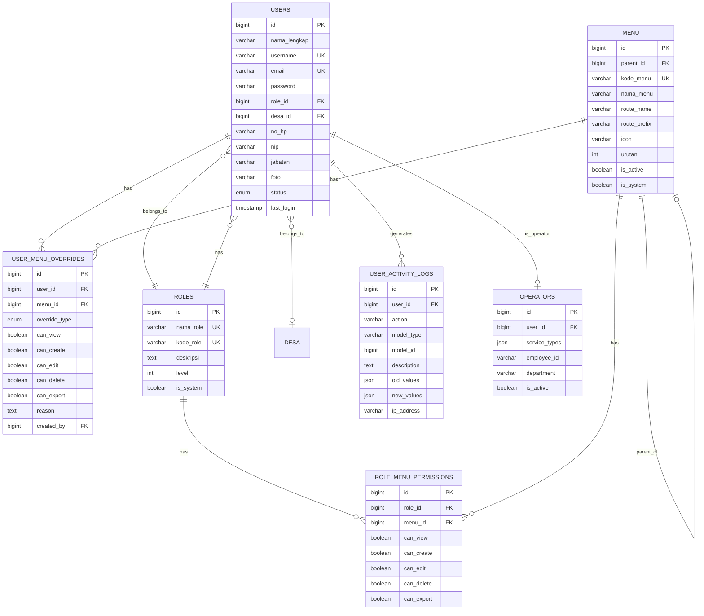

---

## 3. Role Hierarchy

### 3.1 Role Level Structure

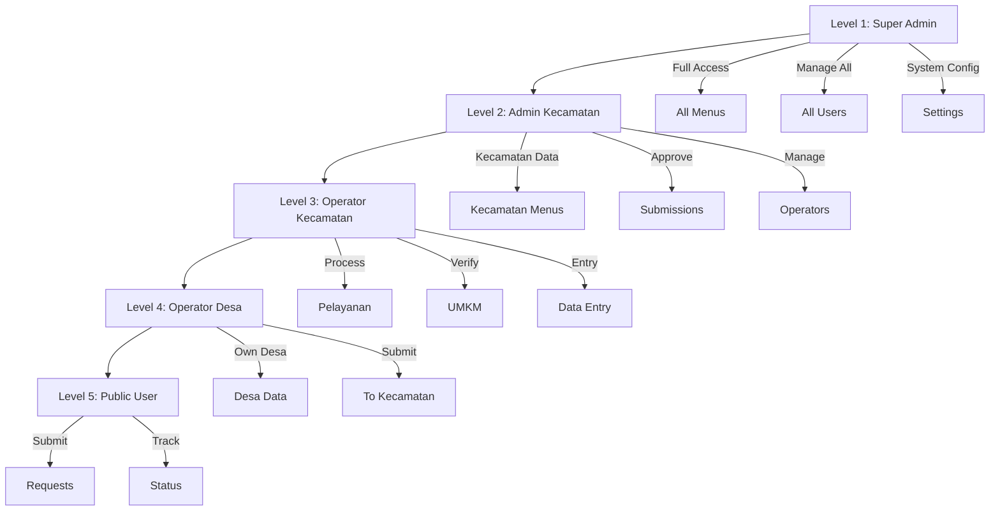

### 3.2 Detailed Role Capabilities

#### Level 1: Super Admin (SUPER_ADMIN)

| Capability | Description |
|------------|-------------|
| Full System Access | Access to all menus and features |
| User Management | Create, edit, delete any user |
| Role Management | Create, edit, delete roles |
| Permission Management | Configure all role permissions |
| System Configuration | App settings, menu management |
| Audit Access | View all activity logs |
| Data Management | Full CRUD on all data |

#### Level 2: Admin Kecamatan (ADMIN_KEC)

| Capability | Description |
|------------|-------------|
| Kecamatan Dashboard | View kecamatan-wide statistics |
| Approval Authority | Approve/reject submissions |
| Operator Management | Create and manage operators |
| Report Access | Generate all reports |
| Announcement | Create system announcements |
| Verification | Verify UMKM, services |
| Limited Settings | Working hours, announcements |

#### Level 3: Operator Kecamatan (OP_KEC)

| Capability | Description |
|------------|-------------|
| Service Processing | Handle assigned service types |
| Data Entry | Input kecamatan data |
| Verification | Verify submissions |
| Limited Reports | Generate assigned reports |
| UMKM Management | Manage UMKM data |
| Trantibum | Report and manage incidents |

#### Level 4: Operator Desa (OP_DESA)

| Capability | Description |
|------------|-------------|
| Desa Dashboard | View own desa statistics |
| Data Entry | Input own desa data only |
| Submission | Submit to kecamatan |
| Document Management | Manage desa documents |
| Limited Access | Only assigned desa |

#### Level 5: Public User (PUBLIC)

| Capability | Description |
|------------|-------------|
| Public Portal | Browse public information |
| Service Request | Submit service requests |
| UMKM Registration | Register own UMKM |
| Complaint | Submit complaints |
| Status Tracking | Track own submissions |

---

## 4. UI Design Specifications

### 4.1 User List Page

```
┌─────────────────────────────────────────────────────────────────────────────────┐
│ MANAJEMEN USER                                                  [+ Tambah User] │
├─────────────────────────────────────────────────────────────────────────────────┤
│                                                                                 │
│ ┌─────────────────────────────────────────────────────────────────────────────┐ │
│ │ Filter: [Semua Role ▼] [Semua Desa ▼] [Semua Status ▼]    [🔄 Reset]       │ │
│ │ 🔍 Cari nama, username, atau NIK...                              [Cari]   │ │
│ └─────────────────────────────────────────────────────────────────────────────┘ │
│                                                                                 │
│ ┌─────────────────────────────────────────────────────────────────────────────┐ │
│ │ 👤 Ahmad Sudirman                                            Status: ✅ Aktif│ │
│ │ 📧 ahmad@kecamatan.go.id                                    Role: Operator   │
│ │ 📱 0812-3456-7890                            Desa: Kecamatan Besuk         │ │
│ │ 🏢 Operator Pelayanan                         Last Login: 13 Feb 10:30     │ │
│ │                                               [Edit] [Permissions] [Reset]  │ │
│ └─────────────────────────────────────────────────────────────────────────────┘ │
│                                                                                 │
│ ┌─────────────────────────────────────────────────────────────────────────────┐ │
│ │ 👤 Budi Santoso                                              Status: ✅ Aktif│ │
│ │ 📧 budi@desa-besuk.go.id                       Role: Operator Desa         │ │
│ │ 📱 0813-4567-8901                              Desa: Besuk                 │ │
│ │ 🏢 Kepala Desa                                  Last Login: 13 Feb 08:15   │ │
│ │                                               [Edit] [Permissions] [Reset]  │ │
│ └─────────────────────────────────────────────────────────────────────────────┘ │
│                                                                                 │
│ ┌─────────────────────────────────────────────────────────────────────────────┐ │
│ │ 👤 Citra Dewi                                                Status: ⏳ Pending│
│ │ 📧 citra@gmail.com                              Role: Public User          │ │
│ │ 📱 0814-5678-9012                               Desa: -                    │ │
│ │ 🏢 Pemohon Baru                                 Last Login: Never          │ │
│ │                                               [Edit] [Activate] [Delete]   │ │
│ └─────────────────────────────────────────────────────────────────────────────┘ │
│                                                                                 │
│ ┌─────────────────────────────────────────────────────────────────────────────┐ │
│ │ 👤 Dedi Kurniawan*                                           Status: ✅ Aktif│ │
│ │ 📧 dedi@kecamatan.go.id                       Role: Operator Kecamatan     │ │
│ │ 📱 0815-6789-0123                              Desa: -                     │ │
│ │ 🏢 Operator Pelayanan + Trantibum              Last Login: 13 Feb 09:45   │ │
│ │                                               [Edit] [Permissions] [Reset]  │ │
│ └─────────────────────────────────────────────────────────────────────────────┘ │
│                                                                                 │
│ * Memiliki 2 permission overrides                                              │
│                                                                                 │
│ ─────────────────────────────────────────────────────────────────────────────── │
│ Menampilkan 1-4 dari 24 user                                                  │
│ [1] [2] [3] ... [6]                                                            │
└─────────────────────────────────────────────────────────────────────────────────┘
```

### 4.2 Add/Edit User Form

```
┌─────────────────────────────────────────────────────────────────────────────────┐
│ TAMBAH USER BARU                                                       [✕ Tutup]│
├─────────────────────────────────────────────────────────────────────────────────┤
│                                                                                 │
│  [Data Pribadi]  [Akun]  [Permissions]  [Akses Desa]                           │
│  ═════════════════════════════════════════════════════════════════════════════  │
│                                                                                 │
│  ┌──────────────────────────────────────────────────────────────────────────┐   │
│  │ DATA PRIBADI                                                             │   │
│  │                                                                          │   │
│  │ Nama Lengkap *                                                           │   │
│  │ ┌────────────────────────────────────────────────────────────────────┐   │   │
│  │ │                                                                    │   │   │
│  │ └────────────────────────────────────────────────────────────────────┘   │   │
│  │                                                                          │   │
│  │ NIP                                                                      │   │
│  │ ┌────────────────────────────────────────────────────────────────────┐   │   │
│  │ │ 197501011998031001                                                 │   │   │
│  │ └────────────────────────────────────────────────────────────────────┘   │   │
│  │                                                                          │   │
│  │ Jabatan                                                                  │   │
│  │ ┌────────────────────────────────────────────────────────────────────┐   │   │
│  │ │ Kepala Seksi Pelayanan                                             │   │   │
│  │ └────────────────────────────────────────────────────────────────────┘   │   │
│  │                                                                          │   │
│  │ Nomor HP / WhatsApp *                                                   │   │
│  │ ┌────────────────────────────────────────────────────────────────────┐   │   │
│  │ │ 08xx-xxxx-xxxx                                        [Verify WA]   │   │   │
│  │ └────────────────────────────────────────────────────────────────────┘   │   │
│  │                                                                          │   │
│  │ Foto Profil                                                              │   │
│  │ ┌────────────────────────────────────────────────────────────────────┐   │   │
│  │ │ [Pilih File]                                                        │   │   │
│  │ └────────────────────────────────────────────────────────────────────┘   │   │
│  └──────────────────────────────────────────────────────────────────────────┘   │
│                                                                                 │
│                                          [Batal]  [Simpan & Lanjutkan →]       │
└─────────────────────────────────────────────────────────────────────────────────┘
```

### 4.3 Account Settings Tab

```
┌─────────────────────────────────────────────────────────────────────────────────┐
│ EDIT USER - Ahmad Sudirman                                             [✕ Tutup]│
├─────────────────────────────────────────────────────────────────────────────────┤
│                                                                                 │
│  [Data Pribadi]  [Akun]  [Permissions]  [Akses Desa]                           │
│  ═════════════════════════════════════════════════════════════════════════════  │
│                                                                                 │
│  ┌──────────────────────────────────────────────────────────────────────────┐   │
│  │ PENGATURAN AKUN                                                          │   │
│  │                                                                          │   │
│  │ Username *                                                               │   │
│  │ ┌────────────────────────────────────────────────────────────────────┐   │   │
│  │ │ ahmad.sudirman                                                     │   │   │
│  │ └────────────────────────────────────────────────────────────────────┘   │   │
│  │                                                                          │   │
│  │ Email                                                                    │   │
│  │ ┌────────────────────────────────────────────────────────────────────┐   │   │
│  │ │ ahmad@kecamatan.go.id                                              │   │   │
│  │ └────────────────────────────────────────────────────────────────────┘   │   │
│  │                                                                          │   │
│  │ Role *                                                                   │   │
│  │ ┌────────────────────────────────────────────────────────────────────┐   │   │
│  │ │ Operator Kecamatan ▼                                               │   │   │
│  │ └────────────────────────────────────────────────────────────────────┘   │   │
│  │                                                                          │   │
│  │ Status *                                                                 │   │
│  │ ┌────────────────────────────────────────────────────────────────────┐   │   │
│  │ │ ◉ Aktif   ○ Nonaktif   ○ Pending                                   │   │   │
│  │ └────────────────────────────────────────────────────────────────────┘   │   │
│  │                                                                          │   │
│  │ Password                                                                 │   │
│  │ ┌────────────────────────────────────────────────────────────────────┐   │   │
│  │ │ ••••••••••••                                       [Reset Password] │   │   │
│  │ └────────────────────────────────────────────────────────────────────┘   │   │
│  └──────────────────────────────────────────────────────────────────────────┘   │
│                                                                                 │
│                                          [Batal]  [Simpan Perubahan]           │
└─────────────────────────────────────────────────────────────────────────────────┘
```

### 4.4 Permission Matrix Page

```
┌─────────────────────────────────────────────────────────────────────────────────┐
│ PERMISSION MATRIX                                                               │
├─────────────────────────────────────────────────────────────────────────────────┤
│                                                                                 │
│  Role: [Operator Kecamatan ▼]                    [Copy from Role ▼]            │
│                                                                                 │
│  ┌───────────────────────────────────────────────────────────────────────────┐ │
│  │ Menu                    │ View │ Create │ Edit │ Delete │ Export │ Aksi   │ │
│  ├─────────────────────────┼──────┼────────┼──────┼────────┼────────┼────────┤ │
│  │ ☑ Dashboard             │  ✓   │   -    │  -   │   -    │   ✓    │[Reset] │ │
│  ├─────────────────────────┼──────┼────────┼──────┼────────┼────────┼────────┤ │
│  │ ☑ Pemerintahan          │  ✓   │   ✓    │  ✓   │   ✓    │   ✓    │[Reset] │ │
│  │   │── ☑ Buku Induk      │  ✓   │   ✓    │  ✓   │   ✗    │   ✓    │[Reset] │ │
│  │   │── ☑ Perencanaan     │  ✓   │   ✓    │  ✓   │   ✗    │   ✓    │[Reset] │ │
│  │   └── ☑ Administrasi    │  ✓   │   ✓    │  ✓   │   ✗    │   ✓    │[Reset] │ │
│  ├─────────────────────────┼──────┼────────┼──────┼────────┼────────┼────────┤ │
│  │ ☑ Ekonomi               │  ✓   │   ✓    │  ✓   │   ✓    │   ✓    │[Reset] │ │
│  │   │── ☑ UMKM            │  ✓   │   ✓    │  ✓   │   ✓    │   ✓    │[Reset] │ │
│  │   └── ☑ Loker           │  ✓   │   ✓    │  ✓   │   ✓    │   ✓    │[Reset] │ │
│  ├─────────────────────────┼──────┼────────┼──────┼────────┼────────┼────────┤ │
│  │ ☐ Trantibum             │  ✗   │   ✗    │  ✗   │   ✗    │   ✗    │[Reset] │ │
│  ├─────────────────────────┼──────┼────────┼──────┼────────┼────────┼────────┤ │
│  │ ☑ Pelayanan Publik      │  ✓   │   ✓    │  ✓   │   ✗    │   ✓    │[Reset] │ │
│  ├─────────────────────────┼──────┼────────┼──────┼────────┼────────┼────────┤ │
│  │ ☐ Manajemen User        │  ✗   │   ✗    │  ✗   │   ✗    │   ✗    │[Reset] │ │
│  ├─────────────────────────┼──────┼────────┼──────┼────────┼────────┼────────┤ │
│  │ ☐ Pengaturan Sistem     │  ✗   │   ✗    │  ✗   │   ✗    │   ✗    │[Reset] │ │
│  └─────────────────────────┴──────┴────────┴──────┴────────┴────────┴────────┘ │
│                                                                                 │
│  [✓] Select All    [✗] Deselect All    [Reset All]    [Simpan Permissions]    │
│                                                                                 │
└─────────────────────────────────────────────────────────────────────────────────┘
```

### 4.5 User Override Management

```
┌─────────────────────────────────────────────────────────────────────────────────┐
│ OVERRIDE PERMISSION - Dedi Kurniawan                                   [✕ Tutup]│
├─────────────────────────────────────────────────────────────────────────────────┤
│                                                                                 │
│  User: Dedi Kurniawan (Operator Kecamatan)                                     │
│  Role Default: Dashboard, Pemerintahan, Ekonomi, Pelayanan Publik              │
│                                                                                 │
│  ┌───────────────────────────────────────────────────────────────────────────┐ │
│  │ TAMBAH OVERRIDE BARU                                                      │ │
│  │                                                                           │ │
│  │ Menu: [Trantibum ▼]              Type: [◉ Allow  ○ Deny]                 │ │
│  │                                                                           │ │
│  │ Permissions: ☑ View  ☑ Create  ☐ Edit  ☐ Delete  ☐ Export               │ │
│  │                                                                           │ │
│  │ Berlaku dari: [__/__/____] sampai: [__/__/____] (opsional)              │ │
│  │                                                                           │ │
│  │ Alasan:                                                                   │ │
│  │ ┌─────────────────────────────────────────────────────────────────────┐   │ │
│  │ │ Berikan akses khusus untuk input kejadian Trantibum selama          │   │ │
│  │ │ Camat cuti                                                          │   │ │
│  │ └─────────────────────────────────────────────────────────────────────┘   │ │
│  │                                                           [Tambah Override]│ │
│  └───────────────────────────────────────────────────────────────────────────┘ │
│                                                                                 │
│  ─────────────────────────────────────────────────────────────────────────────  │
│                                                                                 │
│  OVERRIDE AKTIF:                                                                │
│                                                                                 │
│  ┌───────────────────────────────────────────────────────────────────────────┐ │
│  │ Menu          │ Type   │ Permissions      │ Berlaku    │ Aksi            │ │
│  ├───────────────┼────────┼──────────────────┼────────────┼─────────────────┤ │
│  │ Trantibum     │ Allow  │ View, Create     │ 10-17 Feb  │ [Edit] [Hapus]  │ │
│  │ Manajemen User│ Deny   │ Semua dicabut    │ Permanent  │ [Edit] [Hapus]  │ │
│  └───────────────┴────────┴──────────────────┴────────────┴─────────────────┘ │
│                                                                                 │
└─────────────────────────────────────────────────────────────────────────────────┘
```

### 4.6 User Activity Log View

```
┌─────────────────────────────────────────────────────────────────────────────────┐
│ LOG AKTIVITAS - Ahmad Sudirman                                         [✕ Tutup]│
├─────────────────────────────────────────────────────────────────────────────────┤
│                                                                                 │
│  Filter: [Semua Aksi ▼]  Periode: [13 Feb 2026] - [13 Feb 2026]               │
│                                                                                 │
│  ┌───────────────────────────────────────────────────────────────────────────┐ │
│  │ 13 Feb 2026 10:45:23                                                      │ │
│  │ ┌─────────────────────────────────────────────────────────────────────┐   │ │
│  │ │ 🔵 UPDATE - Pelayanan #PL-2026-0234                                 │   │ │
│  │ │ Status: Diproses → Selesai                                          │   │ │
│  │ │ IP: 192.168.1.100 | Browser: Chrome 120                             │   │ │
│  │ └─────────────────────────────────────────────────────────────────────┘   │ │
│  │                                                                           │ │
│  │ 13 Feb 2026 10:30:15                                                      │ │
│  │ ┌─────────────────────────────────────────────────────────────────────┐   │ │
│  │ │ 🟢 LOGIN                                                            │   │ │
│  │ │ Login berhasil dari IP: 192.168.1.100                               │   │ │
│  │ │ Browser: Chrome 120 on Windows 11                                   │   │ │
│  │ └─────────────────────────────────────────────────────────────────────┘   │ │
│  │                                                                           │ │
│  │ 12 Feb 2026 15:22:10                                                      │ │
│  │ ┌─────────────────────────────────────────────────────────────────────┐   │ │
│  │ │ 🟡 CREATE - UMKM #UMKM-2026-0089                                    │   │ │
│  │ │ Membuat data UMKM baru: Warung Kopi Pak Budi                        │   │ │
│  │ │ IP: 192.168.1.100 | Browser: Chrome 120                             │   │ │
│  │ └─────────────────────────────────────────────────────────────────────┘   │ │
│  │                                                                           │ │
│  │ 12 Feb 2026 09:05:33                                                      │ │
│  │ ┌─────────────────────────────────────────────────────────────────────┐   │ │
│  │ │ 🔴 LOGOUT                                                           │   │ │
│  │ │ Logout dari sistem                                                  │   │ │
│  │ │ IP: 192.168.1.100                                                   │   │ │
│  │ └─────────────────────────────────────────────────────────────────────┘   │ │
│  └───────────────────────────────────────────────────────────────────────────┘ │
│                                                                                 │
│  [Export CSV]  [Export PDF]                                                    │
│                                                                                 │
└─────────────────────────────────────────────────────────────────────────────────┘
```

---

## 5. Permission Matrix

### 5.1 Complete Permission Matrix by Role

| Menu | Super Admin | Admin Kec | Op. Kec | Op. Desa | Public |
|------|:-----------:|:---------:|:-------:|:--------:|:------:|
| **Dashboard** | V,C,E,D,X | V,X | V,X | V | V |
| **Pemerintahan** | V,C,E,D,X | V,C,E,D,X | V,C,E,X | V,C,E | - |
| ├ Buku Induk | V,C,E,D,X | V,C,E,D,X | V,C,E,X | V,C,E | - |
| ├ Perencanaan | V,C,E,D,X | V,C,E,D,X | V,C,E,X | V,C,E | - |
| └ Administrasi | V,C,E,D,X | V,C,E,D,X | V,C,E,X | V,C,E | - |
| **Ekonomi** | V,C,E,D,X | V,C,E,D,X | V,C,E,X | V | V |
| ├ UMKM | V,C,E,D,X | V,C,E,D,X | V,C,E,X | V | V,C,E* |
| └ Loker | V,C,E,D,X | V,C,E,D,X | V,C,E,X | V | V |
| **Kesra** | V,C,E,D,X | V,C,E,D,X | V,C,E,X | V | - |
| **Trantibum** | V,C,E,D,X | V,C,E,D,X | V,C,E,X | V,C | - |
| **Pelayanan Publik** | V,C,E,D,X | V,C,E,X | V,C,E,X | V,C | V,C* |
| **Manajemen User** | V,C,E,D,X | V,C,E,X | - | - | - |
| **Pengaturan Sistem** | V,C,E,D,X | V,X | - | - | - |
| **Audit Logs** | V,X | V | - | - | - |

**Legend:**
- V = View
- C = Create
- E = Edit
- D = Delete
- X = Export
- * = Own data only
- - = No access

### 5.2 Action-Level Permissions

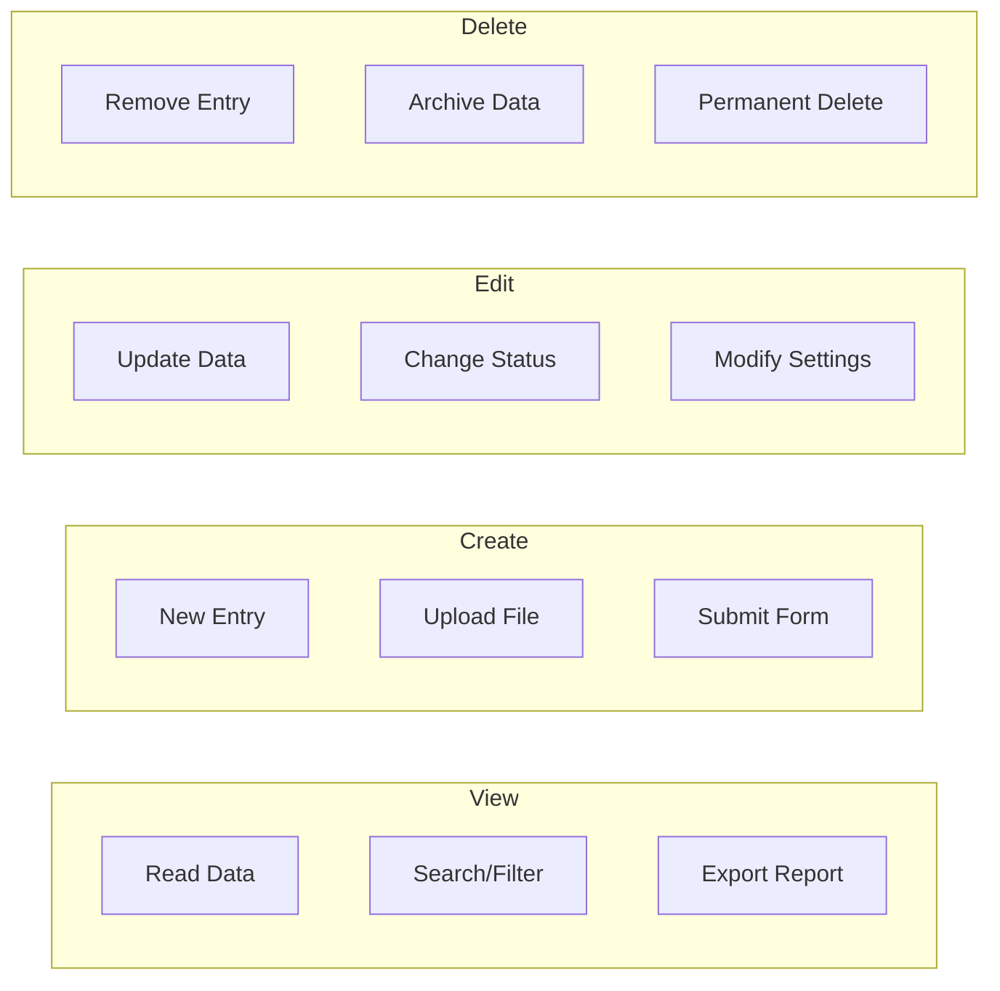

---

## 6. Workflow Diagrams

### 6.1 User Login Flow

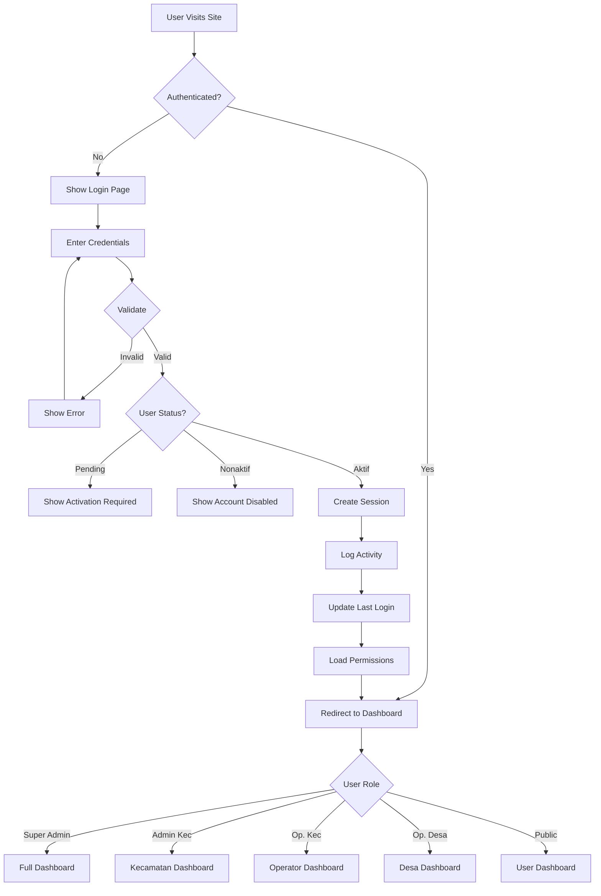

### 6.2 Permission Check Flow

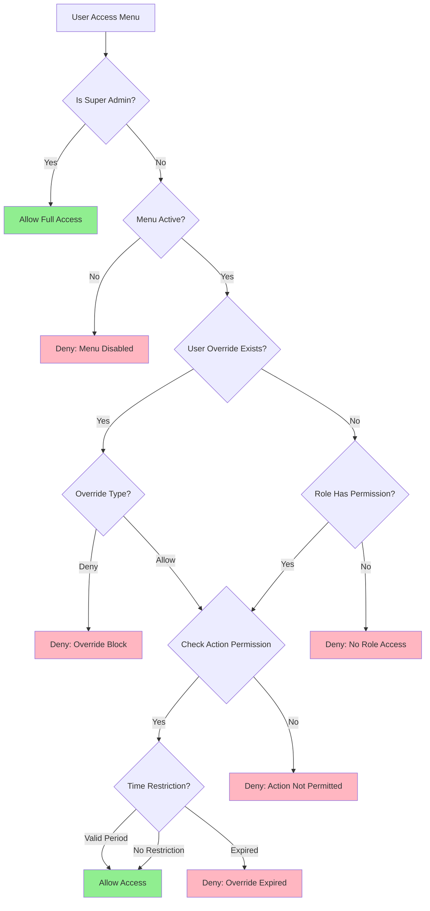

### 6.3 Data Access Flow by Role

```mermaid
flowchart TD
    A[Data Request] --> B{User Role}
    
    B -->|Super Admin| C[All Data Access]
    B -->|Admin Kecamatan| D[Kecamatan Level Data]
    B -->|Operator Kecamatan| E[Assigned Data]
    B -->|Operator Desa| F[Own Desa Data]
    B -->|Public User| G[Own Data Only]
    
    C --> H[Apply Filters]
    D --> H
    E --> I{Assignment Type}
    F --> J[Filter by desa_id]
    G --> K[Filter by user_id]
    
    I -->|Service Type| L[Filter by service_type]
    I -->|General| M[All Kecamatan Data]
    
    H --> N[Return Data]
    J --> N
    K --> N
    L --> N
    M --> N
```

### 6.4 Submission Workflow with User Assignment

```mermaid
flowchart TD
    A[Public User Submits Request] --> B[Create Submission Record]
    B --> C[Generate Tracking Code]
    C --> D[Send Confirmation]
    
    D --> E{Auto Assignment?}
    E -->|Yes| F[Find Available Operator]
    E -->|No| G[Queue for Manual Assignment]
    
    F --> H{Operator Available?}
    H -->|Yes| I[Assign to Operator]
    H -->|No| G
    
    G --> J[Admin Assigns Manually]
    J --> I
    
    I --> K[Notify Operator]
    K --> L[Operator Processes]
    
    L --> M{Decision}
    M -->|Approve| N[Generate Letter]
    M -->|Reject| O[Record Reason]
    M -->|Return| P[Request Revision]
    
    N --> Q[Add QR Code]
    Q --> R[Mark Complete]
    R --> S[Notify User]
    
    O --> S
    P --> T[User Revises]
    T --> L
```

### 6.5 User Management Workflow

```mermaid
flowchart TD
    A[Admin Opens User Management] --> B[View User List]
    
    B --> C{Action}
    C -->|Add User| D[Open Add Form]
    C -->|Edit User| E[Open Edit Form]
    C -->|Manage Permissions| F[Open Permission Matrix]
    C -->|View Activity| G[Open Activity Log]
    C -->|Reset Password| H[Send Reset Link]
    
    D --> D1[Fill Personal Data]
    D1 --> D2[Set Account Info]
    D2 --> D3[Assign Role]
    D3 --> D4{Role = Op. Desa?}
    D4 -->|Yes| D5[Assign Desa]
    D4 -->|No| D6[Review & Save]
    D5 --> D6
    
    E --> E1[Edit Fields]
    E1 --> E2[Save Changes]
    E2 --> E3[Log Activity]
    
    F --> F1[Select Role]
    F1 --> F2[Modify Permissions]
    F2 --> F3[Save Matrix]
    F3 --> F4[Clear User Cache]
    
    G --> G1[Filter by Date/Action]
    G1 --> G2[View Details]
    G2 --> G3[Export Report]
```

---

## 7. Model Relationships

### 7.1 Updated Role Model

```php
// app/Models/Role.php
<?php

namespace App\Models;

use Illuminate\Database\Eloquent\Factories\HasFactory;
use Illuminate\Database\Eloquent\Model;

class Role extends Model
{
    use HasFactory;

    protected $fillable = ['nama_role', 'kode_role', 'deskripsi', 'level', 'is_system'];

    protected $casts = [
        'is_system' => 'boolean',
    ];

    // Constants for role codes
    const SUPER_ADMIN = 'SUPER_ADMIN';
    const ADMIN_KEC = 'ADMIN_KEC';
    const OP_KEC = 'OP_KEC';
    const OP_DESA = 'OP_DESA';
    const PUBLIC = 'PUBLIC';

    public function users()
    {
        return $this->hasMany(User::class);
    }

    public function menuPermissions()
    {
        return $this->hasMany(RoleMenuPermission::class);
    }

    public function menus()
    {
        return $this->belongsToMany(Menu::class, 'role_menu_permissions')
            ->withPivot(['can_view', 'can_create', 'can_edit', 'can_delete', 'can_export'])
            ->withTimestamps();
    }

    public function hasMenuAccess(string $kodeMenu, string $action = 'view'): bool
    {
        $permission = $this->menuPermissions()
            ->whereHas('menu', fn($q) => $q->where('kode_menu', $kodeMenu))
            ->first();

        if (!$permission) {
            return false;
        }

        return match($action) {
            'view' => $permission->can_view,
            'create' => $permission->can_create,
            'edit' => $permission->can_edit,
            'delete' => $permission->can_delete,
            'export' => $permission->can_export,
            default => false,
        };
    }

    public function isSuperAdmin(): bool
    {
        return $this->kode_role === self::SUPER_ADMIN;
    }
}
```

### 7.2 Updated Menu Model

```php
// app/Models/Menu.php
<?php

namespace App\Models;

use Illuminate\Database\Eloquent\Factories\HasFactory;
use Illuminate\Database\Eloquent\Model;

class Menu extends Model
{
    use HasFactory;

    protected $table = 'menu';
    protected $guarded = ['id'];

    protected $casts = [
        'is_active' => 'boolean',
        'is_system' => 'boolean',
    ];

    public function parent()
    {
        return $this->belongsTo(Menu::class, 'parent_id');
    }

    public function children()
    {
        return $this->hasMany(Menu::class, 'parent_id')->orderBy('urutan');
    }

    public function rolePermissions()
    {
        return $this->hasMany(RoleMenuPermission::class);
    }

    public function userOverrides()
    {
        return $this->hasMany(UserMenuOverride::class);
    }

    public function aspek()
    {
        return $this->hasMany(Aspek::class)->orderBy('urutan');
    }

    public function scopeActive($query)
    {
        return $query->where('is_active', true);
    }

    public function scopeRoots($query)
    {
        return $query->whereNull('parent_id');
    }

    public function scopeSystem($query)
    {
        return $query->where('is_system', true);
    }
}
```

### 7.3 New RoleMenuPermission Model

```php
// app/Models/RoleMenuPermission.php
<?php

namespace App\Models;

use Illuminate\Database\Eloquent\Factories\HasFactory;
use Illuminate\Database\Eloquent\Model;

class RoleMenuPermission extends Model
{
    use HasFactory;

    protected $fillable = [
        'role_id',
        'menu_id',
        'can_view',
        'can_create',
        'can_edit',
        'can_delete',
        'can_export',
    ];

    protected $casts = [
        'can_view' => 'boolean',
        'can_create' => 'boolean',
        'can_edit' => 'boolean',
        'can_delete' => 'boolean',
        'can_export' => 'boolean',
    ];

    public function role()
    {
        return $this->belongsTo(Role::class);
    }

    public function menu()
    {
        return $this->belongsTo(Menu::class);
    }
}
```

### 7.4 New UserMenuOverride Model

```php
// app/Models/UserMenuOverride.php
<?php

namespace App\Models;

use Illuminate\Database\Eloquent\Factories\HasFactory;
use Illuminate\Database\Eloquent\Model;

class UserMenuOverride extends Model
{
    use HasFactory;

    protected $fillable = [
        'user_id',
        'menu_id',
        'override_type',
        'can_view',
        'can_create',
        'can_edit',
        'can_delete',
        'can_export',
        'reason',
        'created_by',
        'valid_from',
        'valid_until',
    ];

    protected $casts = [
        'can_view' => 'boolean',
        'can_create' => 'boolean',
        'can_edit' => 'boolean',
        'can_delete' => 'boolean',
        'can_export' => 'boolean',
        'valid_from' => 'datetime',
        'valid_until' => 'datetime',
    ];

    public function user()
    {
        return $this->belongsTo(User::class);
    }

    public function menu()
    {
        return $this->belongsTo(Menu::class);
    }

    public function creator()
    {
        return $this->belongsTo(User::class, 'created_by');
    }

    public function isValid(): bool
    {
        $now = now();
        
        if ($this->valid_from && $now->lt($this->valid_from)) {
            return false;
        }
        
        if ($this->valid_until && $now->gt($this->valid_until)) {
            return false;
        }
        
        return true;
    }
}
```

### 7.5 New UserActivityLog Model

```php
// app/Models/UserActivityLog.php
<?php

namespace App\Models;

use Illuminate\Database\Eloquent\Factories\HasFactory;
use Illuminate\Database\Eloquent\Model;

class UserActivityLog extends Model
{
    use HasFactory;

    public $timestamps = false;

    protected $fillable = [
        'user_id',
        'action',
        'model_type',
        'model_id',
        'description',
        'old_values',
        'new_values',
        'ip_address',
        'user_agent',
        'created_at',
    ];

    protected $casts = [
        'old_values' => 'array',
        'new_values' => 'array',
        'created_at' => 'datetime',
    ];

    // Action constants
    const ACTION_LOGIN = 'login';
    const ACTION_LOGOUT = 'logout';
    const ACTION_VIEW = 'view';
    const ACTION_CREATE = 'create';
    const ACTION_UPDATE = 'update';
    const ACTION_DELETE = 'delete';
    const ACTION_EXPORT = 'export';

    public function user()
    {
        return $this->belongsTo(User::class);
    }

    public function subject()
    {
        return $this->morphTo('model');
    }

    public static function log(string $action, $model = null, string $description = null)
    {
        return static::create([
            'user_id' => auth()->id(),
            'action' => $action,
            'model_type' => $model ? get_class($model) : null,
            'model_id' => $model?->id,
            'description' => $description,
            'ip_address' => request()->ip(),
            'user_agent' => request()->userAgent(),
            'created_at' => now(),
        ]);
    }
}
```

### 7.6 New Operator Model

```php
// app/Models/Operator.php
<?php

namespace App\Models;

use Illuminate\Database\Eloquent\Factories\HasFactory;
use Illuminate\Database\Eloquent\Model;

class Operator extends Model
{
    use HasFactory;

    protected $fillable = [
        'user_id',
        'service_types',
        'employee_id',
        'department',
        'position',
        'work_days',
        'work_start',
        'work_end',
        'total_processed',
        'total_approved',
        'total_rejected',
        'avg_processing_time',
        'is_active',
    ];

    protected $casts = [
        'service_types' => 'array',
        'work_days' => 'array',
        'is_active' => 'boolean',
    ];

    public function user()
    {
        return $this->belongsTo(User::class);
    }

    public function isWorkingNow(): bool
    {
        $now = now();
        $dayOfWeek = $now->dayOfWeekIso; // 1=Monday, 7=Sunday
        
        if (!in_array($dayOfWeek, $this->work_days ?? [])) {
            return false;
        }
        
        $currentTime = $now->format('H:i:s');
        return $currentTime >= $this->work_start && $currentTime <= $this->work_end;
    }

    public function canHandleService(int $serviceTypeId): bool
    {
        return in_array($serviceTypeId, $this->service_types ?? []);
    }

    public function updateMetrics(int $processingTime, string $result): void
    {
        $this->total_processed++;
        
        if ($result === 'approved') {
            $this->total_approved++;
        } elseif ($result === 'rejected') {
            $this->total_rejected++;
        }
        
        // Calculate rolling average
        $this->avg_processing_time = 
            (($this->avg_processing_time * ($this->total_processed - 1)) + $processingTime) 
            / $this->total_processed;
        
        $this->save();
    }
}
```

### 7.7 Updated User Model

```php
// app/Models/User.php - Add these methods to existing model

/**
 * Menu overrides relationship
 */
public function menuOverrides()
{
    return $this->hasMany(UserMenuOverride::class);
}

/**
 * Activity logs relationship
 */
public function activityLogs()
{
    return $this->hasMany(UserActivityLog::class);
}

/**
 * Operator profile relationship
 */
public function operator()
{
    return $this->hasOne(Operator::class);
}

/**
 * Check if user can access a specific menu with given action
 */
public function canAccessMenu(string $kodeMenu, string $action = 'view'): bool
{
    // Super Admin always has access
    if ($this->role?->isSuperAdmin()) {
        return true;
    }

    $menu = Menu::where('kode_menu', $kodeMenu)->first();
    if (!$menu || !$menu->is_active) {
        return false;
    }

    // Check user override first (highest priority)
    $override = $this->menuOverrides()
        ->where('menu_id', $menu->id)
        ->where(function ($q) {
            $q->whereNull('valid_from')
                ->orWhere('valid_from', '<=', now());
        })
        ->where(function ($q) {
            $q->whereNull('valid_until')
                ->orWhere('valid_until', '>=', now());
        })
        ->first();

    if ($override) {
        if ($override->override_type === 'deny') {
            return false;
        }
        
        $actionColumn = 'can_' . $action;
        if ($override->$actionColumn !== null) {
            return $override->$actionColumn;
        }
    }

    // Fall back to role permission
    if (!$this->role) {
        return false;
    }

    return $this->role->hasMenuAccess($kodeMenu, $action);
}

/**
 * Get all menus accessible by this user
 */
public function getAccessibleMenus()
{
    $cacheKey = "user_menus:{$this->id}";
    
    return Cache::remember($cacheKey, 3600, function () {
        if ($this->role?->isSuperAdmin()) {
            return Menu::active()->roots()->with('children')->orderBy('urutan')->get();
        }

        $roleMenuIds = $this->role?->menuPermissions()
            ->where('can_view', true)
            ->pluck('menu_id') ?? collect();

        $overrideAllowIds = $this->menuOverrides()
            ->where('override_type', 'allow')
            ->where('can_view', true)
            ->whereValid()
            ->pluck('menu_id');

        $overrideDenyIds = $this->menuOverrides()
            ->where('override_type', 'deny')
            ->whereValid()
            ->pluck('menu_id');

        $accessibleIds = $roleMenuIds->merge($overrideAllowIds)
            ->diff($overrideDenyIds)
            ->unique();

        return Menu::active()
            ->whereIn('id', $accessibleIds)
            ->roots()
            ->with(['children' => function($q) use ($accessibleIds) {
                $q->whereIn('id', $accessibleIds);
            }])
            ->orderBy('urutan')
            ->get();
    });
}

/**
 * Clear user permission cache
 */
public function clearPermissionCache(): void
{
    Cache::forget("user_menus:{$this->id}");
}

/**
 * Log user activity
 */
public function logActivity(string $action, $model = null, string $description = null)
{
    return UserActivityLog::log($action, $model, $description);
}
```

---

## 8. Middleware Implementation

### 8.1 CheckMenuPermission Middleware

```php
// app/Http/Middleware/CheckMenuPermission.php
<?php

namespace App\Http\Middleware;

use Closure;
use Illuminate\Http\Request;
use App\Models\Menu;
use Symfony\Component\HttpFoundation\Response;

class CheckMenuPermission
{
    /**
     * Handle an incoming request.
     *
     * @param  \Closure(\Illuminate\Http\Request): (\Symfony\Component\HttpFoundation\Response)  $next
     */
    public function handle(Request $request, Closure $next, string $kodeMenu, string $action = 'view'): Response
    {
        $user = $request->user();

        // Must be authenticated
        if (!$user) {
            return redirect()->route('login');
        }

        // Check if user is active
        if ($user->status !== 'aktif') {
            abort(403, 'Akun Anda tidak aktif.');
        }

        // Check menu permission
        if (!$user->canAccessMenu($kodeMenu, $action)) {
            $menu = Menu::where('kode_menu', $kodeMenu)->first();
            $menuName = $menu?->nama_menu ?? $kodeMenu;

            if ($request->expectsJson()) {
                return response()->json([
                    'status' => 'error',
                    'message' => "Anda tidak memiliki akses ke fitur {$menuName}.",
                ], 403);
            }

            return redirect()->route('dashboard')
                ->with('error', "Anda tidak memiliki akses ke fitur {$menuName}.");
        }

        return $next($request);
    }
}
```

### 8.2 Register Middleware

```php
// app/Http/Kernel.php - Add to $middlewareAliases
protected $middlewareAliases = [
    // ... existing aliases
    'menu.permission' => \App\Http\Middleware\CheckMenuPermission::class,
];
```

### 8.3 Route Usage Examples

```php
// routes/web.php

// Single action check
Route::middleware(['auth', 'menu.permission:UMKM,view'])
    ->get('/kecamatan/umkm', [UmkmController::class, 'index'])
    ->name('kecamatan.umkm.index');

// Multiple action checks
Route::middleware(['auth', 'menu.permission:UMKM,create'])
    ->post('/kecamatan/umkm', [UmkmController::class, 'store'])
    ->name('kecamatan.umkm.store');

Route::middleware(['auth', 'menu.permission:UMKM,edit'])
    ->put('/kecamatan/umkm/{id}', [UmkmController::class, 'update'])
    ->name('kecamatan.umkm.update');

Route::middleware(['auth', 'menu.permission:UMKM,delete'])
    ->delete('/kecamatan/umkm/{id}', [UmkmController::class, 'destroy'])
    ->name('kecamatan.umkm.destroy');

// Group with common menu check
Route::middleware(['auth', 'menu.permission:PEM,view'])->group(function () {
    Route::get('/pemerintahan', [PemerintahanController::class, 'index']);
    Route::get('/pemerintahan/buku-induk', [PemerintahanController::class, 'bukuInduk']);
});
```

---

## 9. Controller Implementation

### 9.1 RolePermissionController

```php
// app/Http/Controllers/Kecamatan/RolePermissionController.php
<?php

namespace App\Http\Controllers\Kecamatan;

use App\Http\Controllers\Controller;
use App\Models\Role;
use App\Models\Menu;
use App\Models\RoleMenuPermission;
use Illuminate\Http\Request;

class RolePermissionController extends Controller
{
    public function index()
    {
        $roles = Role::withCount('users')->get();
        return view('kecamatan.permissions.index', compact('roles'));
    }

    public function edit(Role $role)
    {
        // Prevent editing Super Admin permissions
        if ($role->isSuperAdmin()) {
            return redirect()->route('kecamatan.permissions.index')
                ->with('error', 'Permission Super Admin tidak dapat diubah.');
        }

        $menus = Menu::with(['rolePermissions' => function($q) use ($role) {
            $q->where('role_id', $role->id);
        }])->orderBy('urutan')->get();

        return view('kecamatan.permissions.edit', compact('role', 'menus'));
    }

    public function update(Request $request, Role $role)
    {
        // Prevent editing Super Admin permissions
        if ($role->isSuperAdmin()) {
            return redirect()->route('kecamatan.permissions.index')
                ->with('error', 'Permission Super Admin tidak dapat diubah.');
        }

        $permissions = $request->input('permissions', []);

        // Clear existing permissions
        RoleMenuPermission::where('role_id', $role->id)->delete();

        // Insert new permissions
        foreach ($permissions as $menuId => $actions) {
            if (isset($actions['can_view']) && $actions['can_view']) {
                RoleMenuPermission::create([
                    'role_id' => $role->id,
                    'menu_id' => $menuId,
                    'can_view' => $actions['can_view'] ?? false,
                    'can_create' => $actions['can_create'] ?? false,
                    'can_edit' => $actions['can_edit'] ?? false,
                    'can_delete' => $actions['can_delete'] ?? false,
                    'can_export' => $actions['can_export'] ?? false,
                ]);
            }
        }

        // Clear cache for all users with this role
        $role->users->each->clearPermissionCache();

        return redirect()->route('kecamatan.permissions.index')
            ->with('success', "Permission untuk role {$role->nama_role} berhasil diperbarui.");
    }

    public function reset(Role $role, Menu $menu)
    {
        RoleMenuPermission::where('role_id', $role->id)
            ->where('menu_id', $menu->id)
            ->delete();

        $role->users->each->clearPermissionCache();

        return back()->with('success', 'Permission berhasil direset.');
    }
}
```

### 9.2 UserOverrideController

```php
// app/Http/Controllers/Kecamatan/UserOverrideController.php
<?php

namespace App\Http\Controllers\Kecamatan;

use App\Http\Controllers\Controller;
use App\Models\User;
use App\Models\Menu;
use App\Models\UserMenuOverride;
use Illuminate\Http\Request;

class UserOverrideController extends Controller
{
    public function index(User $user)
    {
        $user->load(['role', 'menuOverrides.menu']);
        $menus = Menu::orderBy('urutan')->get();

        return view('kecamatan.users.overrides', compact('user', 'menus'));
    }

    public function store(Request $request, User $user)
    {
        $validated = $request->validate([
            'menu_id' => 'required|exists:menu,id',
            'override_type' => 'required|in:allow,deny',
            'can_view' => 'nullable|boolean',
            'can_create' => 'nullable|boolean',
            'can_edit' => 'nullable|boolean',
            'can_delete' => 'nullable|boolean',
            'can_export' => 'nullable|boolean',
            'reason' => 'required|string|max:500',
            'valid_from' => 'nullable|date',
            'valid_until' => 'nullable|date|after_or_equal:valid_from',
        ]);

        // Check if override already exists
        $existing = UserMenuOverride::where('user_id', $user->id)
            ->where('menu_id', $validated['menu_id'])
            ->first();

        if ($existing) {
            return back()->with('error', 'Override untuk menu ini sudah ada.');
        }

        $validated['created_by'] = auth()->id();
        
        UserMenuOverride::create($validated);

        // Clear user cache
        $user->clearPermissionCache();

        return back()->with('success', 'Override berhasil ditambahkan.');
    }

    public function destroy(User $user, UserMenuOverride $override)
    {
        if ($override->user_id !== $user->id) {
            abort(404);
        }

        $override->delete();

        // Clear user cache
        $user->clearPermissionCache();

        return back()->with('success', 'Override berhasil dihapus.');
    }
}
```

### 9.3 UserManagementController

```php
// app/Http/Controllers/Kecamatan/UserManagementController.php
<?php

namespace App\Http\Controllers\Kecamatan;

use App\Http\Controllers\Controller;
use App\Models\User;
use App\Models\Role;
use App\Models\Desa;
use App\Models\UserActivityLog;
use Illuminate\Http\Request;
use Illuminate\Support\Facades\Hash;
use Illuminate\Support\Str;

class UserManagementController extends Controller
{
    public function index(Request $request)
    {
        $query = User::with(['role', 'desa'])
            ->withCount('menuOverrides');

        // Filter by role
        if ($request->filled('role')) {
            $query->where('role_id', $request->role);
        }

        // Filter by desa
        if ($request->filled('desa')) {
            $query->where('desa_id', $request->desa);
        }

        // Filter by status
        if ($request->filled('status')) {
            $query->where('status', $request->status);
        }

        // Search
        if ($request->filled('search')) {
            $search = $request->search;
            $query->where(function ($q) use ($search) {
                $q->where('nama_lengkap', 'like', "%{$search}%")
                    ->orWhere('username', 'like', "%{$search}%")
                    ->orWhere('email', 'like', "%{$search}%")
                    ->orWhere('no_hp', 'like', "%{$search}%");
            });
        }

        $users = $query->orderBy('created_at', 'desc')->paginate(10);

        $roles = Role::all();
        $desas = Desa::all();

        return view('kecamatan.users.index', compact('users', 'roles', 'desas'));
    }

    public function create()
    {
        $roles = Role::where('kode_role', '!=', Role::SUPER_ADMIN)->get();
        $desas = Desa::all();

        return view('kecamatan.users.create', compact('roles', 'desas'));
    }

    public function store(Request $request)
    {
        $validated = $request->validate([
            'nama_lengkap' => 'required|string|max:255',
            'username' => 'required|string|max:100|unique:users',
            'email' => 'nullable|email|unique:users',
            'password' => 'required|string|min:8|confirmed',
            'role_id' => 'required|exists:roles,id',
            'desa_id' => 'nullable|exists:desa,id',
            'no_hp' => 'required|string|max:20',
            'nip' => 'nullable|string|max:20',
            'jabatan' => 'nullable|string|max:100',
            'status' => 'required|in:aktif,nonaktif,pending',
        ]);

        $validated['password'] = Hash::make($validated['password']);

        $user = User::create($validated);

        // Log activity
        auth()->user()->logActivity('create', $user, "Membuat user baru: {$user->nama_lengkap}");

        return redirect()->route('kecamatan.users.index')
            ->with('success', "User {$user->nama_lengkap} berhasil dibuat.");
    }

    public function edit(User $user)
    {
        $roles = Role::where('kode_role', '!=', Role::SUPER_ADMIN)->get();
        $desas = Desa::all();

        return view('kecamatan.users.edit', compact('user', 'roles', 'desas'));
    }

    public function update(Request $request, User $user)
    {
        $validated = $request->validate([
            'nama_lengkap' => 'required|string|max:255',
            'username' => 'required|string|max:100|unique:users,username,' . $user->id,
            'email' => 'nullable|email|unique:users,email,' . $user->id,
            'role_id' => 'required|exists:roles,id',
            'desa_id' => 'nullable|exists:desa,id',
            'no_hp' => 'required|string|max:20',
            'nip' => 'nullable|string|max:20',
            'jabatan' => 'nullable|string|max:100',
            'status' => 'required|in:aktif,nonaktif,pending',
        ]);

        $user->update($validated);

        // Clear permission cache
        $user->clearPermissionCache();

        // Log activity
        auth()->user()->logActivity('update', $user, "Mengupdate user: {$user->nama_lengkap}");

        return redirect()->route('kecamatan.users.index')
            ->with('success', "User {$user->nama_lengkap} berhasil diperbarui.");
    }

    public function resetPassword(User $user)
    {
        $newPassword = Str::random(12);
        $user->password = Hash::make($newPassword);
        $user->save();

        // Log activity
        auth()->user()->logActivity('update', $user, "Reset password user: {$user->nama_lengkap}");

        return back()->with('success', "Password baru: {$newPassword}");
    }

    public function activityLog(User $user)
    {
        $logs = UserActivityLog::where('user_id', $user->id)
            ->orderBy('created_at', 'desc')
            ->paginate(20);

        return view('kecamatan.users.activity-log', compact('user', 'logs'));
    }
}
```

---

## 10. Sidebar Refactoring

### 10.1 Dynamic Menu Rendering

Replace hardcoded role checks with permission-based rendering:

```blade
{{-- resources/views/layouts/partials/sidebar.blade.php --}}

@php
    $accessibleMenus = auth()->user()->getAccessibleMenus();
@endphp

@foreach($accessibleMenus as $menu)
    @if($menu->children->count() > 0)
        {{-- Menu with submenu --}}
        <div class="nav-section">
            <span class="nav-section-title">{{ $menu->nama_menu }}</span>
            <ul class="nav-menu">
                @foreach($menu->children as $child)
                    <li class="nav-item">
                        <a href="{{ route($child->route_name) }}"
                           class="nav-link {{ request()->routeIs($child->route_prefix . '*') ? 'active' : '' }}">
                            <span class="nav-icon"><i class="{{ $child->icon }}"></i></span>
                            <span class="nav-text">{{ $child->nama_menu }}</span>
                        </a>
                    </li>
                @endforeach
            </ul>
        </div>
    @else
        {{-- Single menu item --}}
        <li class="nav-item">
            <a href="{{ route($menu->route_name) }}"
               class="nav-link {{ request()->routeIs($menu->route_prefix . '*') ? 'active' : '' }}">
                <span class="nav-icon"><i class="{{ $menu->icon }}"></i></span>
                <span class="nav-text">{{ $menu->nama_menu }}</span>
            </a>
        </li>
    @endif
@endforeach
```

### 10.2 Permission-Based Action Buttons

```blade
{{-- Example: Action buttons in a list view --}}

<div class="action-buttons">
    @if(auth()->user()->canAccessMenu('UMKM', 'view'))
        <a href="{{ route('kecamatan.umkm.show', $umkm) }}" class="btn btn-info">
            <i class="fas fa-eye"></i> Lihat
        </a>
    @endif
    
    @if(auth()->user()->canAccessMenu('UMKM', 'edit'))
        <a href="{{ route('kecamatan.umkm.edit', $umkm) }}" class="btn btn-warning">
            <i class="fas fa-edit"></i> Edit
        </a>
    @endif
    
    @if(auth()->user()->canAccessMenu('UMKM', 'delete'))
        <form action="{{ route('kecamatan.umkm.destroy', $umkm) }}" method="POST" 
              onsubmit="return confirm('Hapus data ini?')">
            @csrf @method('DELETE')
            <button type="submit" class="btn btn-danger">
                <i class="fas fa-trash"></i> Hapus
            </button>
        </form>
    @endif
    
    @if(auth()->user()->canAccessMenu('UMKM', 'export'))
        <a href="{{ route('kecamatan.umkm.export', $umkm) }}" class="btn btn-success">
            <i class="fas fa-download"></i> Export
        </a>
    @endif
</div>
```

---

## 11. Implementation Checklist

### Phase 1: Database & Models

- [ ] Create migration for `role_menu_permissions` table
- [ ] Create migration for `user_menu_overrides` table
- [ ] Create migration for `user_activity_logs` table
- [ ] Create migration for `operators` table
- [ ] Create migration to enhance `menu` table (parent_id, route_name, etc.)
- [ ] Create migration to enhance `roles` table (kode_role, level, is_system)
- [ ] Create migration to enhance `users` table (nip, jabatan, whatsapp_verified)
- [ ] Create `RoleMenuPermission` model
- [ ] Create `UserMenuOverride` model
- [ ] Create `UserActivityLog` model
- [ ] Create `Operator` model
- [ ] Update `Role` model with relationships and helper methods
- [ ] Update `Menu` model with relationships and scopes
- [ ] Update `User` model with permission checking methods

### Phase 2: Middleware & Routes

- [ ] Create `CheckMenuPermission` middleware
- [ ] Register middleware in Kernel
- [ ] Update route definitions to use new middleware
- [ ] Remove old `CheckMenuToggle` middleware (deprecated)

### Phase 3: Controllers

- [ ] Create `RolePermissionController` for role permission management
- [ ] Create `UserOverrideController` for user override management
- [ ] Create `UserManagementController` for user CRUD
- [ ] Update existing controllers to use permission checks

### Phase 4: Views

- [ ] Create user list view with filters and search
- [ ] Create user create/edit form views
- [ ] Create role permission management views (index, edit)
- [ ] Create user override management view
- [ ] Create user activity log view
- [ ] Refactor sidebar to use dynamic menu rendering

### Phase 5: Data Seeding

- [ ] Create seeder for enhanced roles with kode_role and level
- [ ] Create seeder for default role permissions
- [ ] Create seeder for menu data with route mappings
- [ ] Migrate existing hardcoded permissions to database

### Phase 6: Testing & Documentation

- [ ] Write unit tests for permission checking
- [ ] Write feature tests for controllers
- [ ] Write integration tests for workflows
- [ ] Update user documentation
- [ ] Create admin guide for permission management

---

## 12. Security Considerations

### 12.1 Permission Bypass Prevention

- Super Admin role should be hardcoded to always have full access
- Never trust client-side permission checks; always verify on server
- Log all permission changes for audit trail
- Implement rate limiting on permission checks

### 12.2 Override Restrictions

- Users cannot create overrides for themselves
- Only Super Admin and Admin Kecamatan can manage permissions
- Override reasons are mandatory for accountability
- Time-limited overrides should auto-expire

### 12.3 Default Deny Policy

- If no permission record exists, access is denied
- New menus are inaccessible until explicitly granted
- New roles have no permissions by default
- Pending users cannot access any protected resources

### 12.4 Audit Trail Requirements

- All login/logout events must be logged
- All CRUD operations must be logged
- Permission changes must be logged with reason
- Logs must be retained for minimum 90 days

---

## 13. Performance Considerations

### 13.1 Caching Strategy

```php
// Cache user permissions for 1 hour
public function getAccessibleMenus()
{
    $cacheKey = "user_menus:{$this->id}";
    
    return Cache::remember($cacheKey, 3600, function () {
        // ... permission logic
    });
}

// Clear cache on permission change
RoleMenuPermission::saved(function () {
    Cache::flush(); // Or more targeted cache clearing
});

// Clear cache on user override change
UserMenuOverride::saved(function ($override) {
    $override->user->clearPermissionCache();
});
```

### 13.2 Eager Loading

Always eager load relationships to avoid N+1 queries:

```php
$users = User::with(['role.menuPermissions.menu', 'menuOverrides.menu'])->get();
```

### 13.3 Database Indexing

Ensure proper indexes on frequently queried columns:

```sql
-- Permission checks
CREATE INDEX idx_role_perm_lookup ON role_menu_permissions(role_id, menu_id);
CREATE INDEX idx_user_override_lookup ON user_menu_overrides(user_id, menu_id);

-- Activity log queries
CREATE INDEX idx_activity_user_date ON user_activity_logs(user_id, created_at);
```

---

## Appendix A: Menu Data Structure

### Default Menu Entries

| kode_menu | nama_menu | icon | route_prefix | parent_id | permission_code |
|-----------|-----------|------|--------------|-----------|-----------------|
| DSH | Dashboard | fa-home | dashboard | NULL | dashboard |
| PEM | Pemerintahan | fa-building-columns | pemerintahan | NULL | pemerintahan |
| BID | Buku Induk Desa | fa-book | pemerintahan.buku-induk | PEM | pemerintahan.buku-induk |
| PRN | Perencanaan | fa-calendar-check | pemerintahan.perencanaan | PEM | pemerintahan.perencanaan |
| ADM | Administrasi | fa-folder | pemerintahan.administrasi | PEM | pemerintahan.administrasi |
| EKB | Ekonomi | fa-chart-line | ekonomi | NULL | ekonomi |
| UMK | UMKM | fa-store | umkm | EKB | umkm |
| LOK | Lowongan Kerja | fa-briefcase | loker | EKB | loker |
| KES | Kesra | fa-heartbeat | kesra | NULL | kesra |
| TRA | Trantibum | fa-shield-alt | trantibum | NULL | trantibum |
| PLY | Pelayanan Publik | fa-hands-helping | pelayanan | NULL | pelayanan |
| USR | Manajemen User | fa-users-cog | users | NULL | users |
| SYS | Pengaturan Sistem | fa-cog | settings | NULL | settings |

---

## Appendix B: API Endpoints

### User Management API

| Method | Endpoint | Description | Permission |
|--------|----------|-------------|------------|
| GET | /api/users | List users | users.view |
| POST | /api/users | Create user | users.create |
| GET | /api/users/{id} | Get user detail | users.view |
| PUT | /api/users/{id} | Update user | users.edit |
| DELETE | /api/users/{id} | Delete user | users.delete |
| POST | /api/users/{id}/reset-password | Reset password | users.edit |
| GET | /api/users/{id}/activity | Get activity log | users.view |

### Permission Management API

| Method | Endpoint | Description | Permission |
|--------|----------|-------------|------------|
| GET | /api/roles | List roles | users.view |
| GET | /api/roles/{id}/permissions | Get role permissions | users.view |
| PUT | /api/roles/{id}/permissions | Update role permissions | users.edit |
| GET | /api/users/{id}/overrides | Get user overrides | users.view |
| POST | /api/users/{id}/overrides | Create user override | users.edit |
| DELETE | /api/users/{id}/overrides/{oid} | Delete override | users.edit |

---

*Document Version: 2.0*
*Last Updated: February 2026*
*Author: System Architect*
