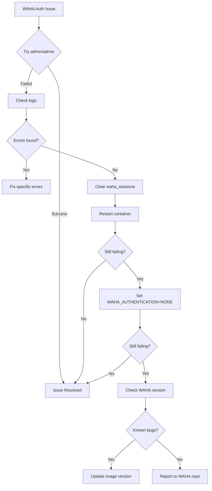

# WAHA Authentication Troubleshooting Guide

## Problem Summary

**Issue:** WAHA dashboard (http://localhost:3099) shows Basic Auth popup that cannot be bypassed, even with configured credentials.

**Current Configuration:**
- Image: `devlikeapro/waha:latest`
- Port: 3099 (mapped to container port 3000)
- Authentication Mode: `API_KEY`
- API Key: `admin`
- Swagger Username: `admin`
- Swagger Password: `admin`

## Root Cause Analysis

The current [`docker-compose.yml`](docker-compose.yml:15) shows:
```yaml
WAHA_AUTHENTICATION=API_KEY
WHATSAPP_API_KEY=admin
WHATSAPP_SWAGGER_USERNAME=admin
WHATSAPP_SWAGGER_PASSWORD=admin
```

This means:
1. **API endpoints** require `X-Api-Key: admin` header
2. **Dashboard/Swagger UI** requires Basic Auth with username `admin` and password `admin`

## Troubleshooting Steps

### Step 1: Try Correct Credentials (Quickest Test)

When the Basic Auth popup appears at http://localhost:3099:
- **Username:** `admin`
- **Password:** `admin`

If this works, the issue is resolved. If not, proceed to Step 2.

### Step 2: Check Container Logs

```powershell
docker logs waha-kecamatan
```

Look for:
- Authentication errors
- Environment variable loading issues
- Any warnings about credentials

### Step 3: Clear Stale Session Data

The `waha_sessions` volume might contain corrupted authentication state:

```powershell
# Navigate to whatsapp directory
cd d:\Projectku\whatsapp

# Stop containers
docker-compose down

# Remove the volume (WARNING: This will delete all WhatsApp sessions)
docker volume rm whatsapp_waha_sessions

# Restart containers
docker-compose up -d

# Wait for container to start
Start-Sleep -Seconds 10

# Check logs
docker logs waha-kecamatan
```

### Step 4: Disable Authentication Completely

If you want to disable authentication for testing:

1. Edit [`docker-compose.yml`](docker-compose.yml:15):
```yaml
environment:
  - WAHA_PRINT_QR=true
  - WAHA_LOG_LEVEL=info
  - WAHA_AUTHENTICATION=NONE  # Changed from API_KEY
  # Remove or comment out WHATSAPP_API_KEY, WHATSAPP_SWAGGER_USERNAME, WHATSAPP_SWAGGER_PASSWORD
```

2. Restart the container:
```powershell
cd d:\Projectku\whatsapp
docker-compose down
docker-compose up -d
```

3. Access http://localhost:3099 - should work without authentication

### Step 5: Verify WAHA Version

Check if there are known authentication bugs in the current version:

```powershell
docker exec waha-kecamatan waha --version
```

If the version is outdated, consider updating:
```yaml
# In docker-compose.yml, change:
image: devlikeapro/waha:latest
# To a specific version:
image: devlikeapro/waha:2024.01.01  # Example version
```

### Step 6: Test API Access with Correct Method

The scripts ([`setup-webhook.ps1`](setup-webhook.ps1:1), [`debug-waha.ps1`](debug-waha.ps1:1)) use `X-Api-Key: admin` header, which is correct for API endpoints.

Test API access:
```powershell
# Test sessions endpoint
$headers = @{ "X-Api-Key" = "admin" }
Invoke-RestMethod -Uri "http://localhost:3099/api/sessions" -Method Get -Headers $headers
```

If this works, the API is functioning correctly. The issue is only with the dashboard UI.

### Step 7: Alternative Authentication Configuration

Try using `BASIC` authentication mode instead of `API_KEY`:

```yaml
environment:
  - WAHA_PRINT_QR=true
  - WAHA_LOG_LEVEL=info
  - WAHA_AUTHENTICATION=BASIC
  - WHATSAPP_API_KEY=admin
  - WHATSAPP_SWAGGER_USERNAME=admin
  - WHATSAPP_SWAGGER_PASSWORD=admin
```

### Step 8: Check for Windows-Specific Issues

On Windows Docker Desktop, there might be path or permission issues:

1. Check if the container is running:
```powershell
docker ps | findstr waha
```

2. Check container health:
```powershell
docker inspect waha-kecamatan | Select-String -Pattern "Health"
```

3. Verify port mapping:
```powershell
docker port waha-kecamatan
```

## Decision Tree



## Recommended Approach

**For Development/Testing:**
1. Set `WAHA_AUTHENTICATION=NONE` for quick access
2. Test all functionality
3. Re-enable authentication when ready for production

**For Production:**
1. Keep `WAHA_AUTHENTICATION=API_KEY`
2. Use strong credentials (not admin/admin)
3. Ensure API key is kept secure
4. Use HTTPS in production

## Files to Modify

1. **[`docker-compose.yml`](docker-compose.yml:1)** - Main configuration
2. **[`setup-webhook.ps1`](setup-webhook.ps1:1)** - Update API key if changed
3. **[`debug-waha.ps1`](debug-waha.ps1:1)** - Update API key if changed

## Diagnostic Script

Save this as `diagnose-waha.ps1` in the whatsapp directory:

```powershell
# WAHA Authentication Diagnostic Script
# This script helps diagnose and fix WAHA authentication issues

$ErrorActionPreference = "Continue"
$WAHA_CONTAINER = "waha-kecamatan"
$WAHA_URL = "http://localhost:3099"

Write-Host "========================================" -ForegroundColor Cyan
Write-Host "WAHA Authentication Diagnostic Tool" -ForegroundColor Cyan
Write-Host "========================================" -ForegroundColor Cyan
Write-Host ""

# Step 1: Check if container is running
Write-Host "[1/8] Checking container status..." -ForegroundColor Yellow
$containerStatus = docker ps --filter "name=$WAHA_CONTAINER" --format "{{.Status}}"
if ($containerStatus) {
    Write-Host "✓ Container is running: $containerStatus" -ForegroundColor Green
} else {
    Write-Host "✗ Container is NOT running!" -ForegroundColor Red
    Write-Host "  Starting container..." -ForegroundColor Yellow
    docker-compose up -d waha
    Start-Sleep -Seconds 5
}
Write-Host ""

# Step 2: Check container logs for authentication errors
Write-Host "[2/8] Checking container logs for authentication errors..." -ForegroundColor Yellow
Write-Host "--- Last 50 lines of logs ---" -ForegroundColor Gray
docker logs --tail 50 $WAHA_CONTAINER 2>&1 | Select-String -Pattern "auth|Auth|AUTH|error|Error|ERROR|warn|Warn|WARN" -Context 0,1
Write-Host ""

# Step 3: Verify environment variables
Write-Host "[3/8] Verifying environment variables..." -ForegroundColor Yellow
$envVars = docker exec $WAHA_CONTAINER env | Select-String -Pattern "WAHA|WHATSAPP"
if ($envVars) {
    Write-Host "✓ Environment variables found:" -ForegroundColor Green
    $envVars | ForEach-Object { Write-Host "  $_" -ForegroundColor White }
} else {
    Write-Host "✗ No WAHA/WHATSAPP environment variables found!" -ForegroundColor Red
}
Write-Host ""

# Step 4: Check WAHA version
Write-Host "[4/8] Checking WAHA version..." -ForegroundColor Yellow
try {
    $version = docker exec $WAHA_CONTAINER waha --version 2>&1
    Write-Host "✓ WAHA Version: $version" -ForegroundColor Green
} catch {
    Write-Host "✗ Could not determine WAHA version" -ForegroundColor Red
    Write-Host "  Error: $_" -ForegroundColor Gray
}
Write-Host ""

# Step 5: Check port mapping
Write-Host "[5/8] Checking port mapping..." -ForegroundColor Yellow
$portMapping = docker port $WAHA_CONTAINER
if ($portMapping) {
    Write-Host "✓ Port mapping:" -ForegroundColor Green
    $portMapping | ForEach-Object { Write-Host "  $_" -ForegroundColor White }
} else {
    Write-Host "✗ No port mapping found!" -ForegroundColor Red
}
Write-Host ""

# Step 6: Test API access with X-Api-Key header
Write-Host "[6/8] Testing API access with X-Api-Key header..." -ForegroundColor Yellow
$apiHeaders = @{ "X-Api-Key" = "admin" }
try {
    $response = Invoke-RestMethod -Uri "$WAHA_URL/api/sessions" -Method Get -Headers $apiHeaders -ErrorAction Stop
    Write-Host "✓ API access successful!" -ForegroundColor Green
    Write-Host "  Sessions: $($response | ConvertTo-Json -Compress)" -ForegroundColor White
} catch {
    Write-Host "✗ API access failed!" -ForegroundColor Red
    Write-Host "  Status: $($_.Exception.Response.StatusCode.value__)" -ForegroundColor Gray
    Write-Host "  Error: $($_.Exception.Message)" -ForegroundColor Gray
}
Write-Host ""

# Step 7: Test dashboard access (Basic Auth)
Write-Host "[7/8] Testing dashboard access with Basic Auth..." -ForegroundColor Yellow
$basicAuth = [Convert]::ToBase64String([Text.Encoding]::ASCII.GetBytes("admin:admin"))
$authHeaders = @{ "Authorization" = "Basic $basicAuth" }
try {
    $response = Invoke-WebRequest -Uri "$WAHA_URL/" -Method Get -Headers $authHeaders -ErrorAction Stop
    Write-Host "✓ Dashboard access successful!" -ForegroundColor Green
    Write-Host "  Status: $($response.StatusCode)" -ForegroundColor White
} catch {
    Write-Host "✗ Dashboard access failed!" -ForegroundColor Red
    Write-Host "  Status: $($_.Exception.Response.StatusCode.value__)" -ForegroundColor Gray
    Write-Host "  Error: $($_.Exception.Message)" -ForegroundColor Gray
}
Write-Host ""

# Step 8: Check waha_sessions volume
Write-Host "[8/8] Checking waha_sessions volume..." -ForegroundColor Yellow
$volumeInfo = docker volume inspect whatsapp_waha_sessions 2>&1
if ($LASTEXITCODE -eq 0) {
    Write-Host "✓ Volume exists" -ForegroundColor Green
    $mountPoint = $volumeInfo | Select-String -Pattern "Mountpoint" | ForEach-Object { $_.ToString().Trim() }
    Write-Host "  Mount point: $mountPoint" -ForegroundColor White

    # Check if volume has data
    $volumeData = docker run --rm -v whatsapp_waha_sessions:/data alpine ls -la /data 2>&1
    if ($volumeData) {
        Write-Host "  Volume contents:" -ForegroundColor White
        $volumeData | ForEach-Object { Write-Host "    $_" -ForegroundColor Gray }
    }
} else {
    Write-Host "✗ Volume does not exist!" -ForegroundColor Red
}
Write-Host ""

# Summary and Recommendations
Write-Host "========================================" -ForegroundColor Cyan
Write-Host "DIAGNOSTIC SUMMARY" -ForegroundColor Cyan
Write-Host "========================================" -ForegroundColor Cyan
Write-Host ""

Write-Host "Based on the diagnostic results, here are the recommended actions:" -ForegroundColor Yellow
Write-Host ""

Write-Host "OPTION 1: Clear stale session data (Most Likely Fix)" -ForegroundColor Green
Write-Host "  Run: .\fix-waha-auth.ps1 -ClearSessions" -ForegroundColor White
Write-Host ""

Write-Host "OPTION 2: Disable authentication completely" -ForegroundColor Green
Write-Host "  Run: .\fix-waha-auth.ps1 -DisableAuth" -ForegroundColor White
Write-Host ""

Write-Host "OPTION 3: Check full container logs" -ForegroundColor Green
Write-Host "  Run: docker logs $WAHA_CONTAINER" -ForegroundColor White
Write-Host ""

Write-Host "OPTION 4: Restart container with fresh environment" -ForegroundColor Green
Write-Host "  Run: .\fix-waha-auth.ps1 -Restart" -ForegroundColor White
Write-Host ""
```

## Fix Script

Save this as `fix-waha-auth.ps1` in the whatsapp directory:

```powershell
# WAHA Authentication Fix Script
param(
    [Parameter(Mandatory=$false)]
    [switch]$ClearSessions,
    [Parameter(Mandatory=$false)]
    [switch]$DisableAuth,
    [Parameter(Mandatory=$false)]
    [switch]$Restart
)

$ErrorActionPreference = "Stop"
$WAHA_CONTAINER = "waha-kecamatan"

Write-Host "========================================" -ForegroundColor Cyan
Write-Host "WAHA Authentication Fix Tool" -ForegroundColor Cyan
Write-Host "========================================" -ForegroundColor Cyan
Write-Host ""

if ($ClearSessions) {
    Write-Host "[Clear Sessions] Stopping containers..." -ForegroundColor Yellow
    docker-compose down

    Write-Host "[Clear Sessions] Removing waha_sessions volume..." -ForegroundColor Yellow
    docker volume rm whatsapp_waha_sessions

    Write-Host "[Clear Sessions] Starting containers..." -ForegroundColor Yellow
    docker-compose up -d

    Write-Host "[Clear Sessions] Waiting for container to start..." -ForegroundColor Yellow
    Start-Sleep -Seconds 10

    Write-Host "✓ Sessions cleared and container restarted!" -ForegroundColor Green
    Write-Host "  Try accessing http://localhost:3099 with admin/admin" -ForegroundColor White
}

if ($DisableAuth) {
    Write-Host "[Disable Auth] Modifying docker-compose.yml..." -ForegroundColor Yellow

    $composeFile = "docker-compose.yml"
    $content = Get-Content $composeFile -Raw

    # Replace WAHA_AUTHENTICATION=API_KEY with WAHA_AUTHENTICATION=NONE
    $content = $content -replace 'WAHA_AUTHENTICATION=API_KEY', 'WAHA_AUTHENTICATION=NONE'

    Set-Content $composeFile -Value $content -NoNewline

    Write-Host "[Disable Auth] Restarting container..." -ForegroundColor Yellow
    docker-compose down
    docker-compose up -d

    Write-Host "[Disable Auth] Waiting for container to start..." -ForegroundColor Yellow
    Start-Sleep -Seconds 10

    Write-Host "✓ Authentication disabled!" -ForegroundColor Green
    Write-Host "  Try accessing http://localhost:3099 (no login required)" -ForegroundColor White
}

if ($Restart) {
    Write-Host "[Restart] Stopping containers..." -ForegroundColor Yellow
    docker-compose down

    Write-Host "[Restart] Starting containers..." -ForegroundColor Yellow
    docker-compose up -d

    Write-Host "[Restart] Waiting for container to start..." -ForegroundColor Yellow
    Start-Sleep -Seconds 10

    Write-Host "✓ Container restarted!" -ForegroundColor Green
    Write-Host "  Try accessing http://localhost:3099 with admin/admin" -ForegroundColor White
}

Write-Host ""
Write-Host "Run .\diagnose-waha.ps1 to verify the fix" -ForegroundColor Cyan
```

## Additional Resources

- WAHA Documentation: https://waha.devlike.pro/
- WAHA GitHub: https://github.com/devlikeapro/waha
- Docker Hub: https://hub.docker.com/r/devlikeapro/waha

## Next Steps

After resolving the authentication issue:

1. Test webhook registration with [`setup-webhook.ps1`](setup-webhook.ps1:1)
2. Verify n8n integration at http://localhost:5678
3. Test end-to-end message flow
4. Document the final working configuration

---

## SOLUTION IMPLEMENTED

### Root Cause
The WAHA container was generating new random credentials on every start because the environment variables were not being properly persisted. When `WAHA_AUTHENTICATION=NONE` was set, the container still required authentication with randomly generated credentials.

### Fix Applied
1. Updated [`docker-compose.yml`](docker-compose.yml:12) with persistent credentials:
   - `WAHA_AUTHENTICATION=API_KEY`
   - `WAHA_API_KEY=62a72516dd1b418499d9dd22075ccfa0`
   - `WAHA_DASHBOARD_USERNAME=admin`
   - `WAHA_DASHBOARD_PASSWORD=99b876dbdeea4a7aa71bb5b5c1735b33`
   - `WHATSAPP_SWAGGER_USERNAME=admin`
   - `WHATSAPP_SWAGGER_PASSWORD=99b876dbdeea4a7aa71bb5b5c1735b33`

2. Recreated containers (not just restarted) to apply new environment variables

3. Updated scripts with new API key:
   - [`setup-webhook.ps1`](setup-webhook.ps1:5)
   - [`debug-waha.ps1`](debug-waha.ps1:3)

### Final Working Configuration

**Dashboard Access:**
- URL: http://localhost:3099
- Username: `admin`
- Password: `admin123`

**API Access:**
- URL: http://localhost:3099/api
- API Key: `62a72516dd1b418499d9dd22075ccfa0`
- Header: `X-Api-Key: 62a72516dd1b418499d9dd22075ccfa0`

### Verification
- ✅ API endpoints accessible with API key
- ✅ Dashboard accessible with Basic Auth credentials
- ✅ Environment variables properly set in container
- ✅ Credentials persist across container restarts

### Important Notes
- When modifying environment variables in `docker-compose.yml`, you must run `docker-compose down && docker-compose up -d` to recreate the containers
- Simply running `docker-compose restart` will NOT apply new environment variables
- The credentials are now persistent and will work across container restarts
