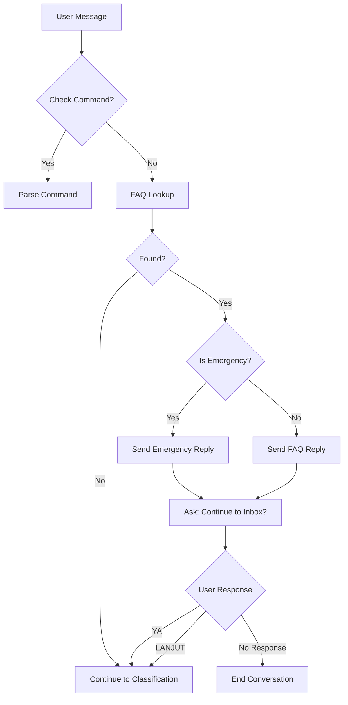
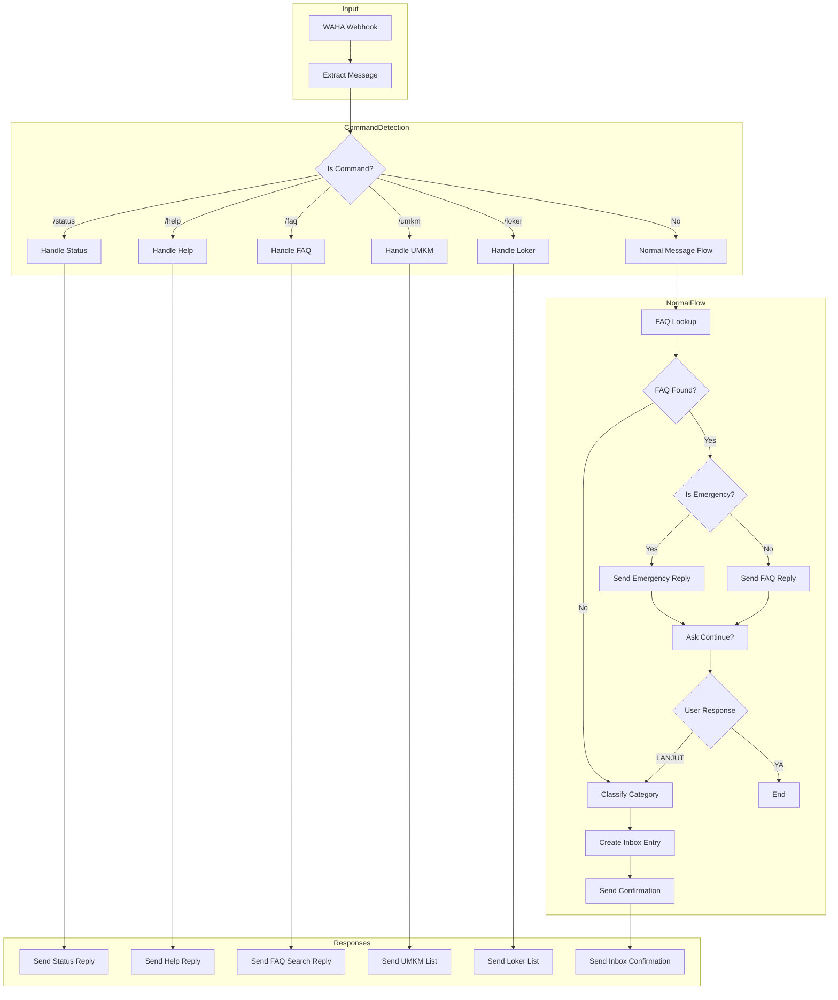

# Bot Database Integration - WhatsApp Automation

## Executive Summary

This document provides a comprehensive analysis of the database structure and API integration design for the WhatsApp bot to serve data about pelayanan, pengaduan, cek berkas, UMKM, and loker.

---

## 1. Database Structure Summary

### 1.1 Table Overview

| Table | Purpose | Key Fields | Status |
|-------|---------|------------|--------|
| `pelayanan_faqs` | FAQ knowledge base | category, keywords, question, answer | ✅ Active |
| `public_services` | Inbox pelayanan/pengaduan | uuid, status, jenis_layanan, whatsapp | ✅ Active |
| `umkm_locals` | UMKM lokal (simple) | name, product, contact_wa, price | ✅ Active |
| `umkm` | UMKM rakyat (advanced) | nama_usaha, no_wa, desa, jenis_usaha | ✅ Active |
| `lokers` | Lowongan kerja | title, job_category, contact_wa, status | ✅ Active |
| `job_vacancies` | Job vacancies (legacy) | title, company_name, contact_wa | ✅ Active |
| `public_service_attachments` | Lampiran berkas | public_service_id, file_path | ✅ Active |

### 1.2 Detailed Table Structures

#### 1.2.1 `pelayanan_faqs` - FAQ Knowledge Base

```sql
CREATE TABLE pelayanan_faqs (
    id BIGINT UNSIGNED PRIMARY KEY,
    category VARCHAR(255),          -- Kategori: Darurat, Adminduk, Umum, etc.
    keywords TEXT,                  -- Comma-separated keywords
    question VARCHAR(255),          -- Pertanyaan
    answer TEXT,                    -- Jawaban lengkap
    is_active BOOLEAN DEFAULT TRUE,
    created_at TIMESTAMP,
    updated_at TIMESTAMP
);
```

**Categories Available:**
- `Darurat` - Emergency responses (highest priority)
- `Adminduk` - Administrative documents (KTP, KK, Akta)
- `Umum` - General information (jam layanan, biaya)

**Sample Data:**
| category | keywords | question |
|----------|----------|----------|
| Darurat | maling, pencurian, kejahatan | Ada pencurian, apa yang harus dilakukan? |
| Adminduk | ktp, e-ktp, ktp hilang | Mau buat KTP, apa syaratnya? |
| Umum | jam kerja, jam pelayanan | Kapan jam pelayanan buka? |

#### 1.2.2 `public_services` - Inbox Pelayanan/Pengaduan

```sql
CREATE TABLE public_services (
    id BIGINT UNSIGNED PRIMARY KEY,
    uuid VARCHAR(255) UNIQUE,       -- Tracking ID
    desa_id BIGINT UNSIGNED NULL,   -- FK to desa table
    nama_desa_manual VARCHAR(255),  -- Manual village name
    nama_pemohon VARCHAR(255),      -- Applicant name
    nik VARCHAR(16),                -- NIK (16 digits)
    jenis_layanan VARCHAR(255),     -- Service type
    uraian TEXT,                    -- Description
    whatsapp VARCHAR(255),          -- Contact number
    category VARCHAR(50),           -- pelayanan, pengaduan, umkm, loker
    source VARCHAR(50),             -- web_form, whatsapp, admin_input
    status VARCHAR(50),             -- Status tracking
    
    -- OTP Verification
    otp_code VARCHAR(6),
    otp_expires_at TIMESTAMP,
    otp_attempts INT DEFAULT 0,
    is_verified BOOLEAN DEFAULT FALSE,
    
    -- Completion Tracking
    completion_type ENUM('digital', 'physical'),
    result_file_path VARCHAR(255),  -- PDF result path
    ready_at TIMESTAMP,             -- When ready for pickup
    pickup_person VARCHAR(255),
    pickup_notes TEXT,
    
    -- Response
    public_response TEXT,
    internal_notes TEXT,
    handled_by BIGINT UNSIGNED,
    handled_at TIMESTAMP,
    responded_at TIMESTAMP,
    
    -- Files
    file_path_1 VARCHAR(255),
    file_path_2 VARCHAR(255),
    
    created_at TIMESTAMP,
    updated_at TIMESTAMP
);
```

**Status Flow:**
```
menunggu_verifikasi → diproses → selesai
                                ↓
                            ditolak
```

**Categories:**
- `pelayanan` - Pelayanan Administrasi
- `pengaduan` - Pengaduan Umum
- `umkm` - UMKM Rakyat
- `loker` - Lowongan Kerja

#### 1.2.3 `umkm_locals` - UMKM Lokal (Simple)

```sql
CREATE TABLE umkm_locals (
    id BIGINT UNSIGNED PRIMARY KEY,
    name VARCHAR(255),              -- Nama UMKM
    product VARCHAR(255),           -- Produk utama
    price DECIMAL(15,2),            -- Harga
    original_price DECIMAL(15,2),   -- Harga asli (diskon)
    description TEXT,               -- Deskripsi
    contact_wa VARCHAR(255),        -- Nomor WhatsApp
    image_path VARCHAR(255),        -- Foto produk
    is_active BOOLEAN DEFAULT TRUE,
    is_featured BOOLEAN DEFAULT FALSE,
    created_at TIMESTAMP,
    updated_at TIMESTAMP
);
```

#### 1.2.4 `umkm` - UMKM Rakyat (Advanced)

```sql
CREATE TABLE umkm (
    id UUID PRIMARY KEY,
    nama_usaha VARCHAR(255),
    nama_pemilik VARCHAR(255),
    no_wa VARCHAR(255),
    desa VARCHAR(255),
    jenis_usaha VARCHAR(255),
    deskripsi TEXT,
    foto_usaha VARCHAR(255),
    lat DECIMAL(10,8),              -- Latitude
    lng DECIMAL(11,8),              -- Longitude
    status ENUM('pending', 'aktif', 'nonaktif'),
    source ENUM('admin', 'self-service'),
    slug VARCHAR(255) UNIQUE,
    manage_token VARCHAR(255) UNIQUE,
    ownership_status VARCHAR(255),
    tokopedia_url VARCHAR(255),
    shopee_url VARCHAR(255),
    tiktok_url VARCHAR(255),
    created_at TIMESTAMP,
    updated_at TIMESTAMP
);
```

**Related Tables:**
- `umkm_products` - Products per UMKM
- `umkm_verification` - Verification codes
- `umkm_admin_log` - Admin action logs

#### 1.2.5 `lokers` - Lowongan Kerja

```sql
CREATE TABLE lokers (
    id BIGINT UNSIGNED PRIMARY KEY,
    uuid UUID UNIQUE,
    title VARCHAR(255),             -- Judul lowongan
    job_category VARCHAR(255),      -- Kategori pekerjaan
    desa_id BIGINT UNSIGNED NULL,
    nama_desa_manual VARCHAR(255),
    contact_wa VARCHAR(255),        -- Kontak WhatsApp
    description TEXT,
    work_time VARCHAR(255),         -- harian, mingguan, dll
    is_available_today BOOLEAN DEFAULT FALSE,
    status VARCHAR(50) DEFAULT 'menunggu_verifikasi',
    is_sensitive BOOLEAN DEFAULT FALSE,
    manage_token VARCHAR(255),
    source VARCHAR(50) DEFAULT 'web_form',
    internal_notes TEXT,
    created_at TIMESTAMP,
    updated_at TIMESTAMP
);
```

**Status Values:**
- `menunggu_verifikasi` - Pending verification
- `aktif` - Active
- `nonaktif` - Inactive

---

## 2. Existing API Endpoints

### 2.1 Dashboard-Kecamatan API

| Endpoint | Method | Purpose | Auth |
|----------|--------|---------|------|
| `/api/faq/search` | GET | Search FAQ by keyword | Public |
| `/api/status/check` | GET | Check service status | Public |
| `/api/inbox/whatsapp` | POST | Create inbox from WhatsApp | API Token |
| `/api/reply/send` | POST | Send WhatsApp reply | API Token |
| `/api/reply/bulk` | POST | Bulk WhatsApp reply | API Token |
| `/api/v1/external/umkm/search` | GET | Search UMKM | API Token |
| `/api/v1/external/loker/search` | GET | Search Loker | API Token |
| `/api/v1/external/config` | GET | Get bot config | API Token |

### 2.2 Laravel API Gateway Endpoints

| Endpoint | Method | Purpose |
|----------|--------|---------|
| `/api/health` | GET | Health check |
| `/api/webhook` | POST | Receive from n8n |
| `/api/faq/search` | GET | Proxy FAQ search |
| `/api/umkm/search` | GET | Proxy UMKM search |
| `/api/loker/search` | GET | Proxy Loker search |
| `/api/status/check` | GET | Proxy status check |
| `/api/config` | GET | Get bot configuration |
| `/api/history/add` | POST | Add conversation history |
| `/api/reply/send` | POST | Send reply via WAHA |

### 2.3 Existing API Details

#### 2.3.1 FAQ Search API

**Endpoint:** `GET /api/faq/search`

**Controller:** [`PublicServiceController::faqSearch()`](dashboard-kecamatan/app/Http/Controllers/PublicServiceController.php:175)

**Request:**
```
GET /api/faq/search?q=jam+pelayanan
```

**Response (Found):**
```json
{
    "found": true,
    "is_emergency": false,
    "question": "Kapan jam pelayanan kantor Kecamatan buka?",
    "results": [
        {
            "jawaban": "Kantor Kecamatan siap melayani Anda pada hari kerja rutin:\n- **Senin - Kamis**: 08.00 s/d 15.30 WIB\n- **Jumat**: 08.00 s/d 14.30 WIB\n\n*Sabtu, Minggu, dan Hari Libur Nasional kantor tutup.*"
        }
    ]
}
```

**Response (Emergency):**
```json
{
    "found": true,
    "is_emergency": true,
    "results": [
        {
            "jawaban": "⚠️ Jika Anda mengalami atau melihat tindak kejahatan:\n\n1. Segera hubungi Kepolisian melalui nomor 110\n2. Atau laporkan langsung ke Polsek terdekat..."
        }
    ]
}
```

**Response (Not Found):**
```json
{
    "found": false,
    "answer": "Maaf, informasi terkait hal tersebut tidak ditemukan dalam database FAQ resmi kami. Silakan coba kata kunci lain..."
}
```

#### 2.3.2 Status Check API

**Endpoint:** `GET /api/status/check`

**Controller:** [`PublicServiceController::checkStatus()`](dashboard-kecamatan/app/Http/Controllers/PublicServiceController.php:373)

**Request:**
```
GET /api/status/check?identifier=550e8400-e29b-41d4-a716-446655440000
GET /api/status/check?identifier=6281234567890
```

**Response:**
```json
{
    "found": true,
    "uuid": "550e8400-e29b-41d4-a716-446655440000",
    "jenis_layanan": "Pengaduan Umum",
    "status": "selesai",
    "status_label": "Selesai",
    "status_color": "emerald",
    "created_at": "11 Feb 2026, 13:00",
    "public_response": "Laporan telah ditindaklanjuti...",
    "completion_type": "digital",
    "download_url": "https://...storage/result.pdf"
}
```

#### 2.3.3 UMKM Search API

**Endpoint:** `GET /api/v1/external/umkm/search`

**Controller:** [`ExternalApiController::searchUmkm()`](dashboard-kecamatan/app/Http/Controllers/ExternalApiController.php:15)

**Request:**
```
GET /api/v1/external/umkm/search?q=keripik
GET /api/v1/external/umkm/search?q=semua
```

**Response:**
```json
{
    "success": true,
    "data": [
        {
            "name": "Keripik Singkong Bu Tuti",
            "product": "Keripik Singkong Original",
            "price": 15000.00,
            "contact_wa": "6281234567890",
            "description": "Keripik singkong renyah dengan berbagai varian rasa"
        }
    ]
}
```

#### 2.3.4 Loker Search API

**Endpoint:** `GET /api/v1/external/loker/search`

**Controller:** [`ExternalApiController::searchLoker()`](dashboard-kecamatan/app/Http/Controllers/ExternalApiController.php:40)

**Request:**
```
GET /api/v1/external/loker/search?q=buruh
GET /api/v1/external/loker/search?q=semua
```

**Response:**
```json
{
    "success": true,
    "data": [
        {
            "title": "Buruh Tani Harian",
            "job_category": "Pertanian",
            "contact_wa": "6281234567890",
            "work_time": "Harian",
            "description": "Butuh 5 orang buruh tani untuk musim panen"
        }
    ]
}
```

---

## 3. Bot Feature Design

### 3.1 FAQ Pelayanan/Pengaduan

#### 3.1.1 Query Logic



#### 3.1.2 Keyword Matching Algorithm

The FAQ search uses a multi-phase matching algorithm:

1. **Synonym Pre-processing**
   ```php
   $synonyms = [
       'jam layanan' => 'jam pelayanan',
       'buka jam' => 'jam pelayanan',
       'syarat' => 'persyaratan'
   ];
   ```

2. **Priority Checklist** - Check "Darurat" category first

3. **Hardcoded Safety Fallbacks** - Emergency keywords (maling, kecelakaan, etc.)

4. **Strict FAQ Matching**
   - Phase A: Search by question title (LIKE query)
   - Phase B: Search by keywords (regex word boundary)

#### 3.1.3 Response Formatting

**FAQ Match Response:**
```
📋 *Jawaban Otomatis*

{answer}

━━━━━━━━━━━━━━━━━
💡 Ketik "LANJUT" untuk mengirim laporan resmi
💡 Ketik "YA" jika jawaban sudah cukup
```

**Emergency Response:**
```
⚠️ *PERINGATAN DARURAT*

{emergency_answer}

━━━━━━━━━━━━━━━━━
📞 Nomor Penting:
• Polisi: 110
• Ambulans: 119
• Damkar: 112/113
```

### 3.2 Cek Berkas (Document Check)

#### 3.2.1 Input Options

| Input Type | Example | Description |
|------------|---------|-------------|
| UUID | `550e8400-e29b-41d4-a716-446655440000` | Full UUID from receipt |
| Short ID | `550e8400` | First 8 characters of UUID |
| Phone | `6281234567890` | WhatsApp number used for submission |

#### 3.2.2 Command Format

```
/status                    → Check latest submission by phone
/status 550e8400...        → Check by UUID
/cekberkas 550e8400        → Alternative command
```

#### 3.2.3 Response Format

**Status Found:**
```
📊 *Status Laporan*

🆔 ID: `550e8400-e29b-41d4...`
📂 Layanan: Pengaduan Umum
📊 Status: *Sedang Diproses*
📅 Dibuat: 11 Feb 2026, 13:00

━━━━━━━━━━━━━━━━━
📝 *Respon Petugas:*
Laporan sedang ditindaklanjuti ke instansi terkait.

💡 Cek status kapan saja: /status 550e8400
```

**Status Selesai (Digital):**
```
✅ *Laporan Selesai*

🆔 ID: `550e8400-e29b-41d4...`
📂 Layanan: Surat Keterangan Domisili
📊 Status: *Selesai*
📅 Selesai: 12 Feb 2026, 09:30

📎 *Dokumen Tersedia:*
[Download PDF](https://...storage/result.pdf)

━━━━━━━━━━━━━━━━━
Terima kasih telah menggunakan layanan kami!
```

**Status Selesai (Physical):**
```
✅ *Laporan Selesai*

🆔 ID: `550e8400-e29b-41d4...`
📂 Layanan: Surat Keterangan Tidak Mampu
📊 Status: *Siap Diambil*

📍 *Info Pengambilan:*
⏰ Waktu: 13 Feb 2026, 08:00
👤 Petugas: Pak Ahmad
📝 Catatan: Bawa KTP asli

━━━━━━━━━━━━━━━━━
📍 Alamat: Kantor Kecamatan Besuk
```

**Not Found:**
```
❌ *Berkas Tidak Ditemukan*

Pastikan ID atau nomor WhatsApp sudah benar.

💡 Tips:
• Gunakan ID dari struk penerimaan
• Gunakan nomor WA yang sama saat mengirim laporan

Contoh: /status 550e8400-e29b-41d4-a716-446655440000
```

### 3.3 UMKM Data

#### 3.3.1 Command Format

```
/umkm                      → List all UMKM (limit 5)
/umkm keripik              → Search UMKM by keyword
/umkm desa:sumbersari      → Filter by desa
```

#### 3.3.2 Response Format

```
🏪 *Daftar UMKM*

━━━━━━━━━━━━━━━━━

1️⃣ *Keripik Singkong Bu Tuti*
📦 Produk: Keripik Singkong Original
💰 Harga: Rp 15.000
📱 WA: 6281234567890

2️⃣ *Batik Besuk Makmur*
📦 Produk: Batik Tulis Khas Besuk
💰 Harga: Rp 250.000
📱 WA: 6281234567891

━━━━━━━━━━━━━━━━━
💡 Ketik /umkm {nama} untuk pencarian spesifik
💡 Total: 25 UMKM terdaftar
```

#### 3.3.3 Filter Options

| Filter | Parameter | Example |
|--------|-----------|---------|
| Keyword | `q` | `/umkm keripik` |
| Desa | `desa` | `/umkm desa:sumbersari` |
| Kategori | `kategori` | `/umkm kategori:makanan` |

### 3.4 Loker (Job Vacancies)

#### 3.4.1 Command Format

```
/loker                     → List all active jobs (limit 5)
/loker buruh               → Search by keyword
/loker hari ini            → Jobs available today
```

#### 3.4.2 Response Format

```
💼 *Lowongan Kerja Tersedia*

━━━━━━━━━━━━━━━━━

1️⃣ *Buruh Tani Harian*
📂 Kategori: Pertanian
⏰ Waktu: Harian
📍 Desa: Sumbersari
📱 WA: 6281234567890

📝 Butuh 5 orang buruh tani untuk musim panen. Upah per hari Rp 100.000 + makan.

━━━━━━━━━━━━━━━━━

2️⃣ *Operator Mesin Cetakan*
📂 Kategori: Industri
⏰ Waktu: Tetap
📍 Desa: Besuk
📱 WA: 6281234567891

━━━━━━━━━━━━━━━━━
💡 Ketik /loker {keyword} untuk pencarian
💡 Total: 12 lowongan aktif
```

---

## 4. New API Endpoints Design

### 4.1 Enhanced Bot API Endpoints

#### 4.1.1 Unified Search API

**Endpoint:** `GET /api/bot/search`

**Purpose:** Unified search across all data types

**Request:**
```
GET /api/bot/search?type=umkm&q=keripik
GET /api/bot/search?type=loker&q=buruh
GET /api/bot/search?type=faq&q=jam+pelayanan
```

**Response:**
```json
{
    "success": true,
    "type": "umkm",
    "count": 3,
    "data": [...]
}
```

#### 4.1.2 Bot Context API

**Endpoint:** `POST /api/bot/context`

**Purpose:** Get user context for personalized responses

**Request:**
```json
{
    "phone": "6281234567890",
    "message": "status"
}
```

**Response:**
```json
{
    "success": true,
    "context": {
        "has_pending_submissions": true,
        "latest_submission": {
            "uuid": "550e8400...",
            "status": "diproses",
            "jenis_layanan": "Pengaduan Umum"
        },
        "total_submissions": 3,
        "suggested_action": "check_status"
    }
}
```

#### 4.1.3 Desa List API

**Endpoint:** `GET /api/bot/desa`

**Purpose:** Get list of desa for filtering

**Response:**
```json
{
    "success": true,
    "data": [
        {"id": 1, "nama_desa": "Sumbersari"},
        {"id": 2, "nama_desa": "Besuk"},
        {"id": 3, "nama_desa": "Kras"}
    ]
}
```

### 4.2 API Implementation Code

#### 4.2.1 Bot Context Controller

```php
<?php

namespace App\Http\Controllers;

use App\Models\PublicService;
use Illuminate\Http\Request;

class BotContextController extends Controller
{
    /**
     * Get user context for personalized bot responses
     */
    public function getContext(Request $request)
    {
        $request->validate([
            'phone' => 'required|string',
            'message' => 'nullable|string'
        ]);

        $phone = $request->phone;
        $message = strtolower($request->message ?? '');

        // Get user's submissions
        $submissions = PublicService::where('whatsapp', $phone)
            ->orderBy('created_at', 'desc')
            ->get();

        $context = [
            'has_pending_submissions' => false,
            'latest_submission' => null,
            'total_submissions' => $submissions->count(),
            'suggested_action' => null
        ];

        if ($submissions->count() > 0) {
            $latest = $submissions->first();
            $context['latest_submission'] = [
                'uuid' => $latest->uuid,
                'status' => $latest->status,
                'jenis_layanan' => $latest->jenis_layanan,
                'created_at' => $latest->created_at->format('d M Y, H:i')
            ];

            $context['has_pending_submissions'] = in_array($latest->status, [
                PublicService::STATUS_MENUNGGU,
                PublicService::STATUS_DIPROSES
            ]);
        }

        // Determine suggested action
        if (str_contains($message, 'status') || str_contains($message, 'cek')) {
            $context['suggested_action'] = 'check_status';
        } elseif ($context['has_pending_submissions']) {
            $context['suggested_action'] = 'check_status';
        }

        return response()->json([
            'success' => true,
            'context' => $context
        ]);
    }
}
```

#### 4.2.2 Enhanced UMKM Search

```php
/**
 * Enhanced UMKM Search with filters
 */
public function searchUmkmEnhanced(Request $request)
{
    $query = $request->query('q', '');
    $desa = $request->query('desa', '');
    $kategori = $request->query('kategori', '');
    $limit = min($request->query('limit', 5), 10);

    // Search in umkm_locals (simple)
    $umkmLocals = UmkmLocal::where('is_active', true)
        ->when($query && $query !== 'semua', function ($q) use ($query) {
            $q->where(function ($sub) use ($query) {
                $sub->where('name', 'like', "%{$query}%")
                    ->orWhere('product', 'like', "%{$query}%")
                    ->orWhere('description', 'like', "%{$query}%");
            });
        })
        ->latest()
        ->limit($limit)
        ->get()
        ->map(function ($item) {
            return [
                'id' => $item->id,
                'nama_usaha' => $item->name,
                'produk' => $item->product,
                'harga' => $item->price,
                'deskripsi' => $item->description,
                'contact_wa' => $item->contact_wa,
                'source' => 'umkm_locals'
            ];
        });

    // Search in umkm (advanced) if filters provided
    $umkmAdvanced = collect();
    if ($desa || $kategori) {
        $umkmAdvanced = Umkm::where('status', Umkm::STATUS_AKTIF)
            ->when($desa, fn($q) => $q->where('desa', 'like', "%{$desa}%"))
            ->when($kategori, fn($q) => $q->where('jenis_usaha', 'like', "%{$kategori}%"))
            ->when($query && $query !== 'semua', function ($q) use ($query) {
                $q->where(function ($sub) use ($query) {
                    $sub->where('nama_usaha', 'like', "%{$query}%")
                        ->orWhere('deskripsi', 'like', "%{$query}%");
                });
            })
            ->latest()
            ->limit($limit)
            ->get()
            ->map(function ($item) {
                return [
                    'id' => $item->id,
                    'nama_usaha' => $item->nama_usaha,
                    'pemilik' => $item->nama_pemilik,
                    'produk' => null,
                    'desa' => $item->desa,
                    'jenis_usaha' => $item->jenis_usaha,
                    'deskripsi' => $item->deskripsi,
                    'contact_wa' => $item->no_wa,
                    'marketplace' => [
                        'tokopedia' => $item->tokopedia_url,
                        'shopee' => $item->shopee_url,
                        'tiktok' => $item->tiktok_url
                    ],
                    'source' => 'umkm'
                ];
            });
    }

    $results = $umkmLocals->merge($umkmAdvanced)->take($limit);

    return response()->json([
        'success' => true,
        'count' => $results->count(),
        'data' => $results->values()
    ]);
}
```

---

## 5. n8n Workflow Logic

### 5.1 Complete Workflow Design



### 5.2 n8n Node Configuration

#### 5.2.1 Webhook Node

```json
{
    "name": "Webhook WAHA",
    "type": "n8n-nodes-base.webhook",
    "parameters": {
        "httpMethod": "POST",
        "path": "whatsapp-bot",
        "responseMode": "responseNode"
    }
}
```

#### 5.2.2 Message Extraction Code

```javascript
// Extract message data from WAHA webhook
const body = $input.item.json.body || $input.item.json;

// Handle different message types
let messageText = '';
if (body.body) {
    messageText = body.body;
} else if (body.text) {
    messageText = body.text;
} else if (body.caption) {
    messageText = body.caption;
}

// Clean phone number
let phone = body.from || '';
phone = phone.replace(/[^0-9]/g, '');

// Ensure Indonesian format
if (phone.startsWith('0')) {
    phone = '62' + phone.substring(1);
}

return {
    phone: phone,
    message: messageText,
    sender_name: body.notifyName || body.pushName || 'Warga',
    timestamp: body.timestamp || Date.now(),
    message_type: body.type || 'text',
    raw_data: body
};
```

#### 5.2.3 Command Detection Switch

```javascript
// Command Detection
const message = $json.message.toLowerCase().trim();

// Check for commands
if (message.startsWith('/status') || message.startsWith('/cek ')) {
    return { command: 'status', ...$json };
}
if (message.startsWith('/help') || message.startsWith('/bantuan')) {
    return { command: 'help', ...$json };
}
if (message.startsWith('/faq')) {
    return { command: 'faq', ...$json };
}
if (message.startsWith('/umkm')) {
    return { command: 'umkm', ...$json };
}
if (message.startsWith('/loker') || message.startsWith('/lowongan')) {
    return { command: 'loker', ...$json };
}

// No command - normal message
return { command: 'normal', ...$json };
```

#### 5.2.4 FAQ Lookup HTTP Request

```json
{
    "name": "FAQ Lookup",
    "type": "n8n-nodes-base.httpRequest",
    "parameters": {
        "method": "GET",
        "url": "http://whatsapp-api-gateway:8001/api/faq/search",
        "sendQuery": true,
        "queryParameters": {
            "parameters": [
                {
                    "name": "q",
                    "value": "={{$json.message}}"
                }
            ]
        },
        "options": {
            "timeout": 10000
        }
    }
}
```

#### 5.2.5 Status Check HTTP Request

```json
{
    "name": "Check Status",
    "type": "n8n-nodes-base.httpRequest",
    "parameters": {
        "method": "GET",
        "url": "http://whatsapp-api-gateway:8001/api/status/check",
        "sendQuery": true,
        "queryParameters": {
            "parameters": [
                {
                    "name": "identifier",
                    "value": "={{$json.uuid || $json.phone}}"
                }
            ]
        }
    }
}
```

#### 5.2.6 Response Formatting Code

```javascript
// Format Status Response
const data = $json.data || $json;

if (!data.found) {
    return {
        phone: $json.phone,
        message: `❌ *Berkas Tidak Ditemukan*\n\nPastikan ID atau nomor WhatsApp sudah benar.\n\n💡 Tips:\n• Gunakan ID dari struk penerimaan\n• Gunakan nomor WA yang sama saat mengirim laporan\n\nContoh: /status 550e8400-e29b-41d4-a716-446655440000`
    };
}

const statusEmoji = {
    'menunggu_verifikasi': '⏳',
    'diproses': '🔄',
    'selesai': '✅',
    'ditolak': '❌'
};

const emoji = statusEmoji[data.status] || '📋';

let message = `${emoji} *Status Laporan*\n\n`;
message += `🆔 ID: \`${data.uuid}\`\n`;
message += `📂 Layanan: ${data.jenis_layanan}\n`;
message += `📊 Status: *${data.status_label}*\n`;
message += `📅 Dibuat: ${data.created_at}\n\n`;

if (data.public_response) {
    message += `━━━━━━━━━━━━━━━━━\n`;
    message += `📝 *Respon Petugas:*\n${data.public_response}\n\n`;
}

if (data.completion_type === 'digital' && data.download_url) {
    message += `━━━━━━━━━━━━━━━━━\n`;
    message += `📎 *Dokumen Tersedia:*\n${data.download_url}\n\n`;
}

if (data.completion_type === 'physical' && data.pickup_info) {
    message += `━━━━━━━━━━━━━━━━━\n`;
    message += `📍 *Info Pengambilan:*\n`;
    if (data.pickup_info.ready_at) {
        message += `⏰ Waktu: ${data.pickup_info.ready_at}\n`;
    }
    if (data.pickup_info.pickup_person) {
        message += `👤 Petugas: ${data.pickup_info.pickup_person}\n`;
    }
    if (data.pickup_info.pickup_notes) {
        message += `📝 Catatan: ${data.pickup_info.pickup_notes}\n`;
    }
    message += `\n`;
}

message += `💡 Cek status kapan saja: /status ${data.uuid}`;

return {
    phone: $json.phone,
    message: message
};
```

### 5.3 Complete n8n Workflow JSON

```json
{
    "name": "WhatsApp Service Bot - Complete",
    "nodes": [
        {
            "parameters": {
                "httpMethod": "POST",
                "path": "whatsapp-bot",
                "responseMode": "responseNode"
            },
            "name": "Webhook WAHA",
            "type": "n8n-nodes-base.webhook",
            "position": [250, 300]
        },
        {
            "parameters": {
                "functionCode": "// See 5.2.2 for full code"
            },
            "name": "Extract Message",
            "type": "n8n-nodes-base.code",
            "position": [450, 300]
        },
        {
            "parameters": {
                "functionCode": "// See 5.2.3 for full code"
            },
            "name": "Detect Command",
            "type": "n8n-nodes-base.code",
            "position": [650, 300]
        },
        {
            "parameters": {
                "rules": {
                    "values": [
                        {"outputKey": "status", "conditions": {"string": [{"value1": "={{$json.command}}", "value2": "status"}]}},
                        {"outputKey": "help", "conditions": {"string": [{"value1": "={{$json.command}}", "value2": "help"}]}},
                        {"outputKey": "faq", "conditions": {"string": [{"value1": "={{$json.command}}", "value2": "faq"}]}},
                        {"outputKey": "umkm", "conditions": {"string": [{"value1": "={{$json.command}}", "value2": "umkm"}]}},
                        {"outputKey": "loker", "conditions": {"string": [{"value1": "={{$json.command}}", "value2": "loker"}]}},
                        {"outputKey": "normal", "conditions": {"string": [{"value1": "={{$json.command}}", "value2": "normal"}]}}
                    ]
                }
            },
            "name": "Route Command",
            "type": "n8n-nodes-base.switch",
            "position": [850, 300]
        }
    ],
    "connections": {
        "Webhook WAHA": {"main": [[{"node": "Extract Message"}]]},
        "Extract Message": {"main": [[{"node": "Detect Command"}]]},
        "Detect Command": {"main": [[{"node": "Route Command"}]]}
    }
}
```

---

## 6. Example Conversations

### 6.1 FAQ Query

```
👤 User: Jam berapa kantor kecamatan buka?

🤖 Bot: 📋 *Jawaban Otomatis*

Kantor Kecamatan siap melayani Anda pada hari kerja rutin:
- **Senin - Kamis**: 08.00 s/d 15.30 WIB
- **Jumat**: 08.00 s/d 14.30 WIB

*Sabtu, Minggu, dan Hari Libur Nasional kantor tutup.*

━━━━━━━━━━━━━━━━━
💡 Ketik "LANJUT" untuk mengirim laporan resmi
💡 Ketik "YA" jika jawaban sudah cukup
```

### 6.2 Emergency Query

```
👤 User: Ada maling di rumah saya!

🤖 Bot: ⚠️ *PERINGATAN DARURAT KEAMANAN!*

Jika Anda mengalami atau melihat tindak kejahatan:

1. Segera hubungi Kepolisian melalui nomor **110**
2. Atau laporkan langsung ke Polsek terdekat
3. Mintalah Surat Tanda Lapor Polisi (STLP) jika diperlukan

*Utamakan keselamatan diri Anda.*

━━━━━━━━━━━━━━━━━
📞 Nomor Penting:
• Polisi: 110
• Ambulans: 119
• Damkar: 112/113
```

### 6.3 Status Check

```
👤 User: /status

🤖 Bot: 📊 *Status Laporan Terbaru*

🆔 ID: `550e8400-e29b-41d4...`
📂 Layanan: Pengaduan Jalan Rusak
📊 Status: *Sedang Diproses*
📅 Dibuat: 10 Feb 2026, 14:30

━━━━━━━━━━━━━━━━━
📝 *Respon Petugas:*
Laporan sedang dikoordinasikan ke Dinas PUPR untuk penanganan lebih lanjut.

💡 Cek status kapan saja: /status 550e8400-e29b-41d4...
```

### 6.4 UMKM Search

```
👤 User: /umkm keripik

🤖 Bot: 🏪 *Hasil Pencarian UMKM*

Ditemukan 3 UMKM untuk "keripik"

━━━━━━━━━━━━━━━━━

1️⃣ *Keripik Singkong Bu Tuti*
📦 Produk: Keripik Singkong Original
💰 Harga: Rp 15.000
📱 WA: 081234567890

2️⃣ *Keripik Tempe Pak Darmo*
📦 Produk: Keripik Tempe Renyah
💰 Harga: Rp 10.000
📱 WA: 081234567891

3️⃣ *UD Keripik Besuk*
📦 Produk: Berbagai Keripik
💰 Harga: Rp 12.000 - Rp 25.000
📱 WA: 081234567892

━━━━━━━━━━━━━━━━━
💡 Ketik /umkm untuk lihat semua
```

### 6.5 Loker Search

```
👤 User: /loker

🤖 Bot: 💼 *Lowongan Kerja Tersedia*

━━━━━━━━━━━━━━━━━

1️⃣ *Buruh Tani Harian*
📂 Kategori: Pertanian
⏰ Waktu: Harian
📍 Desa: Sumbersari
📱 WA: 081234567890

📝 Butuh 5 orang buruh tani untuk musim panen.

━━━━━━━━━━━━━━━━━

2️⃣ *Operator Mesin*
📂 Kategori: Industri
⏰ Waktu: Tetap
📍 Desa: Besuk
📱 WA: 081234567891

━━━━━━━━━━━━━━━━━
💡 Total: 12 lowongan aktif
💡 Ketik /loker {keyword} untuk pencarian
```

### 6.6 New Submission

```
👤 User: Saya mau mengadu jalan di depan rumah saya rusak parah

🤖 Bot: 📝 *Laporan Diterima*

Terima kasih telah menghubungi kami. Laporan Anda telah kami terima dengan detail:

🆔 ID: `a1b2c3d4-e5f6-7890...`
📂 Kategori: Pengaduan Umum
📊 Status: Menunggu Verifikasi

━━━━━━━━━━━━━━━━━
Petugas kami akan segera meninjau laporan Anda. Anda akan mendapat notifikasi saat ada update.

💡 Cek status kapan saja: /status a1b2c3d4...
```

---

## 7. Implementation Checklist

### 7.1 Database & Models

- [x] `pelayanan_faqs` table exists
- [x] `public_services` table exists with all fields
- [x] `umkm_locals` table exists
- [x] `umkm` table exists with related tables
- [x] `lokers` table exists
- [x] All Eloquent models configured

### 7.2 Dashboard API Endpoints

- [x] `GET /api/faq/search` - FAQ search
- [x] `GET /api/status/check` - Status check
- [x] `POST /api/inbox/whatsapp` - Create inbox from WhatsApp
- [x] `POST /api/reply/send` - Send WhatsApp reply
- [x] `GET /api/v1/external/umkm/search` - UMKM search
- [x] `GET /api/v1/external/loker/search` - Loker search
- [x] `GET /api/v1/external/config` - Bot config

### 7.3 Laravel API Gateway

- [x] `GET /api/health` - Health check
- [x] `POST /api/webhook` - Receive from n8n
- [x] `GET /api/faq/search` - Proxy FAQ search
- [x] `GET /api/umkm/search` - Proxy UMKM search
- [x] `GET /api/loker/search` - Proxy Loker search
- [x] `GET /api/status/check` - Proxy status check
- [x] `GET /api/config` - Bot configuration
- [x] `POST /api/history/add` - Conversation history
- [x] `POST /api/reply/send` - Send reply

### 7.4 n8n Workflow

- [x] Webhook receiver node
- [x] Message extraction code
- [x] Command detection logic
- [x] FAQ lookup integration
- [x] Status check integration
- [x] UMKM search integration
- [x] Loker search integration
- [x] Response formatting
- [x] WAHA send message node

### 7.5 New Features to Implement

- [ ] `GET /api/bot/context` - User context API
- [ ] `GET /api/bot/desa` - Desa list for filtering
- [ ] Enhanced UMKM search with desa/kategori filters
- [ ] Conversation state management
- [ ] Multi-step submission flow
- [ ] Broadcast message feature

### 7.6 Testing Checklist

- [ ] Test FAQ search with various keywords
- [ ] Test emergency keyword detection
- [ ] Test status check by UUID
- [ ] Test status check by phone
- [ ] Test UMKM search
- [ ] Test Loker search
- [ ] Test new submission flow
- [ ] Test command parsing
- [ ] Test response formatting
- [ ] Test error handling

---

## 8. File Reference

### 8.1 Dashboard-Kecamatan Files

| File | Purpose |
|------|---------|
| [`app/Models/PelayananFaq.php`](dashboard-kecamatan/app/Models/PelayananFaq.php) | FAQ model |
| [`app/Models/PublicService.php`](dashboard-kecamatan/app/Models/PublicService.php) | PublicService model |
| [`app/Models/Umkm.php`](dashboard-kecamatan/app/Models/Umkm.php) | UMKM model |
| [`app/Models/UmkmLocal.php`](dashboard-kecamatan/app/Models/UmkmLocal.php) | UMKM Local model |
| [`app/Models/Loker.php`](dashboard-kecamatan/app/Models/Loker.php) | Loker model |
| [`app/Http/Controllers/PublicServiceController.php`](dashboard-kecamatan/app/Http/Controllers/PublicServiceController.php) | Public API controller |
| [`app/Http/Controllers/ExternalApiController.php`](dashboard-kecamatan/app/Http/Controllers/ExternalApiController.php) | External API controller |
| [`routes/api.php`](dashboard-kecamatan/routes/api.php) | API routes |

### 8.2 WhatsApp Integration Files

| File | Purpose |
|------|---------|
| [`laravel-api/app/Services/DashboardApiService.php`](whatsapp/laravel-api/app/Services/DashboardApiService.php) | API service |
| [`laravel-api/app/Http/Controllers/WebhookController.php`](whatsapp/laravel-api/app/Http/Controllers/WebhookController.php) | Webhook controller |
| [`laravel-api/routes/api.php`](whatsapp/laravel-api/routes/api.php) | API routes |
| [`n8n-workflows/whatsapp-service-bot.json`](whatsapp/n8n-workflows/whatsapp-service-bot.json) | n8n workflow |

### 8.3 Migration Files

| File | Table |
|------|-------|
| [`2026_01_27_160756_create_pelayanan_faqs_table.php`](dashboard-kecamatan/database/migrations/2026_01_27_160756_create_pelayanan_faqs_table.php) | pelayanan_faqs |
| [`2026_01_27_150121_create_public_services_table.php`](dashboard-kecamatan/database/migrations/2026_01_27_150121_create_public_services_table.php) | public_services |
| [`2026_02_07_120000_create_umkm_locals_table.php`](dashboard-kecamatan/database/migrations/2026_02_07_120000_create_umkm_locals_table.php) | umkm_locals |
| [`2026_02_08_220000_create_umkm_rakyat_tables.php`](dashboard-kecamatan/database/migrations/2026_02_08_220000_create_umkm_rakyat_tables.php) | umkm, umkm_products, etc. |
| [`2026_02_10_203000_create_lokers_table.php`](dashboard-kecamatan/database/migrations/2026_02_10_203000_create_lokers_table.php) | lokers |

---

## 9. Summary

This document provides a comprehensive analysis of the database structure and API integration design for the WhatsApp bot. The key findings are:

1. **Database Structure**: All required tables exist with proper relationships and fields for FAQ, public services, UMKM, and loker data.

2. **Existing APIs**: Most required API endpoints are already implemented and functional:
   - FAQ search with emergency priority
   - Status check by UUID or phone
   - UMKM and Loker search
   - WhatsApp inbox creation

3. **Bot Features**: The bot can support:
   - FAQ auto-reply with emergency detection
   - Document status checking
   - UMKM listing and search
   - Job vacancy listing and search
   - New submission intake

4. **n8n Workflow**: The existing workflow structure can be extended with the command detection and response formatting logic documented above.

5. **Implementation Priority**:
   - Phase 1: Complete n8n workflow with all commands
   - Phase 2: Add user context API for personalized responses
   - Phase 3: Add multi-step submission flow
   - Phase 4: Add broadcast and notification features

---

**Document Version**: 1.0  
**Last Updated**: February 2026  
**Status**: Complete Analysis
