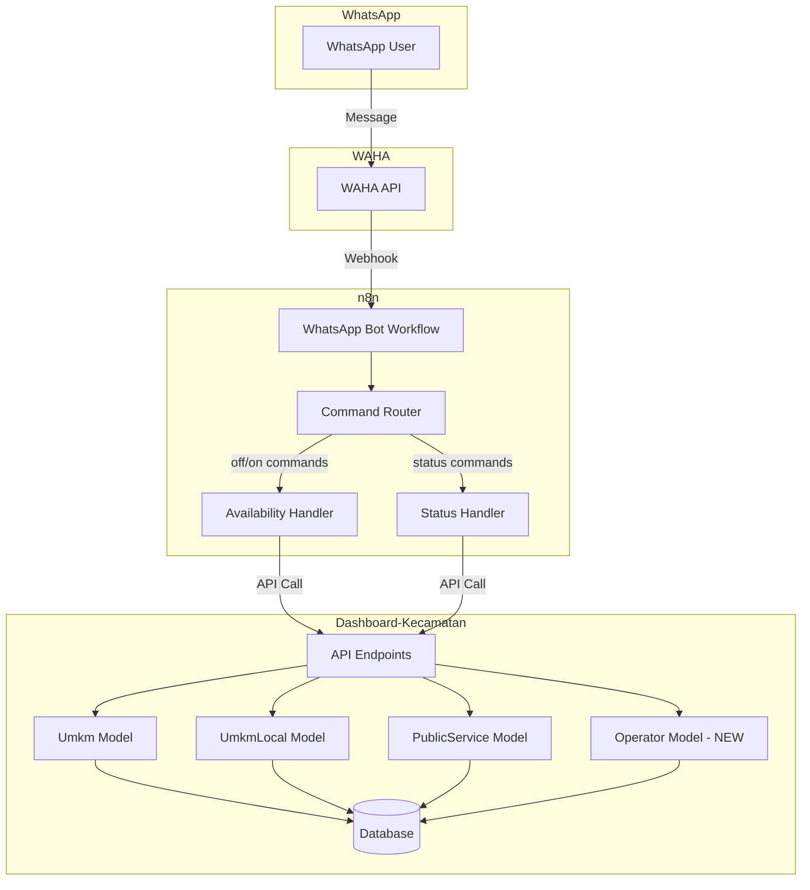
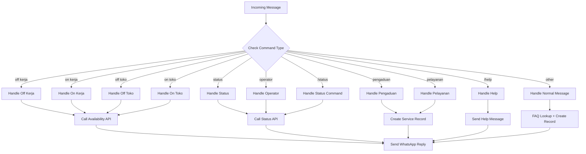
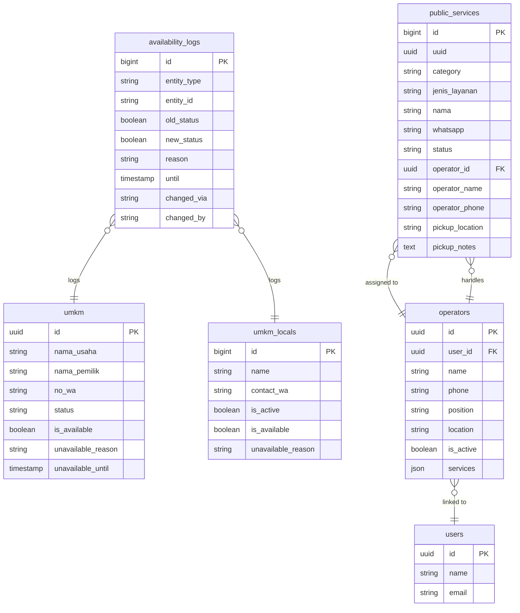
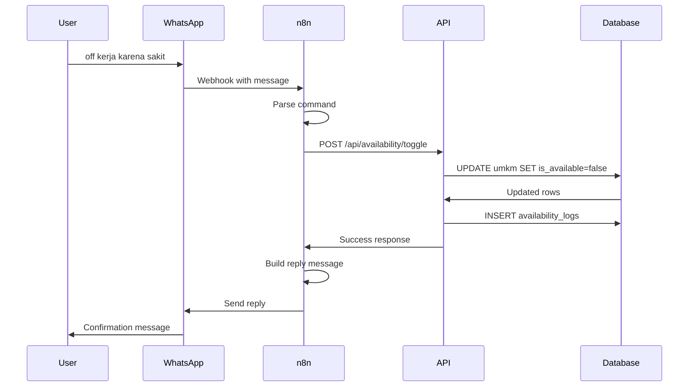
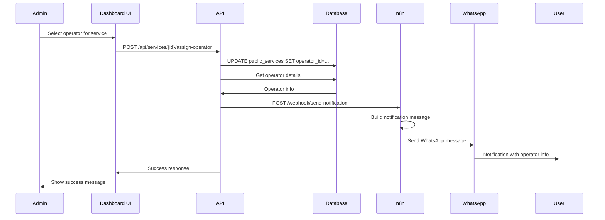

# Enhanced WhatsApp Bot Features Design Document

## Document Information
- **Created**: 2026-02-13
- **Author**: System Architect
- **Status**: Draft
- **Version**: 1.0

---

## Table of Contents
1. [Executive Summary](#1-executive-summary)
2. [Current System Analysis](#2-current-system-analysis)
3. [Feature 1: UMKM/Jasa Availability Toggle](#3-feature-1-umkmjasa-availability-toggle)
4. [Feature 2: Operator Assignment for Document Collection](#4-feature-2-operator-assignment-for-document-collection)
5. [Feature 3: Pelayanan/Pengaduan via WhatsApp](#5-feature-3-pelayananpengaduan-via-whatsapp)
6. [Database Schema Changes](#6-database-schema-changes)
7. [Model Updates](#7-model-updates)
8. [API Endpoints](#8-api-endpoints)
9. [n8n Workflow Logic](#9-n8n-workflow-logic)
10. [Bot Command Reference](#10-bot-command-reference)
11. [Example Conversations](#11-example-conversations)
12. [Implementation Checklist](#12-implementation-checklist)

---

## 1. Executive Summary

This document outlines the design for three enhanced WhatsApp bot features:

1. **UMKM/Jasa Availability Toggle** - Allow service providers and UMKM owners to temporarily set their availability status via WhatsApp
2. **Operator Assignment for Document Collection** - Enable users to know which operator handles their document and get pickup information
3. **Pelayanan/Pengaduan Integration** - Streamlined complaint and service request submission via WhatsApp

### Architecture Overview



---

## 2. Current System Analysis

### 2.1 UMKM Table Structure

**Table**: `umkm`

| Column | Type | Description |
|--------|------|-------------|
| `id` | UUID | Primary key |
| `nama_usaha` | VARCHAR | Business name |
| `nama_pemilik` | VARCHAR | Owner name |
| `no_wa` | VARCHAR | WhatsApp number |
| `desa` | VARCHAR | Village location |
| `jenis_usaha` | VARCHAR | Business type |
| `deskripsi` | TEXT | Description |
| `status` | ENUM | pending, aktif, nonaktif |
| `source` | VARCHAR | self-service, admin, whatsapp |
| `manage_token` | VARCHAR | Token for management |

**Limitations**:
- No temporary availability field
- Status only reflects verification state, not operational state
- Cannot temporarily hide from search without changing verification status

### 2.2 UmkmLocal Table Structure

**Table**: `umkm_locals`

| Column | Type | Description |
|--------|------|-------------|
| `id` | BIGINT | Primary key |
| `name` | VARCHAR | Business name |
| `product` | VARCHAR | Product name |
| `contact_wa` | VARCHAR | WhatsApp contact |
| `is_active` | BOOLEAN | Active status |
| `is_featured` | BOOLEAN | Featured status |

**Limitations**:
- `is_active` is for admin control, not user control
- No availability toggle for service providers

### 2.3 PublicService Table Structure

**Table**: `public_services`

| Column | Type | Description |
|--------|------|-------------|
| `id` | BIGINT | Primary key |
| `uuid` | UUID | Public identifier |
| `category` | ENUM | pengaduan, pelayanan, umkm, loker |
| `jenis_layanan` | VARCHAR | Service type |
| `nama` | VARCHAR | Applicant name |
| `whatsapp` | VARCHAR | WhatsApp number |
| `status` | ENUM | menunggu_verifikasi, diproses, selesai, ditolak |
| `handled_by` | UUID | User ID who handles |
| `public_response` | TEXT | Public response |
| `completion_type` | ENUM | digital, physical |
| `result_file_path` | VARCHAR | Digital document path |
| `ready_at` | TIMESTAMP | Ready for pickup time |
| `pickup_person` | VARCHAR | Pickup person name |
| `pickup_notes` | TEXT | Pickup notes |

**Limitations**:
- No operator information stored
- No operator phone for pickup notification
- No pickup location field

### 2.4 Existing Bot Commands

From [`whatsapp-service-bot-complete.json`](whatsapp/n8n-workflows/whatsapp-service-bot-complete.json):

| Command | Description |
|---------|-------------|
| `/status` | Check last report status |
| `/status {uuid}` | Check specific report status |
| `/help` | Show help |
| `/faq {keyword}` | Search FAQ |

---

## 3. Feature 1: UMKM/Jasa Availability Toggle

### 3.1 Use Cases

#### UC-1.1: Service Provider Toggle
```
Actor: Tukang Pijat / Service Provider
Goal: Temporarily stop receiving orders
Precondition: Registered in system with WhatsApp number

Flow:
1. Provider sends "off kerja" to WhatsApp bot
2. System identifies provider by WhatsApp number
3. System sets is_available = false
4. Provider disappears from search results
5. Provider sends "on kerja" when ready
6. System sets is_available = true
7. Provider appears in search results again
```

#### UC-1.2: UMKM Owner Toggle
```
Actor: UMKM Owner / Toko Owner
Goal: Temporarily close shop in search
Precondition: Registered UMKM with WhatsApp number

Flow:
1. Owner sends "off toko" or "lapak tutup" to WhatsApp bot
2. System identifies UMKM by WhatsApp number
3. System sets is_available = false
4. UMKM disappears from search results
5. Owner sends "on toko" or "lapak buka" when ready
6. System sets is_available = true
7. UMKM appears in search results again
```

### 3.2 Business Rules

| Rule ID | Description |
|---------|-------------|
| BR-1.1 | Availability toggle only works for verified/active UMKM |
| BR-1.2 | Setting unavailable does not change verification status |
| BR-1.3 | Optional: Can set unavailable_until for automatic reactivation |
| BR-1.4 | Optional: Can set unavailable_reason for display purposes |
| BR-1.5 | Multiple UMKM with same WhatsApp: all are toggled |

### 3.3 Command Variations

| Primary Command | Aliases | Description |
|-----------------|---------|-------------|
| `off kerja` | `tidak kerja`, `libur kerja` | Set service provider unavailable |
| `on kerja` | `kerja`, `siap kerja` | Set service provider available |
| `off toko` | `lapak tutup`, `toko tutup` | Set UMKM unavailable |
| `on toko` | `lapak buka`, `toko buka` | Set UMKM available |
| `status` | `cek status`, `info` | Check current availability |

---

## 4. Feature 2: Operator Assignment for Document Collection

### 4.1 Use Cases

#### UC-2.1: Admin Assigns Operator
```
Actor: Admin / Petugas
Goal: Assign operator to handle document
Precondition: Service request exists in system

Flow:
1. Admin opens service request detail
2. Admin selects operator from available list
3. Admin adds pickup notes
4. System saves operator assignment
5. System sends WhatsApp notification to applicant
6. Applicant receives operator info and pickup details
```

#### UC-2.2: User Checks Operator via WhatsApp
```
Actor: User / Applicant
Goal: Know which operator handles their document
Precondition: Has submitted service request

Flow:
1. User sends "status {uuid}" or "operator" to WhatsApp bot
2. System looks up service request
3. System returns operator information:
   - Operator name
   - Operator phone
   - Pickup location
   - Pickup notes
```

### 4.2 UI Concept for Operator Assignment

```
┌─────────────────────────────────────────────────────────────┐
│                   PENUGASAN OPERATOR                        │
├─────────────────────────────────────────────────────────────┤
│                                                             │
│  No. Tiket: PS-2026-02-13-001                              │
│  Pemohon: Ahmad Sudirman                                    │
│  Layanan: Surat Keterangan Domisili                        │
│                                                             │
│  ─────────────────────────────────────────────────────────  │
│                                                             │
│  Pilih Operator:                                            │
│  ┌─────────────────────────────────────────────────────┐   │
│  │ ☑ Budi Santoso - Operator Pelayanan                 │   │
│  │   📱 0812-3456-7890                                 │   │
│  │   📍 Meja 3 - Loket Pelayanan                       │   │
│  └─────────────────────────────────────────────────────┘   │
│  ┌─────────────────────────────────────────────────────┐   │
│  │ ☐ Siti Aminah - Operator Pelayanan                  │   │
│  │   📱 0813-4567-8901                                 │   │
│  │   📍 Meja 2 - Loket Pelayanan                       │   │
│  └─────────────────────────────────────────────────────┘   │
│                                                             │
│  Catatan Pengambilan:                                       │
│  ┌─────────────────────────────────────────────────────┐   │
│  │ Silakan ambil di kantor kecamatan jam 08:00-15:00   │   │
│  └─────────────────────────────────────────────────────┘   │
│                                                             │
│  [Simpan Penugasan]  [Kirim Notifikasi ke Pemohon]         │
└─────────────────────────────────────────────────────────────┘
```

### 4.3 Operator Model Design

```php
class Operator extends Model
{
    protected $fillable = [
        'user_id',           // Link to User if internal
        'name',              // Operator name
        'phone',             // WhatsApp number
        'position',          // Position/role
        'location',          // Desk/location
        'is_active',         // Active status
        'services',          // JSON array of handled services
    ];
    
    protected $casts = [
        'is_active' => 'boolean',
        'services' => 'array',
    ];
}
```

---

## 5. Feature 3: Pelayanan/Pengaduan via WhatsApp

### 5.1 Use Cases

#### UC-3.1: Submit Complaint via WhatsApp
```
Actor: User / Warga
Goal: Submit complaint without visiting office
Precondition: Has WhatsApp number

Flow:
1. User sends "pengaduan [description]" to bot
2. System creates PublicService record:
   - category: pengaduan
   - status: menunggu_verifikasi
   - source: whatsapp
3. System sends confirmation with UUID
4. User can check status anytime
```

#### UC-3.2: Request Service via WhatsApp
```
Actor: User / Warga
Goal: Request administrative service
Precondition: Has WhatsApp number

Flow:
1. User sends "pelayanan [jenis]" to bot
2. System checks if service type is valid
3. System creates PublicService record:
   - category: pelayanan
   - jenis_layanan: [service type]
   - status: menunggu_verifikasi
   - source: whatsapp
4. System sends confirmation with UUID
5. Admin processes request
6. User receives notification when ready
```

### 5.2 Service Type Mapping

| Keyword | Service Type |
|---------|-------------|
| `ktp`, `e-ktp` | KTP |
| `kk`, `kartu keluarga` | Kartu Keluarga |
| `domisili`, `skd` | Surat Keterangan Domisili |
| `nikah`, `akta nikah` | Akta Nikah |
| `usaha`, `sku` | Surat Keterangan Usaha |
| `tidak mampu`, `sktm` | SKTM |
| `lainnya` | Lainnya |

---

## 6. Database Schema Changes

### 6.1 Migration: Add Availability to UMKM

```sql
-- File: 2026_02_13_000001_add_availability_to_umkm.php

ALTER TABLE umkm 
ADD COLUMN is_available BOOLEAN DEFAULT TRUE,
ADD COLUMN unavailable_reason VARCHAR(255) NULL,
ADD COLUMN unavailable_until TIMESTAMP NULL,
ADD COLUMN availability_updated_at TIMESTAMP NULL,
ADD COLUMN availability_updated_by VARCHAR(255) NULL;

-- Index for quick filtering
CREATE INDEX idx_umkm_availability ON umkm(is_available, status);
```

### 6.2 Migration: Add Availability to UmkmLocal

```sql
-- File: 2026_02_13_000002_add_availability_to_umkm_locals.php

ALTER TABLE umkm_locals 
ADD COLUMN is_available BOOLEAN DEFAULT TRUE,
ADD COLUMN unavailable_reason VARCHAR(255) NULL,
ADD COLUMN unavailable_until TIMESTAMP NULL;

-- Index for quick filtering
CREATE INDEX idx_umkm_locals_availability ON umkm_locals(is_available, is_active);
```

### 6.3 Migration: Create Operators Table

```sql
-- File: 2026_02_13_000003_create_operators_table.php

CREATE TABLE operators (
    id UUID PRIMARY KEY DEFAULT gen_random_uuid(),
    user_id UUID NULL REFERENCES users(id),
    name VARCHAR(255) NOT NULL,
    phone VARCHAR(20) NOT NULL,
    position VARCHAR(255) NULL,
    location VARCHAR(255) NULL,
    is_active BOOLEAN DEFAULT TRUE,
    services JSONB NULL,
    created_at TIMESTAMP DEFAULT CURRENT_TIMESTAMP,
    updated_at TIMESTAMP DEFAULT CURRENT_TIMESTAMP
);

CREATE INDEX idx_operators_active ON operators(is_active);
CREATE INDEX idx_operators_phone ON operators(phone);
```

### 6.4 Migration: Add Operator to PublicService

```sql
-- File: 2026_02_13_000004_add_operator_to_public_services.php

ALTER TABLE public_services 
ADD COLUMN operator_id UUID NULL REFERENCES operators(id),
ADD COLUMN operator_name VARCHAR(255) NULL,
ADD COLUMN operator_phone VARCHAR(20) NULL,
ADD COLUMN pickup_location VARCHAR(255) NULL;

-- Note: pickup_notes already exists
```

### 6.5 Migration: Create Availability Logs

```sql
-- File: 2026_02_13_000005_create_availability_logs_table.php

CREATE TABLE availability_logs (
    id BIGINT PRIMARY KEY GENERATED ALWAYS AS IDENTITY,
    entity_type VARCHAR(50) NOT NULL,  -- 'umkm' or 'umkm_local'
    entity_id VARCHAR(36) NOT NULL,
    old_status BOOLEAN NOT NULL,
    new_status BOOLEAN NOT NULL,
    reason VARCHAR(255) NULL,
    until TIMESTAMP NULL,
    changed_via VARCHAR(50) NOT NULL,  -- 'whatsapp', 'web', 'api'
    changed_by VARCHAR(255) NULL,      -- phone number or user id
    created_at TIMESTAMP DEFAULT CURRENT_TIMESTAMP
);

CREATE INDEX idx_availability_logs_entity ON availability_logs(entity_type, entity_id);
CREATE INDEX idx_availability_logs_date ON availability_logs(created_at);
```

---

## 7. Model Updates

### 7.1 Umkm Model Update

```php
<?php

namespace App\Models;

class Umkm extends Model
{
    // ... existing code ...
    
    protected $fillable = [
        // ... existing fields ...
        'is_available',
        'unavailable_reason',
        'unavailable_until',
        'availability_updated_at',
        'availability_updated_by',
    ];
    
    protected $casts = [
        // ... existing casts ...
        'is_available' => 'boolean',
        'unavailable_until' => 'datetime',
        'availability_updated_at' => 'datetime',
    ];
    
    /**
     * Scope for available UMKM
     */
    public function scopeAvailable($query)
    {
        return $query->where('is_available', true)
                     ->where('status', self::STATUS_AKTIF);
    }
    
    /**
     * Check if currently available
     */
    public function isCurrentlyAvailable(): bool
    {
        if (!$this->is_available) {
            return false;
        }
        
        // Check if temporary unavailability has expired
        if ($this->unavailable_until && $this->unavailable_until->isPast()) {
            $this->update([
                'is_available' => true,
                'unavailable_until' => null,
                'unavailable_reason' => null,
            ]);
            return true;
        }
        
        return true;
    }
    
    /**
     * Set availability status
     */
    public function setAvailability(bool $available, ?string $reason = null, ?Carbon $until = null, ?string $changedBy = null): void
    {
        $oldStatus = $this->is_available;
        
        $this->update([
            'is_available' => $available,
            'unavailable_reason' => $reason,
            'unavailable_until' => $until,
            'availability_updated_at' => now(),
            'availability_updated_by' => $changedBy,
        ]);
        
        // Log the change
        AvailabilityLog::create([
            'entity_type' => 'umkm',
            'entity_id' => $this->id,
            'old_status' => $oldStatus,
            'new_status' => $available,
            'reason' => $reason,
            'until' => $until,
            'changed_via' => 'whatsapp',
            'changed_by' => $changedBy,
        ]);
    }
}
```

### 7.2 UmkmLocal Model Update

```php
<?php

namespace App\Models;

class UmkmLocal extends Model
{
    // ... existing code ...
    
    protected $fillable = [
        // ... existing fields ...
        'is_available',
        'unavailable_reason',
        'unavailable_until',
    ];
    
    protected $casts = [
        // ... existing casts ...
        'is_available' => 'boolean',
        'unavailable_until' => 'datetime',
    ];
    
    /**
     * Scope for available items
     */
    public function scopeAvailable($query)
    {
        return $query->where('is_available', true)
                     ->where('is_active', true);
    }
}
```

### 7.3 Operator Model (New)

```php
<?php

namespace App\Models;

use Illuminate\Database\Eloquent\Model;

class Operator extends Model
{
    protected $table = 'operators';
    
    protected $keyType = 'string';
    public $incrementing = false;
    
    protected $fillable = [
        'id',
        'user_id',
        'name',
        'phone',
        'position',
        'location',
        'is_active',
        'services',
    ];
    
    protected $casts = [
        'is_active' => 'boolean',
        'services' => 'array',
    ];
    
    protected static function boot()
    {
        parent::boot();
        static::creating(function ($model) {
            if (!$model->getKey()) {
                $model->{$model->getKeyName()} = (string) Str::uuid();
            }
        });
    }
    
    /**
     * Link to User if internal staff
     */
    public function user()
    {
        return $this->belongsTo(User::class);
    }
    
    /**
     * Services handled by this operator
     */
    public function publicServices()
    {
        return $this->hasMany(PublicService::class);
    }
    
    /**
     * Scope for active operators
     */
    public function scopeActive($query)
    {
        return $query->where('is_active', true);
    }
    
    /**
     * Check if handles specific service type
     */
    public function handlesService(string $serviceType): bool
    {
        if (!$this->services) {
            return true; // Handles all if not specified
        }
        return in_array($serviceType, $this->services);
    }
}
```

### 7.4 PublicService Model Update

```php
<?php

namespace App\Models;

class PublicService extends Model
{
    // ... existing code ...
    
    protected $fillable = [
        // ... existing fields ...
        'operator_id',
        'operator_name',
        'operator_phone',
        'pickup_location',
    ];
    
    /**
     * Relationship to Operator
     */
    public function operator()
    {
        return $this->belongsTo(Operator::class);
    }
    
    /**
     * Assign operator to this service
     */
    public function assignOperator(Operator $operator, ?string $pickupLocation = null): void
    {
        $this->update([
            'operator_id' => $operator->id,
            'operator_name' => $operator->name,
            'operator_phone' => $operator->phone,
            'pickup_location' => $pickupLocation ?? $operator->location,
        ]);
    }
}
```

### 7.5 AvailabilityLog Model (New)

```php
<?php

namespace App\Models;

use Illuminate\Database\Eloquent\Model;

class AvailabilityLog extends Model
{
    protected $table = 'availability_logs';
    
    public $timestamps = false;
    
    protected $fillable = [
        'entity_type',
        'entity_id',
        'old_status',
        'new_status',
        'reason',
        'until',
        'changed_via',
        'changed_by',
        'created_at',
    ];
    
    protected $casts = [
        'old_status' => 'boolean',
        'new_status' => 'boolean',
        'until' => 'datetime',
        'created_at' => 'datetime',
    ];
}
```

---

## 8. API Endpoints

### 8.1 Availability Endpoints

#### GET /api/availability/check
Check availability status by phone number.

**Request:**
```json
{
  "phone": "6281234567890"
}
```

**Response:**
```json
{
  "found": true,
  "entities": [
    {
      "type": "umkm",
      "id": "uuid-here",
      "name": "Toko Buah Segar",
      "is_available": true,
      "status": "aktif"
    },
    {
      "type": "umkm_local",
      "id": "123",
      "name": "Tukang Pijat Pak Budi",
      "is_available": false,
      "unavailable_reason": "Sedang sakit"
    }
  ]
}
```

#### POST /api/availability/toggle
Toggle availability status.

**Request:**
```json
{
  "phone": "6281234567890",
  "available": false,
  "reason": "Libur lebaran",
  "until": "2026-02-20T00:00:00Z"
}
```

**Response:**
```json
{
  "success": true,
  "updated_count": 2,
  "entities": [
    {
      "type": "umkm",
      "id": "uuid-here",
      "name": "Toko Buah Segar",
      "is_available": false
    }
  ],
  "message": "Status ketersediaan telah diubah menjadi TIDAK TERSEDIA"
}
```

### 8.2 Operator Endpoints

#### GET /api/operators
List all active operators.

**Response:**
```json
{
  "operators": [
    {
      "id": "uuid-here",
      "name": "Budi Santoso",
      "phone": "081234567890",
      "position": "Operator Pelayanan",
      "location": "Meja 3 - Loket Pelayanan",
      "services": ["KTP", "KK", "Domisili"]
    }
  ]
}
```

#### POST /api/services/{id}/assign-operator
Assign operator to service request.

**Request:**
```json
{
  "operator_id": "uuid-here",
  "pickup_location": "Meja 3 - Loket Pelayanan",
  "pickup_notes": "Ambil jam 08:00-15:00",
  "send_notification": true
}
```

**Response:**
```json
{
  "success": true,
  "service": {
    "id": 123,
    "uuid": "public-uuid",
    "operator_name": "Budi Santoso",
    "operator_phone": "081234567890"
  },
  "notification_sent": true
}
```

### 8.3 Service Submission Endpoints

#### POST /api/services/whatsapp
Submit service request from WhatsApp.

**Request:**
```json
{
  "phone": "6281234567890",
  "name": "Ahmad Sudirman",
  "category": "pengaduan",
  "jenis_layanan": "Pengaduan Jalan Rusak",
  "description": "Jalan di depan rumah saya rusak parah...",
  "desa_id": "uuid-desa"
}
```

**Response:**
```json
{
  "success": true,
  "uuid": "generated-uuid",
  "ticket_number": "PS-2026-02-13-001",
  "message": "Laporan Anda telah diterima"
}
```

### 8.4 Status Check Endpoint (Enhanced)

#### GET /api/status/check
Enhanced status check with operator info.

**Request:**
```
GET /api/status/check?identifier=uuid-or-phone
```

**Response:**
```json
{
  "found": true,
  "uuid": "550e8400-e29b-41d4-a716-446655440000",
  "ticket_number": "PS-2026-02-13-001",
  "jenis_layanan": "Surat Keterangan Domisili",
  "status": "selesai",
  "status_label": "Selesai",
  "created_at": "13 Feb 2026, 08:00",
  "public_response": "Dokumen sudah selesai",
  "completion_type": "physical",
  "operator": {
    "name": "Budi Santoso",
    "phone": "081234567890",
    "location": "Meja 3 - Loket Pelayanan"
  },
  "pickup": {
    "ready_at": "13 Feb 2026, 14:00",
    "location": "Meja 3 - Loket Pelayanan",
    "notes": "Ambil jam 08:00-15:00, bawa KTP"
  }
}
```

---

## 9. n8n Workflow Logic

### 9.1 Command Router Flow



### 9.2 Availability Handler Node

```javascript
// n8n Code Node: Handle Availability Toggle

const message = $json.message.toLowerCase().trim();
const phone = $json.phone;

// Determine action
let available = null;
let entityType = null;
let reason = null;

if (message.includes('off kerja') || message.includes('tidak kerja')) {
    available = false;
    entityType = 'service'; // Service provider
} else if (message.includes('on kerja') || message.includes('kerja')) {
    available = true;
    entityType = 'service';
} else if (message.includes('off toko') || message.includes('tutup') || message.includes('lapak tutup')) {
    available = false;
    entityType = 'umkm';
} else if (message.includes('on toko') || message.includes('buka') || message.includes('lapak buka')) {
    available = true;
    entityType = 'umkm';
}

// Extract reason if provided (after "karena" or "alasan")
const reasonMatch = message.match(/(?:karena|alasan)\s+(.+)/i);
if (reasonMatch) {
    reason = reasonMatch[1].trim();
}

// Extract until date if provided
let until = null;
const untilMatch = message.match(/(?:sampai|hingga)\s+(\d{1,2}[\/\-]\d{1,2}[\/\-]\d{2,4})/i);
if (untilMatch) {
    until = new Date(untilMatch[1]).toISOString();
}

return {
    phone: phone,
    available: available,
    entity_type: entityType,
    reason: reason,
    until: until,
    original_message: message
};
```

### 9.3 API Call Node Configuration

```json
{
  "name": "Call Availability API",
  "type": "httpRequest",
  "parameters": {
    "method": "POST",
    "url": "http://dashboard-kecamatan:8000/api/availability/toggle",
    "authentication": "predefinedCredentialType",
    "nodeCredentialType": "httpHeaderAuth",
    "sendBody": true,
    "bodyParameters": {
      "parameters": [
        {
          "name": "phone",
          "value": "={{$json.phone}}"
        },
        {
          "name": "available",
          "value": "={{$json.available}}"
        },
        {
          "name": "reason",
          "value": "={{$json.reason}}"
        },
        {
          "name": "until",
          "value": "={{$json.until}}"
        }
      ]
    }
  }
}
```

### 9.4 Reply Builder Node

```javascript
// n8n Code Node: Build Availability Reply

const result = $json;
const action = result.available ? 'TERSEDIA' : 'TIDAK TERSEDIA';
const emoji = result.available ? '✅' : '🚫';

let message = `${emoji} Status ketersediaan Anda telah diubah menjadi *${action}*\n\n`;
message += `📅 Sejak: ${new Date().toLocaleDateString('id-ID', { 
    day: 'numeric', 
    month: 'short', 
    year: 'numeric',
    hour: '2-digit',
    minute: '2-digit'
})}\n`;

if (!result.available && result.reason) {
    message += `📝 Alasan: ${result.reason}\n`;
}

if (!result.available && result.until) {
    message += `⏰ Sampai: ${new Date(result.until).toLocaleDateString('id-ID')}\n`;
}

if (result.available) {
    message += `\n🎉 Sekarang Anda akan muncul di pencarian`;
} else {
    message += `\n🔄 Ketik "on kerja" atau "on toko" untuk kembali tersedia`;
}

if (result.updated_count > 1) {
    message += `\n\nℹ️ ${result.updated_count} entitas diperbarui`;
}

return {
    phone: result.phone,
    message: message,
    type: 'availability_update'
};
```

---

## 10. Bot Command Reference

### 10.1 Complete Command List

| Command | Aliases | Description | Example |
|---------|---------|-------------|---------|
| `off kerja` | `tidak kerja`, `libur kerja` | Set service provider unavailable | `off kerja karena sakit` |
| `on kerja` | `kerja`, `siap kerja` | Set service provider available | `on kerja` |
| `off toko` | `lapak tutup`, `toko tutup` | Set UMKM unavailable | `off toko sampai 20/02/2026` |
| `on toko` | `lapak buka`, `toko buka` | Set UMKM available | `on toko` |
| `status` | `cek status`, `info` | Check own availability status | `status` |
| `status {uuid}` | `cek {uuid}` | Check specific service status | `status PS-2026-02-13-001` |
| `operator` | `operator saya` | Show assigned operator | `operator` |
| `pengaduan {desc}` | `lapor {desc}` | Submit complaint | `pengaduan jalan rusak di depan rumah` |
| `pelayanan {jenis}` | `layanan {jenis}` | Request service | `pelayanan domisili` |
| `/status` | `/cek` | Check last report status | `/status` |
| `/status {uuid}` | `/cek {uuid}` | Check specific report | `/status abc-123` |
| `/help` | `/bantuan` | Show help | `/help` |
| `/faq {keyword}` | `/tanya {keyword}` | Search FAQ | `/faq jam layanan` |

### 10.2 Command Detection Logic

```javascript
// Command detection patterns
const patterns = {
    offKerja: /^(off|tidak|libur)\s+(kerja|bisa|melayani)/i,
    onKerja: /^(on|siap|bisa)\s+(kerja|melayani)/i,
    offToko: /^(off|tutup)\s+(toko|lapak|usaha)/i,
    onToko: /^(on|buka)\s+(toko|lapak|usaha)/i,
    lapakTutup: /^lapak\s+(tutup|libur)/i,
    lapakBuka: /^lapak\s+(buka|siap)/i,
    status: /^status$/i,
    statusUuid: /^status\s+([a-zA-Z0-9\-]+)/i,
    operator: /^operator(\s+saya)?$/i,
    pengaduan: /^(pengaduan|lapor)\s+(.+)/i,
    pelayanan: /^(pelayanan|layanan)\s+(.+)/i,
    slashStatus: /^\/status(\s+([a-zA-Z0-9\-]+))?$/i,
    slashHelp: /^\/(help|bantuan)$/i,
    slashFaq: /^\/(faq|tanya)\s+(.+)/i,
};
```

---

## 11. Example Conversations

### 11.1 Availability Toggle Conversation

```
┌─────────────────────────────────────────────────────────────┐
│ User: off kerja karena sakit                                │
├─────────────────────────────────────────────────────────────┤
│ Bot: 🚫 Status ketersediaan Anda telah diubah menjadi       │
│      TIDAK TERSEDIA                                         │
│                                                             │
│      📅 Sejak: 13 Feb 2026, 12:17                          │
│      📝 Alasan: sakit                                       │
│                                                             │
│      🔄 Ketik "on kerja" untuk kembali tersedia             │
└─────────────────────────────────────────────────────────────┘

┌─────────────────────────────────────────────────────────────┐
│ User: on kerja                                              │
├─────────────────────────────────────────────────────────────┤
│ Bot: ✅ Status ketersediaan Anda telah diubah menjadi       │
│      TERSEDIA                                               │
│                                                             │
│      📅 Sejak: 13 Feb 2026, 14:30                          │
│                                                             │
│      🎉 Sekarang Anda akan muncul di pencarian jasa         │
└─────────────────────────────────────────────────────────────┘
```

### 11.2 UMKM Toggle Conversation

```
┌─────────────────────────────────────────────────────────────┐
│ User: lapak tutup sampai 20/02/2026                         │
├─────────────────────────────────────────────────────────────┤
│ Bot: 🚫 Status ketersediaan Anda telah diubah menjadi       │
│      TIDAK TERSEDIA                                         │
│                                                             │
│      📅 Sejak: 13 Feb 2026, 12:17                          │
│      ⏰ Sampai: 20 Feb 2026                                 │
│                                                             │
│      🔄 Ketik "on toko" atau "lapak buka" untuk kembali     │
│      tersedia sebelum tanggal                               │
│                                                             │
│      ℹ️ Status akan otomatis kembali tersedia pada 20 Feb   │
└─────────────────────────────────────────────────────────────┘
```

### 11.3 Status Check Conversation

```
┌─────────────────────────────────────────────────────────────┐
│ User: status                                                │
├─────────────────────────────────────────────────────────────┤
│ Bot: 📊 Status Layanan Anda:                                │
│                                                             │
│      📱 0812-3456-7890                                      │
│      🏪 Tukang Pijat - Pijat Urut Tradisional              │
│      ✅ Status: TERSEDIA                                    │
│      📍 Desa Besuk                                          │
│                                                             │
│      ─────────────────────────────────────────────────      │
│                                                             │
│      📋 Riwayat Laporan Terakhir:                           │
│      🆔 PS-2026-02-10-003                                   │
│      📂 Surat Keterangan Domisili                           │
│      ✅ Status: Selesai                                     │
└─────────────────────────────────────────────────────────────┘
```

### 11.4 Operator Check Conversation

```
┌─────────────────────────────────────────────────────────────┐
│ User: status PS-2026-02-13-001                              │
├─────────────────────────────────────────────────────────────┤
│ Bot: 📋 Status Pengajuan: PS-2026-02-13-001                │
│                                                             │
│      📝 Jenis: Surat Keterangan Domisili                   │
│      ✅ Status: SELESAI                                     │
│      📅 Dibuat: 13 Feb 2026, 08:00                         │
│                                                             │
│      ─────────────────────────────────────────────────      │
│                                                             │
│      👤 Operator: Budi Santoso                              │
│      📱 0812-3456-7890                                      │
│      📍 Meja 3 - Loket Pelayanan                           │
│                                                             │
│      💬 Catatan: Silakan ambil di kantor kecamatan         │
│      jam 08:00-15:00, bawa KTP asli                        │
│                                                             │
│      💡 Ketik /status PS-2026-02-13-001 untuk cek lagi     │
└─────────────────────────────────────────────────────────────┘
```

### 11.5 Pengaduan Submission Conversation

```
┌─────────────────────────────────────────────────────────────┐
│ User: pengaduan jalan di depan rumah saya di desa besuk    │
│       rusak parah, sudah 3 bulan tidak diperbaiki          │
├─────────────────────────────────────────────────────────────┤
│ Bot: ✅ Laporan Anda telah diterima!                        │
│                                                             │
│      🆔 ID: PS-2026-02-13-002                              │
│      📂 Kategori: Pengaduan                                 │
│      📝 Jenis: Pengaduan Jalan Rusak                       │
│      📊 Status: Menunggu Verifikasi                        │
│                                                             │
│      ─────────────────────────────────────────────────      │
│                                                             │
│      📋 Ringkasan Laporan:                                  │
│      Jalan di depan rumah saya di desa besuk               │
│      rusak parah, sudah 3 bulan tidak diperbaiki           │
│                                                             │
│      💡 Cek status kapan saja dengan ketik:                │
│      status PS-2026-02-13-002                              │
└─────────────────────────────────────────────────────────────┘
```

### 11.6 Pelayanan Request Conversation

```
┌─────────────────────────────────────────────────────────────┐
│ User: pelayanan domisili                                    │
├─────────────────────────────────────────────────────────────┤
│ Bot: 📋 Permohonan Layanan: Surat Keterangan Domisili      │
│                                                             │
│      Untuk melanjutkan, mohon berikan informasi berikut:    │
│                                                             │
│      1. Nama Lengkap                                        │
│      2. NIK                                                 │
│      3. Alamat Lengkap                                      │
│      4. Desa                                                │
│                                                             │
│      Contoh:                                                │
│      Ahmad Sudirman, 3507120101900001, Jl. Merdeka No. 10, │
│      Desa Besuk                                             │
└─────────────────────────────────────────────────────────────┘

┌─────────────────────────────────────────────────────────────┐
│ User: Ahmad Sudirman, 3507120101900001, Jl. Merdeka No.    │
│       10, Desa Besuk                                        │
├─────────────────────────────────────────────────────────────┤
│ Bot: ✅ Permohonan Anda telah diterima!                     │
│                                                             │
│      🆔 ID: PS-2026-02-13-003                              │
│      📂 Layanan: Surat Keterangan Domisili                 │
│      📊 Status: Menunggu Verifikasi                        │
│                                                             │
│      ─────────────────────────────────────────────────      │
│                                                             │
│      📋 Data Pemohon:                                       │
│      👤 Nama: Ahmad Sudirman                               │
│      🪪 NIK: 3507120101900001                              │
│      📍 Alamat: Jl. Merdeka No. 10, Desa Besuk             │
│                                                             │
│      ⏰ Estimasi selesai: 2-3 hari kerja                   │
│                                                             │
│      💡 Cek status kapan saja dengan ketik:                │
│      status PS-2026-02-13-003                              │
└─────────────────────────────────────────────────────────────┘
```

---

## 12. Implementation Checklist

### Phase 1: Database & Models

- [ ] Create migration for `umkm` availability fields
- [ ] Create migration for `umkm_locals` availability fields
- [ ] Create migration for `operators` table
- [ ] Create migration for `public_services` operator fields
- [ ] Create migration for `availability_logs` table
- [ ] Update `Umkm` model with availability methods
- [ ] Update `UmkmLocal` model with availability methods
- [ ] Create `Operator` model
- [ ] Update `PublicService` model with operator relationship
- [ ] Create `AvailabilityLog` model

### Phase 2: API Endpoints

- [ ] Create `AvailabilityController` with:
  - [ ] `check` method - GET /api/availability/check
  - [ ] `toggle` method - POST /api/availability/toggle
  - [ ] `status` method - GET /api/availability/status
- [ ] Create `OperatorController` with:
  - [ ] `index` method - GET /api/operators
  - [ ] `store` method - POST /api/operators
  - [ ] `update` method - PUT /api/operators/{id}
  - [ ] `destroy` method - DELETE /api/operators/{id}
- [ ] Update `PublicServiceController` with:
  - [ ] `assignOperator` method - POST /api/services/{id}/assign-operator
  - [ ] Enhanced `checkStatus` with operator info
- [ ] Add API routes in `routes/api.php`

### Phase 3: n8n Workflow Updates

- [ ] Add command detection for availability toggle
- [ ] Add availability handler node
- [ ] Add API call node for availability toggle
- [ ] Add reply builder for availability responses
- [ ] Add operator check command handling
- [ ] Add pengaduan/pelayanan submission handling
- [ ] Update status check to include operator info
- [ ] Test workflow with various commands

### Phase 4: Dashboard UI

- [ ] Create Operator Management page
  - [ ] List operators
  - [ ] Add/Edit operator form
  - [ ] Delete operator
- [ ] Update Service Request detail page
  - [ ] Add operator selection dropdown
  - [ ] Add pickup location field
  - [ ] Add send notification button
- [ ] Update UMKM listing to show availability
- [ ] Add availability toggle in UMKM detail page

### Phase 5: Testing & Documentation

- [ ] Unit tests for availability toggle
- [ ] Unit tests for operator assignment
- [ ] Integration tests for WhatsApp commands
- [ ] Update API documentation
- [ ] Create user guide for WhatsApp commands
- [ ] Create admin guide for operator management

---

## Appendix A: Database ERD



---

## Appendix B: Sequence Diagrams

### B.1 Availability Toggle Sequence



### B.2 Operator Assignment Sequence



---

## Appendix C: Risk Assessment

| Risk | Impact | Likelihood | Mitigation |
|------|--------|------------|------------|
| Multiple UMKM with same phone | Medium | High | Toggle all, show count in response |
| Command misinterpretation | Low | Medium | Fuzzy matching, confirmation for ambiguous |
| Operator not found | Low | Medium | Graceful fallback, show generic message |
| WhatsApp API downtime | High | Low | Queue messages, retry mechanism |
| Database migration failure | High | Low | Backup before migration, rollback script |

---

## Document History

| Version | Date | Author | Changes |
|---------|------|--------|---------|
| 1.0 | 2026-02-13 | System Architect | Initial design document |
